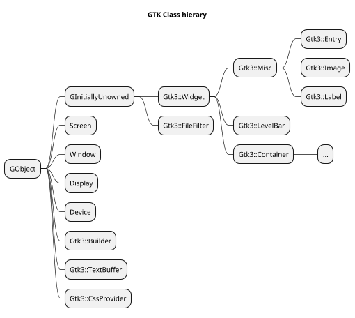
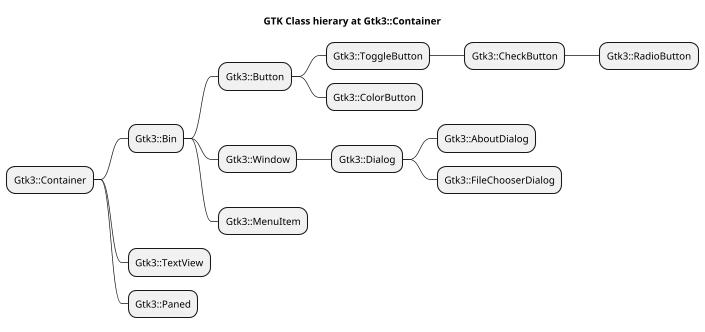
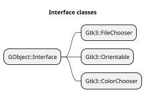
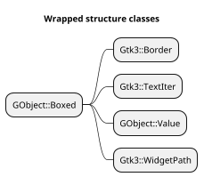

[toc]

# Command line
Recognized options by GTK
See https://www.systutorials.com/docs/linux/man/7-gtk-options/

# Web site start

```
bundle exec jekyll serve
```
# native sub search
```
  SomeModule.some-sub()
  Gnome::GObject::Object.FALLBACK()
    translate some-sub -> some_sub
    SomeModule._fallback
      try some-sub or Gxyz_somemodule_some_sub => sub address
      callsame() if no address until one is found
    Substitute native objects for perl6 objects in argument list
    Cast first argument when sub is found in another class

    Gnome::N::X.test-call()
```

# Codes used in source modules to mark what is tested or not

The codes will show what is tested or not in the source code. The developer can than see what is tested and what is not. The code always start with `#T` followed with a letter for each type or action;
  * `L` module load
  * `M` method
  * `S` signal
  * `P` for properties
  * `E` for enums
  * `T` for structures
Then a colon ':' with a digit to show it is tested or not; 0 not tested, 1 tested in test script, 2 tested elsewhere, 4 used elsewhere (binary, so combinations are possible. 2 and 4 is not easy to find out). Then another colon followed with the name of the module, method, signal or type. E.g. `#TL:1:Gnome::Gtk3::Widget` or `#TM:0:gtk_widget_get_path`. When 2 and 4 are set, or combinations thereof, another column might follow to show the source. There might be more than one. E.g. `TM:3:gtk_color_chooser_add_palette:ColorChooserWidget`.

Absence of codes means that a particular item is not tested.


# Types of gtk and (native) types in perl6

| GTK Type | typedef | Native Perl6 | Perl6 Type | Note |
| -------- | ------- | ------------ | ---------- | ---- |
| gboolean | gint    | int32        | Int        |
|
| gchar *  | char *  | str          | Str        |
|
| gchar    | char    | int8         | Int        | +/- n % 2**7 - 1
| gshort   | short   | int16        | Int        | +/- n % 2**15 - 1
| glong    | long    | int64        | Int        | +/- n % 2**63 - 1
| gint8    | char    | int8         | Int        | +/- n % 2**7 -1
| gint16   | short   | int16        | Int        | +/- n % 2**15 - 1
| gint32   | int     | int32        | Int        | +/- n % 2**31 - 1
| gint64   | long    | int64        | Int        | +/- n % 2**63 - 1
|
| gint     | int     | int32        | Int        | +/- n % 2**31 - 1
|
| guchar   | un. char  | uint8, byte  | Int      | n % 2**8 - 1
| gunichar |           | uint32       | Int
| gushort  | un. short | uint16       | Int      | n % 2**16 - 1
| gulong   | un. long  | uint64       | Int      | n % 2**64 - 1
| guint8   | un. char  | uint8        | Int      | n % 2**8 - 1
| guint16  | un. short | uint16       | Int      | n % 2**16 - 1
| guint32  | un. int   | uint32       | Int      | n % 2**32 - 1
| guint64  | un. long  | uint64       | Int      | n % 2**64 - 1
|
| guint    | un. int   | uint32       | Int      | +/- n % 2**31 - 1
|
| gssize   | long      | int64        | Int      |
| gsize    | un. long  | uint64       | Int      |
| goffset  | gint64    | int64        | Int      |
|
| gfloat   | float     | num32        | Num      |
| gdouble  | double    | num64        | Num      |
|
| GType    | int32
| GQuark   | int32
| GError   |           |              | N-GError
| GList    |           |              | N-GList
| GSList   |           |              | N-GSList

# TODO list of things
* Boxed values and objects must have the following implemented to prevent memory leaks;
  * A boolean test to check if object is valid
  * A clear function which calls some free function -> toggles the valid flag
  * A `DESTROY()` submethod which calls the clear method or free func if object is still valid.
* Study ref/unref of gtk objects.
* Reverse testing procedure in `_fallback()` methods. This will make it possible to find functions in the modules first before some perl6 module is selected. E.g. in **Gnome::Gtk3::TreePath** a sub `gtk-tree-path-next()` is defined. When `.next()` is used it could find a method from perl if it was tested without the 'gtk_tree_path_' prefix first. It still can go wrong when it is to be found in a parent class.
  ```
  try { $s = &::("gtk_list_store_$native-sub"); };
  try { $s = &::($native-sub); } if !$s and $native-sub ~~ m/^ 'gtk_' /;
  ```
* Add a test to `_fallback()` so that the prefix 'gtk_' can be left of the sub name when used. So the above tests can become;
  ```
  try { $s = &::("gtk_list_store_$native-sub"); };
  try { $s = &::("gtk_$native-sub"); } unless ?$s;
  try { $s = &::($native-sub); } if !$s and $native-sub ~~ m/^ 'gtk_' /;
  ```
  In other packages `gtk_` can be `g_` or `gdk_`.
* Caching the sub address in Object must be more specific. There could be a sub name (short version) in more than one module. So the class name of the caller should be stored with it too. We can take the $!gtk-class-name-of-sub for it.
* Make some of the routines in several packages the same
  * .clear-object()
  * .set-native-object()
  * .get-native-object()
  * .is-valid()
* Use Method::Also to have several names for methods

# Interface using modules

The `_fallback()` method in a module, which also uses an interface, should also call a likewise method in that interface module. This method is named `_xyz_interface()` and does not need to call callsame() to scan for subs in the parent modules of the interface. An example from `_fallback()` in **Gnome::Gtk3::FileChooserDialog**;

```
unit class Gnome::Gtk3::FileChooserDialog;
also is Gnome::Gtk3::Dialog;                # parent class
also does Gnome::Gtk3::FileChooser;         # interface
also does Gnome::Gtk3::Buildable;           # interface

...

method _fallback ( $native-sub is copy --> Callable ) {

  my Callable $s;

  # search this module first
  try { $s = &::($native-sub); }
  try { $s = &::("gtk_file_chooser_dialog_$native-sub"); } unless ?$s;

  # then in interfaces
  $s = self._buildable_interface($native-sub) unless ?$s;
  $s = self._file_chooser_interface($native-sub) unless ?$s;

  # stamp class mark on it
  self.set-class-name-of-sub('GtkFileChooserDialog') if $s;

  # then parent classes
  $s = callsame unless ?$s;

  # return result
  $s;
}
```
And the interface sub in e.g. Buildable;
```
method _buildable_interface ( Str $native-sub --> Callable ) {

  my Callable $s;
  try { $s = &::("$native-sub"); };
  try { $s = &::("gtk_buildable_$native-sub"); } unless ?$s;

  $s
}
```
Interfaces can also define signals sometimes. Define this like so in the interfacing module;
```
method _file_chooser_add_signal_types ( Str $class-name ) {

  self.add-signal-types( $class-name, :w2<row-changed row-inserted>);
  callsame;
}
```
and call this from the interface using class like so;
```
submethod BUILD ( *%options ) {

  # add signal info in the form of group<signal-name>.
  # groups are e.g. signal, event, nativeobject etc
  unless $signals-added {
    $signals-added = self.add-signal-types( $?CLASS.^name,
      :w0<columns-changed cursor-changed select-all unselect-all toggle-cursor-row select-cursor-parent start-interactive-search>,
      :w1<select-cursor-row>,
      :w2<row-activated test-expand-row test-collapse-row row-expanded row-collapsed move-cursor>,
      :w3<expand-collapse-cursor-row>,
    );

    self._file_chooser_add_signal_types($?CLASS.^name);
  }

```
All this is a bit awkward and messy and is all because of using a role for an interface module instead of using classes. It is not possible to define the same method in several roles, like e.g. `_interface()` because they clash when multiple roles are imported. Classes would behave better and then callsame could be used too. The problem then would be (surely for Buildable) that an interface class is inherited by multiple classes which are in the same inheritance tree;


```plantuml
scale 0.7
title Dependency details for hierargy and interfaces

class Button
class Bin
class Container
class Widget

class Buildable << (I, #efed80) Interface >>

Buildable <|-- Widget
Buildable <|-- Container
Buildable <|-- Bin
Buildable <|-- Button

Widget <|-- Container
Container <|-- Bin
Bin <|-- Button

```

## Definitions of interfaces and class inheritance

### Interfaces

**Interfaces** define a common contract. Such as an interface called IAnimal, where all animals share functions such as Eat(), Move(), Attack() etc. While all of them share the same functions, all or most of them have a different way (implementation) of achieving it. **Interfaces** are for *'can do'* or *'can be treated as'* type of relationships. In Raku this is called a role.

### Classes
**Abstract** ( as well as **concrete** ) classes are for *'is a'* kind of relationship. **Abstract or concrete classes** define a common implementation and optionally common contracts. For example a simple Calculator could qualify as an abstract class which implements all the basic logical and bitwise operators and then gets extended by ScientificCalculator, GraphicalCalculator and so on.

Look at these examples:

class Bird **is an** Animal **can do** Flight;
class Plane **is a** Vehicle **can do** Flight, **can be treated as** AccountableAsset;
class Mosquito **is an** Animal **can do** Flight;
class Horse **is an** Animal;
class RaceHorse **is a** Horse **can be treated as** AccountableAsset;
class Pegasus **is a** Horse **can do** Flight;

Bird, Mosquito and Horse are Animals. They are related. They inherit common methods from Animal like eat(), metabolize() and reproduce(). Maybe they override these methods, adding a little extra to them, but they take advantage of the default behavior implemented in Animal like metabolizeGlucose().

Plane is not related to Bird, Mosquito or Horse.

Flight is implemented by dissimilar, unrelated classes, like Bird and Plane.

AccountableAsset is also implemented by dissimilar, unrelated classes, like Plane and RaceHorse.

Horse doesn't implement Flight.

As you can see classes (abstract or concrete) helps you build a hierarchies, letting you inhering code from the upper levels to the lower levels of the hierarchy. In theory the lower you are in the hierarchy, the more specialized your behavior is, but you don't have to worry about a lot of things that are already taken care of.

Interfaces, in the other hand, create no hierarchy, but they can help homogenize certain behaviors across hierarchies so you can abstract them from the hierarchy in certain contexts.

For example you can have a program sum the value of a group of AccountableAssets regardless of their being RaceHorses or Planes.


# creation subroutines
A widget, e.g. Button is created using the BUILD Api of perl like so
```
my Gnome::Gtk3::Button $b .= new(:label('start'));
```
Under the hood it calls `gtk_button_new_with_label('start')`. These subs cannot be called directly if one wants to do that, because the subs are searched for and to do that the class must be instantiated.
```
my Gnome::Gtk3::Button $b .= new(:empty);
$b .= new(:widget($b.new-with-label('start'));
```
This is messy. so to do it directly, these subs should be exported and then can be used like; (note that a full name must be used now!)
```
my Gnome::Gtk3::Button $b .= new(:widget(gtk_button_new_with_label('start')));
```
This is just an example to show it, better is to use `new(:$label)` of course.


# variable argument lists
This is work of Elizabeth (lizmat)

```
# mail example variable lists
# Vittore Scolari
sub pera-int-f(Str $format, *@args) {
    state $ptr = cglobal(Str, "printf", Pointer);
    my $signature = Signature.new(
        params => (
            Parameter.new(type => Str),
            |(@args.map: { Parameter.new(type => .WHAT) })
        ),

        returns => int32
    );

    my &f = nativecast($signature, $ptr);
    f($format, |@args)
}

pera-int-f("Pera + Mela = %d + %d %s\n", 25, 12, "cippas");
```


<!--








-->
<!--
```plantuml
scale 0.7
hide members
hide circle

title Standalone classes

class X

class GLib::Main
class GLib::List
class GLib::SList
class GObject::Type
class GObject::Signal

class Gtk3::Main
```
-->


```plantuml
scale 0.7
title Dependency details for signal processing


package Gnome::Gtk3 {
  class Builder
}

package Gnome::Gdk3 {
  class Events

  class GdkEvent << (S, #dfdfff) Struct >>
}

package Gnome::GObject {
  class Object {
    N-GObject $!gobject
    GSignal $!g-signal
    Array $builders
  }

  'hide members
  class Signal
}

'class usage
Builder "0..*" --o Object
'Builder --|> Object
Object *-> Signal
'Signal <--* Object
Signal o--> "GdkEvent"
Events o-> GdkEvent

'package dependencies
'Gtk3 ...> Gdk3
'note right on link
'  Nomal use as some Gtk3
'  classes use Gdk3 classes
'end note

'Gtk3 ...> GObject
'note right on link
'  Normal use as many Gtk3
'  classes inherit from
'  Object
'end note

'Gtk3 <... GObject
'note right on link
'  dependency is solved by
'  handing over the Builder
'  address to GObject

'  also dependency on Main
'  is solved by redefining a sub
'  to initialize GTK+
'end note

'Gdk3 ..> GObject
'note right on link
'  Normal use as some Gdk3
'  classes inherit from
'  Object
'end note

'Gdk3 <.. GObject
'note right on link
'  dependency solved by
'  moving some sub
'  declarations to GObject
'  and Wiget
'end note
```

```plantuml
scale 0.7
title Dependency details for hierargy and interfaces

package Gnome::Gtk3 {
  class Button
  class Bin
  class Container
  class Widget

  class Buildable << (I, #efed80) Interface >>
}

package Gnome::GObject {
  class InitiallyUnowned
  class Object
}

Object <|-- InitiallyUnowned
InitiallyUnowned <|-- Widget
Widget <|-- Container
Container <|-- Bin
Bin <|-- Button

Widget o-> Buildable
Container o-> Buildable
Button o-> Buildable

```

<!-- Restjes ...

```plantuml
scale 0.7
hide members
hide circle

'class Gui
'class GSignal
'GSignal <|-- Gtk3::Widget
'X <-* Gui


Gtk3::Bin <|-- Gtk3::Button
Gtk3::Button <|-- Gtk3::ToggleButton
Gtk3::ToggleButton <|-- Gtk3::CheckButton
Gtk3::CheckButton <|-- Gtk3::RadioButton

Gtk3::Bin <|-- Gtk3::Window
Gtk3::Window <|-- Gtk3::Dialog
Gtk3::Dialog <|-- Gtk3::AboutDialog
Gtk3::Dialog <|-- Gtk3::FileChooserDialog

Gtk3::Widget <|-- Gtk3::Label
Gtk3::Widget <|-- Gtk3::Entry

Gtk3::Container <|-- Gtk3::Bin
Gtk3::Container <|-- Gtk3::TextView
Gtk3::Widget <|-- Gtk3::Container

GInitiallyUnowned <|-- Gtk3::Widget
GObject <|-- GInitiallyUnowned

Gtk3::Bin <|-- Gtk3::MenuItem

GInitiallyUnowned <|-- Gtk3::FileFilter

```
-->
