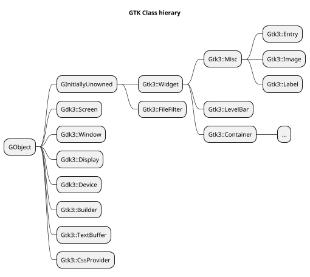
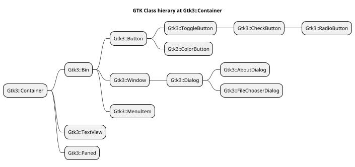
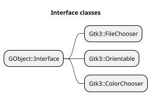
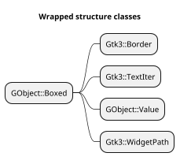

[toc]

# Web site start

```
bundle exec jekyll serve
```

# Codes used in source modules to mark what is tested or not

The codes will show what is tested or not in the source code. The developer can than see what is tested and what is not. The code always start with `#T` followed with a letter for each type or action;
  * `L` module load
  * `M` method
  * `S` signal
  * `P` for properties
  * `E` for enums
  * `T` for structures
Then a colon ':' with a digit to show it is tested or not; 0 not tested, 1 tested in test script, 2 tested elsewhere, 4 used elsewhere (binary, so combinations are possible. 2 and 4 is not easy to find out). Then another colon followed with the name of the module, method, signal or type. E.g. `#TL:1:Gnome::Gtk3::Widget` or `#TM:0:gtk_widget_get_path`. When 2 and 4 are set, or combinations thereof, another column might follow to show the source. There might be more than one. E.g. `TM:3:gtk_color_chooser_add_palette:ColorChooserWidget`.

Absence of codes means that a particular item is not tested.


# Types of gtk and (native) types in perl6

| GTK Type | typedef | Native Perl6 | Perl6 Type | Note |
| -------- | ------- | ------------ | ---------- | ---- |
| gboolean | gint    | int32        | Int        |
|
| gchar *  | char *  | str          | Str        |
|
| gchar    | char    | int8         | Int        | +/- n % 2**7 - 1
| gshort   | short   | int16        | Int        | +/- n % 2**15 - 1
| glong    | long    | int64        | Int        | +/- n % 2**63 - 1
| gint8    | char    | int8         | Int        | +/- n % 2**7 -1
| gint16   | short   | int16        | Int        | +/- n % 2**15 - 1
| gint32   | int     | int32        | Int        | +/- n % 2**31 - 1
| gint64   | long    | int64        | Int        | +/- n % 2**63 - 1
|
| gint     | int     | int32        | Int        | +/- n % 2**31 - 1
|
| guchar   | un. char  | uint8, byte  | Int      | n % 2**8 - 1
| gushort  | un. short | uint16       | Int      | n % 2**16 - 1
| gulong   | un. long  | uint64       | Int      | n % 2**64 - 1
| guint8   | un. char  | uint8        | Int      | n % 2**8 - 1
| guint16  | un. short | uint16       | Int      | n % 2**16 - 1
| guint32  | un. int   | uint32       | Int      | n % 2**32 - 1
| guint64  | un. long  | uint64       | Int      | n % 2**64 - 1
|
| guint    | un. int   | uint32       | Int      | +/- n % 2**31 - 1
|
| gssize   | long      | int64        | Int      |
| gsize    | un. long  | uint64       | Int      |
| goffset  | gint64    | int64        | Int      |
|
| gfloat   | float     | num32        | Num      |
| gdouble  | double    | num64        | Num      |
|
| GType    | int32
| GQuark   | int32
| GError   |           |              | N-GError
| GList    |           |              | N-GList
| GSList   |           |              | N-GSList

# Interface using modules

The `_fallback()` method in a module, which also uses an interface, should also call a likewise method in that interface module. This method is named `_interface()` and does not need to call callsame() to scan for subs in the parent modules of the interface. An example from `_fallback()` in **Gnome::Gtk3::FileChooserDialog**;

```
method _fallback ( $native-sub is copy --> Callable ) {

  my Callable $s;

  # search this module first
  try { $s = &::($native-sub); }
  try { $s = &::("gtk_file_chooser_dialog_$native-sub"); } unless ?$s;

  # search in the interface module
  if !$s {
    my Gnome::Gtk3::FileChooser $fc .= new(:widget(self.native-gobject));
    $s = $fc._interface($native-sub);
  }

  # any other parent class
  $s = callsame unless ?$s;

  # return result
  $s;
}
```
And the `_interface()` in **Gnome::GObject::Interface**;
```
method _interface ( $native-sub is copy --> Callable ) {

  my Callable $s;
  try { $s = &::($native-sub); }
  try { $s = &::("gtk_file_chooser_$native-sub"); } unless ?$s;

  self.set-class-name-of-sub('GtkFileChooser');

  $s;
}
```

# variable argument lists
This is work of Elizabeth (lizmat)

```
# mail example variable lists
# Vittore Scolari
sub pera-int-f(Str $format, *@args) {
    state $ptr = cglobal(Str, "printf", Pointer);
    my $signature = Signature.new(
        params => (
            Parameter.new(type => Str),
            |(@args.map: { Parameter.new(type => .WHAT) })
        ),

        returns => int32
    );

    my &f = nativecast($signature, $ptr);
    f($format, |@args)
}

pera-int-f("Pera + Mela = %d + %d %s\n", 25, 12, "cippas");
```


<!--








-->
<!--
```plantuml
scale 0.7
hide members
hide circle

title Standalone classes

class X

class GLib::Main
class GLib::List
class GLib::SList
class GObject::Type
class GObject::Signal

class Gtk3::Main
```
-->


```plantuml
scale 0.7
title Dependency details of some of the packages and classes therein


package Gtk3 {
  class Gtk3::Builder

  'Gtk3::Builder .. dep1
}

package Gdk3 {
  class Gdk3::Events

  class GdkEvent << (S, #dfdfff) Struct >>
}

package GObject {
  class GObject::Object {
    N-GObject $!gobject
    GSignal $!g-signal
    Array $builders
  }

  'hide members
  class GObject::Signal
}

'class usage
Gtk3::Builder "0..*" --o GObject::Object
'Gtk3::Builder --|> GObject::Object
'GObject::Object *-> GObject::Signal
GObject::Signal <--* GObject::Object
GObject::Signal o--> "GdkEvent"
Gdk3::Events o-> GdkEvent

'package dependencies
Gtk3 ...> Gdk3
note right on link
  Nomal use as some Gtk3
  classes use Gdk3 classes
end note

Gtk3 ...> GObject
note right on link
  Normal use as many Gtk3
  classes inherit from
  Gobject::Object
end note

Gtk3 <... GObject
note right on link
  dependency is solved by
  handing over the Builder
  address to GObject

  also dependency on Gtk3::Main
  is solved by redefining a sub
  to initialize GTK+
end note

Gdk3 ..> GObject
note right on link
  Normal use as some Gdk3
  classes inherit from
  Gobject::Object
end note

Gdk3 <.. GObject
note right on link
  dependency solved by
  moving some sub
  declarations to GObject
  and Gtk3::Wiget
end note
```

<!-- Restjes ...

```plantuml
scale 0.7
hide members
hide circle

'class Gui
'class GSignal
'GSignal <|-- Gtk3::Widget
'X <-* Gui


Gtk3::Bin <|-- Gtk3::Button
Gtk3::Button <|-- Gtk3::ToggleButton
Gtk3::ToggleButton <|-- Gtk3::CheckButton
Gtk3::CheckButton <|-- Gtk3::RadioButton

Gtk3::Bin <|-- Gtk3::Window
Gtk3::Window <|-- Gtk3::Dialog
Gtk3::Dialog <|-- Gtk3::AboutDialog
Gtk3::Dialog <|-- Gtk3::FileChooserDialog

Gtk3::Widget <|-- Gtk3::Label
Gtk3::Widget <|-- Gtk3::Entry

Gtk3::Container <|-- Gtk3::Bin
Gtk3::Container <|-- Gtk3::TextView
Gtk3::Widget <|-- Gtk3::Container

GInitiallyUnowned <|-- Gtk3::Widget
GObject <|-- GInitiallyUnowned

Gtk3::Bin <|-- Gtk3::MenuItem

GInitiallyUnowned <|-- Gtk3::FileFilter

```
-->
