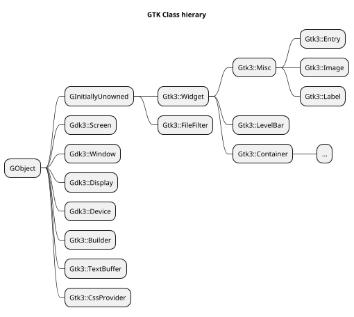
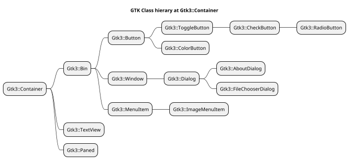
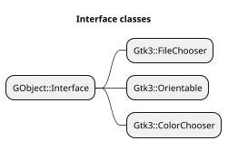
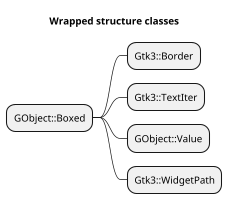

[toc]

# Codes used in source modules to mark what is tested or not

The codes will show what is tested or not in the source code. The developer can than see what is tested and what is not. The code always start with `#T` followed with a letter for each type or action; `L` module load, `M` method, `S` signal, `P` for properties, `E` for enums and `T` for structures. Then a colon ':' with '+' or '-' to show it is tested or not. Then another colon followed with the name of the module, method, signal or type. E.g. `#TL:+:Gnome::Gtk3::Widget` or `#TM:-:gtk_widget_get_path`.

Absence of codes means that a particular item is not tested.


# Types of gtk and (native) types in perl6

| GTK Type | typedef | Native Perl6 | Perl6 Type | Note |
| -------- | ------- | ------------ | ---------- | ---- |
| gboolean | gint    | int32        | Int        |
|
| gchar *  | char *  | str          | Str        |
|
| gchar    | char    | int8         | Int        | +/- n % 2**7 - 1
| gshort   | short   | int16        | Int        | +/- n % 2**15 - 1
| glong    | long    | int64        | Int        | +/- n % 2**63 - 1
| gint8    | char    | int8         | Int        | +/- n % 2**7 -1
| gint16   | short   | int16        | Int        | +/- n % 2**15 - 1
| gint32   | int     | int32        | Int        | +/- n % 2**31 - 1
| gint64   | long    | int64        | Int        | +/- n % 2**63 - 1
|
| gint     | int     | int32        | Int        | +/- n % 2**31 - 1
|
| guchar   | un. char  | uint8, byte  | Int      | n % 2**8 - 1
| gushort  | un. short | uint16       | Int      | n % 2**16 - 1
| gulong   | un. long  | uint64       | Int      | n % 2**64 - 1
| guint8   | un. char  | uint8        | Int      | n % 2**8 - 1
| guint16  | un. short | uint16       | Int      | n % 2**16 - 1
| guint32  | un. int   | uint32       | Int      | n % 2**32 - 1
| guint64  | un. long  | uint64       | Int      | n % 2**64 - 1
|
| guint    | un. int   | uint32       | Int      | +/- n % 2**31 - 1
|
| gssize   | long      | int64        | Int      |
| gsize    | un. long  | uint64       | Int      |
| goffset  | gint64    | int64        | Int      |
|
| gfloat   | float     | num32        | Num      |
| gdouble  | double    | num64        | Num      |
|
| GType    | int32
| GQuark   | int32

# Class hierargy
* Below are diagrams of what is implemented. See also the [object hierarchy in GTK docs](https://developer.gnome.org/gtk3/stable/ch02.html).










<!--
```plantuml
scale 0.7
hide members
hide circle

title Standalone classes

class X

class GLib::Main
class GLib::List
class GLib::SList
class GObject::Type
class GObject::Signal

class Gtk3::Main
```
-->


```plantuml
scale 0.7
title Dependency details of some of the packages and classes therein


package Gtk3 {
  class Gtk3::Builder

  'Gtk3::Builder .. dep1
}

package Gdk3 {
  class Gdk3::Events

  class GdkEvent << (S, #dfdfff) Struct >>
}

package GObject {
  class GObject::Object {
    N-GObject $!gobject
    GSignal $!g-signal
    Array $builders
  }

  'hide members
  class GObject::Signal
}

'class usage
Gtk3::Builder "0..*" --o GObject::Object
'Gtk3::Builder --|> GObject::Object
'GObject::Object *-> GObject::Signal
GObject::Signal <--* GObject::Object
GObject::Signal o--> "GdkEvent"
Gdk3::Events o-> GdkEvent

'package dependencies
Gtk3 ...> Gdk3
note right on link
  Nomal use as some Gtk3
  classes use Gdk3 classes
end note

Gtk3 ...> GObject
note right on link
  Normal use as many Gtk3
  classes inherit from
  Gobject::Object
end note

Gtk3 <... GObject
note right on link
  dependency is solved by
  handing over the Builder
  address to GObject

  also dependency on Gtk3::Main
  is solved by redefining a sub
  to initialize GTK+
end note

Gdk3 ..> GObject
note right on link
  Normal use as some Gdk3
  classes inherit from
  Gobject::Object
end note

Gdk3 <.. GObject
note right on link
  dependency solved by
  moving some sub
  declarations to GObject
  and Gtk3::Wiget
end note
```

<!-- Restjes ...

```plantuml
scale 0.7
hide members
hide circle

'class Gui
'class GSignal
'GSignal <|-- Gtk3::Widget
'X <-* Gui


Gtk3::Bin <|-- Gtk3::Button
Gtk3::Button <|-- Gtk3::ToggleButton
Gtk3::ToggleButton <|-- Gtk3::CheckButton
Gtk3::CheckButton <|-- Gtk3::RadioButton

Gtk3::Bin <|-- Gtk3::Window
Gtk3::Window <|-- Gtk3::Dialog
Gtk3::Dialog <|-- Gtk3::AboutDialog
Gtk3::Dialog <|-- Gtk3::FileChooserDialog

Gtk3::Widget <|-- Gtk3::Label
Gtk3::Widget <|-- Gtk3::Entry

Gtk3::Container <|-- Gtk3::Bin
Gtk3::Container <|-- Gtk3::TextView
Gtk3::Widget <|-- Gtk3::Container

GInitiallyUnowned <|-- Gtk3::Widget
GObject <|-- GInitiallyUnowned

Gtk3::Bin <|-- Gtk3::MenuItem
Gtk3::MenuItem <|-- Gtk3::ImageMenuItem

GInitiallyUnowned <|-- Gtk3::FileFilter

```
-->

# Notes

* Sometimes I had to stray away from the native function names because of the way one has to define it in perl6. This is caused by the possibility of returning or specifying different types of values depending on how the function is used. E.g. `g_slist_nth_data()` can return several types of data. This is solved using several subs linking to the same native sub. In this library, the methods `g_slist_nth_data_str()` and `g_slist_nth_data_gobject()` are created. This can be extended for integers, reals and other types.

```
sub g_slist_nth_data_str ( N-GSList $list, uint32 $n --> Str )
  is native(&gtk-lib)
  is symbol('g_slist_nth_data')
  { * }

sub g_slist_nth_data_gobject ( N-GSList $list, uint32 $n --> N-GObject )
  is native(&gtk-lib)
  is symbol('g_slist_nth_data')
  { * }
```
  Other causes are variable argument lists where I had to choose for the extra arguments. E.g. in the `GtkFileChooserDialog` the native sub `gtk_file_chooser_dialog_new` has a way to extend it with a number of buttons on the dialog. I had to fix that list to a known number of arguments and renamed the sub `gtk_file_chooser_dialog_new_two_buttons`.

  1) The `CALL-ME` method is coded in such a way that a native widget can be set or retrieved easily. E.g.
```
my Gnome::Gtk3::Label $label .= new(:label('my label'));
my Gnome::Gtk3::Grid $grid .= new;
$grid.gtk_grid_attach( $label(), 0, 0, 1, 1);
```
  Notice how the native widget is retrieved with `$label()`. However this method is mostly internally only. See also [9].

  2) The `FALLBACK` method is used to test for the defined native functions as if the functions where methods. It calls the `fallback` methods in the class which in turn call the parent fallback using `callsame`. The resulting function addres is returned and processed with the `test-call` functions from **Gnome::N::X**. Thrown exceptions are handled by the function `test-catch-exception` from the same module.

  3) `N-GObject` is a native widget which is held internally in most of the classes. Sometimes they need to be handed over in a call or stored when it is returned.

  4) Each method can at least be called with perl6 like dashes in the method name. E.g. `gtk_container_add` can be written as `gtk-container-add`.

  5) In some cases the calls can be shortened too. E.g. `gtk_button_get_label` can also be called like `get_label` or `get-label`. Sometimes, when shortened, calls can end up with a call using the wrong native widget. When in doubt use the complete method name.

  6) Also a sub like `gtk_button_new` cannot be shortened because it will call the perl6 init method `new()`. These methods are used when initializing classes, in this case to initialize a `Gnome::Gtk3::Button` class. In the documentation, the use of brackets **[ ]** show which part can be chopped. E.g. `[gtk_button_] get_label`.

  7) All classes deriving from `GTK::V3::Glib::GObject` know about the `:widget(…)` named attribute when instantiating a widget class. This is used when the result of another native sub returns a N-GObject. E.g. cleaning a list box;
```
my Gnome::Gtk3::ListBox $list-box .= new(:build-id<someListBox>);
loop {
  # Keep the index 0, entries will shift up after removal
  my $nw = $list-box.get-row-at-index(0);
  last unless $nw.defined;

  # Instantiate a container object using the :widget argument
  my Gnome::Gtk3::Bin $lb-row .= new(:widget($nw));
  $lb-row.gtk-widget-destroy;
}
```

  8) The named argument `:build-id(…)` is used to get a N-GObject from a `Gnome::Gtk3::Builder` object. It does something like `$builder.gtk_builder_get_object(…)`. A builder must be initialized and loaded with a GUI description before to be useful. For this, see also `GTK::Glade`. This option works for all child classes too if those classes are managed by `GtkBuilder`. E.g.
```
my Gnome::Gtk3::Label $label .= new(:build-id<inputLabel>);
```

  9) Sometimes a `N-GObject` must be given as a parameter. As mentioned above in [1] the CALL-ME method helps to return that object. To prevent mistakes (forgetting the '()' after the object), the parameters to the call are checked for the use of a `GTK::V3::Glib::GObject` instead of the native object. When encountered, the parameters are automatically converted. E.g.
```
my Gnome::Gtk3::Button $button .= new(:label('press here'));
my Gnome::Gtk3::Label $label .= new(:label('note'));

my Gnome::Gtk3::Grid $grid .= new(:empty);
$grid.attach( $button, 0, 0, 1, 1);
$grid.attach( $label, 0, 1, 1, 1);
```
Here in the call to `gtk_grid_attach` \$button and \$label is used instead of \$button() and \$label().

  10) The C functions can only return simple values like int32, num64 etc. When a structure must be returned, it is returned in a value given in the argument list. Mostly this is implemented by using a pointer to the structure. Perl users are used to be able to return all sorts of types. To provide this behavior, the native sub is wrapped in another sub which can return the result and directly assigned to some variable. **_This is not yet implemented!_**
    The following line where a GTK::V3::Gdk::GdkRectangle is returned;
```
my GTK::V3::Gdk3::Rectangle $rectangle;
$range.get-range-rect($rectangle);
```
could then be rewritten as;
```
my GTK::V3::Gdk::GdkRectangle $rectangle = $range.get-range-rect();
```

  11) There is no Boolean type in C. All Booleans are integers and only 0 (False) or 1 (True) is used. Also here to use Perl6 Booleans, the native sub must be wrapped into another sub to transform the variables. **_This is not yet implemented!_**

  12) Sometimes a native sub wants to return more than one value. In GTK+ C code one must give a pointer to a location wherein the value can be returned. In perl6 one must add a trait `is rw` to the argument of the native sub to create a pointer. In these packages this going wrong because of some manipulations of the arguments. This is solved by creating a wrapper around the native sub, the arguments can be provided locally and after the call, the wrapper returns a list of values. **This is not yet fully implemented!**

  An example from `Gnome::Gdk3::Window`;
```
sub gdk_window_get_position ( N-GObject $window --> List ) is inlinable {
  _gdk_window_get_position( $window, my int32 $x, my int32 $y);
  ( $x, $y)
}

sub _gdk_window_get_position (
  N-GObject $window, int32 $x is rw, int32 $y is rw
) is native(&gdk-lib)
  is symbol('gdk_window_get_position')
  { * }
```
