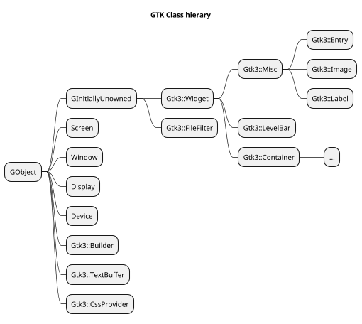
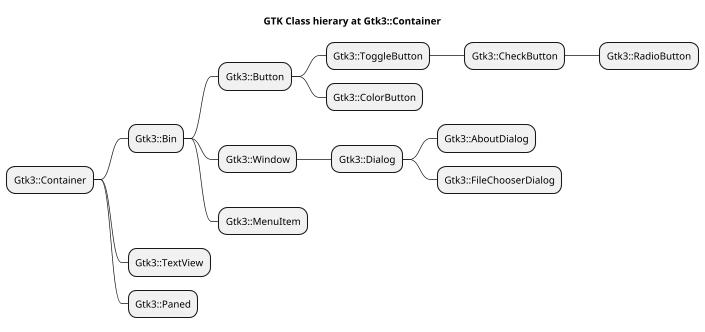
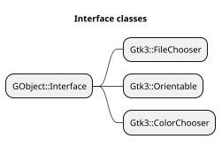
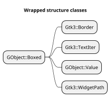

[toc]

# Command line
Recognized options by GTK
See https://www.systutorials.com/docs/linux/man/7-gtk-options/

# Web site start

```
bundle exec jekyll serve
```
# native sub search
```
  SomeModule.some-sub()
  Gnome::GObject::Object.FALLBACK()
    translate some-sub -> some_sub
    SomeModule._fallback
      try some-sub or Gxyz_somemodule_some_sub => sub address
      callsame() if no address until one is found
    Substitute native objects for Raku objects in argument list
    Cast first argument when sub is found in another class

    Gnome::N::X.test-call()
```

# Make example code downloadable archives

* Tar `tar cvfz todo-viewer.tgz --exclude '.precomp' todo-viewer/`
* Zip `zip -r todo-viewer.zip todo-viewer --exclude '*.precomp*'`

# Codes used in source modules to mark what is tested or not

The codes will show what is tested or not in the source code. The developer can than see what is tested and what is not. The code always start with `#T` followed with a letter for each type or action;
  * `L` module load
  * `M` method
  * `S` signal
  * `P` for properties
  * `E` for enums
  * `T` for structures
Then a colon ':' with a hex digit to show if it is tested or not;
  * 0 not tested
  * 1 tested in test script
  * 2 tested elsewhere
  * 4 used elsewhere
  * FF Not supported
It is binary, so combinations are possible exept with 16. 2 and 4 is not easy to find out. Then another colon followed with the name of the module, method, signal or type. E.g. `#TL:1:Gnome::Gtk3::Widget` or `#TM:0:gtk_widget_get_path`. When 2 and 4 are set, or combinations thereof, another column might follow to show the source. There might be more than one. E.g. `TM:3:gtk_color_chooser_add_palette:ColorChooserWidget`.

Absence of codes means that a particular item is not tested.

# Proto use with multi sub
Need a proto because otherwise the signature.parms will
become Mu in Gnome::N::test-call()
```
proto gtk_builder_add_from_file ( N-GObject, Str, |) { * }
multi sub gtk_builder_add_from_file (
  N-GObject $builder, Str $filename, Any $error
  --> uint32
) { ... }

multi ...
```

# Interface using modules

The `_fallback()` method in a module, which also uses an interface, should also call a likewise method in that interface module. This method is named `_xyz_interface()` and does not need to call callsame() to scan for subs in the parent modules of the interface. An example from `_fallback()` in **Gnome::Gtk3::FileChooserDialog**;

```
unit class Gnome::Gtk3::FileChooserDialog;
also is Gnome::Gtk3::Dialog;                # parent class
also does Gnome::Gtk3::FileChooser;         # interface
also does Gnome::Gtk3::Buildable;           # interface

...

method _fallback ( $native-sub is copy --> Callable ) {

  my Callable $s;

  # search this module first
  try { $s = &::($native-sub); }
  try { $s = &::("gtk_file_chooser_dialog_$native-sub"); } unless ?$s;

  # then in interfaces
  $s = self._buildable_interface($native-sub) unless ?$s;
  $s = self._file_chooser_interface($native-sub) unless ?$s;

  # stamp class mark on it
  self.set-class-name-of-sub('GtkFileChooserDialog') if $s;

  # then parent classes
  $s = callsame unless ?$s;

  # return result
  $s;
}
```
And the interface sub in e.g. Buildable;
```
method _buildable_interface ( Str $native-sub --> Callable ) {

  my Callable $s;
  try { $s = &::("$native-sub"); };
  try { $s = &::("gtk_buildable_$native-sub"); } unless ?$s;

  $s
}
```
Interfaces can also define signals sometimes. Define this like so in the interfacing module;
```
method _file_chooser_add_signal_types ( Str $class-name ) {

  self.add-signal-types( $class-name, :w2<row-changed row-inserted>);
  callsame;
}
```
and call this from the interface using class like so;
```
submethod BUILD ( *%options ) {

  # add signal info in the form of group<signal-name>.
  # groups are e.g. signal, event, nativeobject etc
  unless $signals-added {
    $signals-added = self.add-signal-types( $?CLASS.^name,
      :w0<columns-changed cursor-changed select-all unselect-all toggle-cursor-row select-cursor-parent start-interactive-search>,
      :w1<select-cursor-row>,
      :w2<row-activated test-expand-row test-collapse-row row-expanded row-collapsed move-cursor>,
      :w3<expand-collapse-cursor-row>,
    );

    self._file_chooser_add_signal_types($?CLASS.^name);
  }

```
All this is a bit awkward and messy and is all because of using a role for an interface module instead of using classes. It is not possible to define the same method in several roles, like e.g. `_interface()` because they clash when the same role is imported multiple times in the tree. Classes would behave better and then callsame could be used too. The problem then would be (surely for Buildable) that an interface class is inherited by multiple classes which are in the same inheritance tree;


```plantuml
scale 0.7
title Dependency details for hierargy and interfaces, plan A

'class TopLevelClassSupport << (C, #efad00) catch all class >>
class UserClass << (C, #00ffff) user class >>
class Buildable << (I, #efed80) Interface >>

Buildable <|-- Widget
Buildable <|-- Container
Buildable <|-- Bin
Buildable <|-- Button

'TopLevelClassSupport <|-- Object
Object <|-- InitiallyUnowned
InitiallyUnowned <|-- Widget
Widget <|-- Container
Container <|-- Bin
Bin <|-- Button
Button <|-- UserClass

```
## Review the use of interfaces and where they are being used

If you look in the diagram above, we see that **Buildable** is used in all classes below **InitiallyUnowned**. The methods are kind of inherited by the classes below it. Following this we should then use something like the diagram below. By the way, the latest developments are that a 'catch all' class is build and displayed below too.

```plantuml

scale 0.7
title Dependency details for hierargy and interfaces, plan B

class TopLevelClassSupport << (C, #efad00) catch all class >>
class TopLevelInterfaceSupport << (I, #efad00) catch all interface >>
class Buildable << (I, #efed80) Interface >>

TopLevelInterfaceSupport <|-- Buildable
Buildable <|-- Widget
class UserClass << (C, #00ffff) user class >>

TopLevelClassSupport <|-- Object
Object <|-- InitiallyUnowned
InitiallyUnowned <|-- Widget
Widget <|-- Container
Container <|-- Bin
Bin <|-- Button
Button <|-- UserClass
```

This is a lot easier. To see if this is at all possible, a list must be made of classes who use an interface and if the below classes are using it too. In a way they did, e.g. if **Button** did not had the interface to **Buildable**, it would use the calls of the interface used by **Bin** or **Container** so effectively it is the same as in the second diagram.

Below is a tree of modules. The letters are explained at the bottom.

```
Tree of Gtk C structures                              Interface use
----------------------------------------------------- ------------------------
GObject                                               
├── GInitiallyUnowned
│   ├── GtkWidget                                     b
│   │   ├── GtkContainer                              b
│   │   │   ├── GtkBin                                b
│   │   │   │   ├── GtkWindow                         b
│   │   │   │   │   ├── GtkDialog                     b
│   │   │   │   │   │   ├── GtkAboutDialog            b
│   │   │   │   │   │   ├── GtkAppChooserDialog       b,ap
│   │   │   │   │   │   ├── GtkColorChooserDialog     b,cc
│   │   │   │   │   │   ├─✗ GtkColorSelectionDialog   b
│   │   │   │   │   │   ├── GtkFileChooserDialog      b,fic
│   │   │   │   │   │   ├── GtkFontChooserDialog      b,foc
│   │   │   │   │   │   ├─✗ GtkFontSelectionDialog    b
│   │   │   │   │   │   ├── GtkMessageDialog          b
│   │   │   │   │   │   ├── GtkPageSetupUnixDialog    b
│   │   │   │   │   │   ├── GtkPrintUnixDialog        b
│   │   │   │   │   │   ╰── GtkRecentChooserDialog    b,rc
│   │   │   │   │   ├── GtkApplicationWindow          b
│   │   │   │   │   ├── GtkAssistant                  b
│   │   │   │   │   ├── GtkOffscreenWindow            b
│   │   │   │   │   ├── GtkPlug                       b
│   │   │   │   │   ╰── GtkShortcutsWindow            b
│   │   │   │   ├── GtkActionBar                      b
│   │   │   │   ├─✗ GtkAlignment                      b
│   │   │   │   ├── GtkComboBox                       b,cl,ce
│   │   │   │   │   ├── GtkAppChooserButton           b,ap,cl,ce
│   │   │   │   │   ╰── GtkComboBoxText               b,cl,ce
│   │   │   │   ├── GtkFrame                          b
│   │   │   │   │   ╰── GtkAspectFrame                b
│   │   │   │   ├── GtkButton                         b,ac
│   │   │   │   │   ├── GtkToggleButton               b,ac
│   │   │   │   │   │   ├── GtkCheckButton            b,ac
│   │   │   │   │   │   │   ╰── GtkRadioButton        b,ac
│   │   │   │   │   │   ╰── GtkMenuButton             b,ac
│   │   │   │   │   ├── GtkColorButton                b,ac,cc
│   │   │   │   │   ├── GtkFontButton                 b,ac,foc
│   │   │   │   │   ├── GtkLinkButton                 b,ac
│   │   │   │   │   ├── GtkLockButton                 b,ac
│   │   │   │   │   ├── GtkModelButton                b,ac
│   │   │   │   │   ╰── GtkScaleButton                b,o,ac
│   │   │   │   │       ╰── GtkVolumeButton           b,o,ac
│   │   │   │   ├── GtkMenuItem                       b,ac
│   │   │   │   │   ├── GtkCheckMenuItem              b,ac
│   │   │   │   │   │   ╰── GtkRadioMenuItem          b,ac
│   │   │   │   │   ├─✗ GtkImageMenuItem              b,ac
│   │   │   │   │   ├── GtkSeparatorMenuItem          b,ac
│   │   │   │   │   ╰─✗ GtkTearoffMenuItem            b,ac
│   │   │   │   ├── GtkEventBox                       b
│   │   │   │   ├── GtkExpander                       b
│   │   │   │   ├── GtkFlowBoxChild                   b
│   │   │   │   ├── GtkHandleBox                      b
│   │   │   │   ├── GtkListBoxRow                     b,ac
│   │   │   │   ├── GtkToolItem                       b
│   │   │   │   │   ├── GtkToolButton                 b,ac
│   │   │   │   │   │   ├── GtkMenuToolButton         b,ac
│   │   │   │   │   │   ╰── GtkToggleToolButton       b,ac
│   │   │   │   │   │       ╰── GtkRadioToolButton    b,ac
│   │   │   │   │   ╰── GtkSeparatorToolItem          b
│   │   │   │   ├── GtkOverlay                        b
│   │   │   │   ├── GtkScrolledWindow                 b
│   │   │   │   │   ╰── GtkPlacesSidebar              b
│   │   │   │   ├── GtkPopover                        b
│   │   │   │   │   ╰── GtkPopoverMenu                b
│   │   │   │   ├── GtkRevealer                       b
│   │   │   │   ├── GtkSearchBar                      b
│   │   │   │   ├── GtkStackSidebar                   b
│   │   │   │   ╰── GtkViewport                       b,s
│   │   │   ├── GtkBox                                b,o
│   │   │   │   ├── GtkAppChooserWidget               b,o,ap
│   │   │   │   ├── GtkButtonBox                      b,o
│   │   │   │   │   ├─✗ GtkHButtonBox                 b,o
│   │   │   │   │   ╰─✗ GtkVButtonBox                 b,o
│   │   │   │   ├── GtkColorChooserWidget             b,o,cc
│   │   │   │   ├─✗ GtkColorSelection                 b,o
│   │   │   │   ├── GtkFileChooserButton              b,o,fic
│   │   │   │   ├── GtkFileChooserWidget              b,o,fic
│   │   │   │   ├── GtkFontChooserWidget              b,o,foc
│   │   │   │   ├─✗ GtkFontSelection                  b,o
│   │   │   │   ├─✗ GtkHBox                           b,o
│   │   │   │   ├── GtkInfoBar                        b,o
│   │   │   │   ├── GtkRecentChooserWidget            b,o,rc
│   │   │   │   ├── GtkShortcutsSection               b,o
│   │   │   │   ├── GtkShortcutsGroup                 b,o
│   │   │   │   ├── GtkShortcutsShortcut              b,o
│   │   │   │   ├── GtkStackSwitcher                  b,o
│   │   │   │   ├── GtkStatusbar                      b,o
│   │   │   │   ╰─✗ GtkVBox                           b,o
│   │   │   ├── GtkFixed                              b
│   │   │   ├── GtkFlowBox                            b,o
│   │   │   ├── GtkGrid                               b,o
│   │   │   ├── GtkHeaderBar                          b
│   │   │   ├── GtkPaned                              b,o
│   │   │   │   ├─✗ GtkHPaned                         b,o
│   │   │   │   ╰─✗ GtkVPaned                         b,o
│   │   │   ├── GtkIconView                           b,cl,s
│   │   │   ├── GtkLayout                             b,s
│   │   │   ├── GtkListBox                            b
│   │   │   ├── GtkMenuShell                          b
│   │   │   │   ├── GtkMenuBar                        b
│   │   │   │   ╰── GtkMenu                           b
│   │   │   │       ╰── GtkRecentChooserMenu          b,rc
│   │   │   ├── GtkNotebook                           b
│   │   │   ├── GtkSocket                             b
│   │   │   ├── GtkStack                              b
│   │   │   ├─✗ GtkTable                              b
│   │   │   ├── GtkTextView                           b,s
│   │   │   ├── GtkToolbar                            b,o,tsh
│   │   │   ├── GtkToolItemGroup                      b,tsh
│   │   │   ├── GtkToolPalette                        b,o,s
│   │   │   ╰── GtkTreeView                           b,s
│   │   ├─✗ GtkMisc                                   b
│   │   │   ├── GtkLabel                              b
│   │   │   │   ╰── GtkAccelLabel                     b
│   │   │   ├─✗ GtkArrow                              b
│   │   │   ╰── GtkImage                              b
│   │   ├── GtkCalendar                               b
│   │   ├── GtkCellView                               b,o,cl
│   │   ├── GtkDrawingArea                            b
│   │   ├── GtkEntry                                  b,ce,e
│   │   │   ├── GtkSearchEntry                        b,ce,e
│   │   │   ╰── GtkSpinButton                         b,o,ce,e
│   │   ├── GtkGLArea                                 b
│   │   ├── GtkRange                                  b,o
│   │   │   ├── GtkScale                              b,o
│   │   │   │   ├─✗ GtkHScale                         b,o
│   │   │   │   ╰─✗ GtkVScale                         b,o
│   │   │   ╰── GtkScrollbar                          b,o
│   │   │       ├─✗ GtkHScrollbar                     b,o
│   │   │       ╰─✗ GtkVScrollbar                     b,o
│   │   ├── GtkSeparator                              b,o
│   │   │   ├─✗ GtkHSeparator                         b,o
│   │   │   ╰─✗ GtkVSeparator                         b,o
│   │   ├─✗ GtkHSV                                    b
│   │   ├─✗ GtkInvisible                              b
│   │   ├── GtkProgressBar                            b,o
│   │   ├── GtkSpinner                                b
│   │   ├── GtkSwitch                                 b,ac
│   │   ╰── GtkLevelBar                               b,o
│   ├── GtkAdjustment
│   ├── GtkCellArea                                   b,cl
│   │   ╰── GtkCellAreaBox                            b,o,cl
│   ├── GtkCellRenderer                               
│   │   ├── GtkCellRendererText                       
│   │   │   ├── GtkCellRendererAccel                  
│   │   │   ├── GtkCellRendererCombo                  
│   │   │   ╰── GtkCellRendererSpin                   
│   │   ├── GtkCellRendererPixbuf                     
│   │   ├── GtkCellRendererProgress                   o
│   │   ├── GtkCellRendererSpinner                    
│   │   ╰── GtkCellRendererToggle                     
│   ├── GtkFileFilter                                 b
│   ├── GtkTreeViewColumn                             b,cl
│   ╰── GtkRecentFilter                               b
├── GtkAccelGroup
├── GtkAccelMap
├── AtkObject
│   ╰── GtkAccessible
├─✗ GtkAction                                         b
│   ├─✗ GtkToggleAction                               b
│   │   ╰─✗ GtkRadioAction                            b
│   ╰─✗ GtkRecentAction                               b,rc
├─✗ GtkActionGroup                                    b
├── GApplication                                      
│   ╰── GtkApplication                                
├── GtkBuilder                                        
├── GtkCellAreaContext
├── GtkClipboard
├── GtkCssProvider                                    sp
├── GtkEntryBuffer                                    
├── GtkEntryCompletion                                b,cl
├── GtkEventController
│   ├── GtkEventControllerKey
│   ├── GtkEventControllerMotion
│   ├── GtkEventControllerScroll
│   ├── GtkGesture
│   │   ├── GtkGestureSingle
│   │   │   ├── GtkGestureDrag
│   │   │   │   ╰── GtkGesturePan
│   │   │   ├── GtkGestureLongPress
│   │   │   ├── GtkGestureMultiPress
│   │   │   ├── GtkGestureStylus
│   │   │   ╰── GtkGestureSwipe
│   │   ├── GtkGestureRotate
│   │   ╰── GtkGestureZoom
│   ╰── GtkPadController
├── GtkIconFactory                                    b
├── GtkIconTheme
├── GtkIMContext
│   ├── GtkIMContextSimple
│   ╰── GtkIMMulticontext
├── GtkListStore                                      b,tm,tds,tdd,ts
├── GMountOperation                                   
│   ╰── GtkMountOperation                             
├── GEmblemedIcon                                     
│   ╰─✗ GtkNumerableIcon                              
├── GtkPageSetup
├── GtkPrinter
├── GtkPrintContext
├── GtkPrintJob
├── GtkPrintOperation                                 pop
├── GtkPrintSettings
├── GtkRcStyle
├── GtkRecentManager
├── GtkSettings                                       sp
├── GtkSizeGroup                                      b
├─✗ GtkStatusIcon                                     
├─✗ GtkStyle                                          
├── GtkStyleContext                                   
├── GtkTextBuffer                                     
├── GtkTextChildAnchor
├── GtkTextMark
├── GtkTextTag                                        
├── GtkTextTagTable                                   b
├─✗ GtkThemingEngine                                  
├── GtkTreeModelFilter                                tm,tds
├── GtkTreeModelSort                                  tm,tds,ts
├── GtkTreeSelection
├── GtkTreeStore                                      b,tm,tds,tdd,ts
├─✗ GtkUIManager                                      b
├── GtkWindowGroup
├── GtkTooltip
╰── GtkPrintBackend

GInterface                                            
├── GtkBuildable                                      B
├── GtkActionable                                     ac
├─✗ GtkActivatable                                    
├── GtkAppChooser                                     ap
├── GtkCellLayout                                     cl
├── GtkCellEditable                                   ce
├── GtkOrientable                                     o
├── GtkColorChooser                                   cc
├── GtkStyleProvider                                  sp
├── GtkEditable                                       e
├── GtkFileChooser                                    fic
├── GtkFontChooser                                    foc
├── GtkScrollable                                     s
├── GtkTreeModel                                      tm
├── GtkTreeDragSource                                 tds
├── GtkTreeDragDest                                   tdd
├── GtkTreeSortable                                   ts
├── GtkPrintOperationPreview                          pop
├── GtkRecentChooser                                  rc
╰── GtkToolShell                                      tsh
```

A second list is the administration of options to the BUILD process
```
Tree of Gtk C structures                              options
----------------------------------------------------- ------------------------
GObject                                               :native-object
                                                      :build-id
├── GInitiallyUnowned                                 -
│   ├── GtkWidget                                     -
│   │   ├── GtkContainer                              -
│   │   │   ├── GtkBin                                -
│   │   │   │   ├── GtkWindow                         :*
                                                      :title
│   │   │   │   │   ├── GtkDialog                     :*
                                                      :title
│   │   │   │   │   │   ├── GtkAboutDialog            :*
│   │   │   │   │   │   ├── GtkAppChooserDialog       
│   │   │   │   │   │   ├── GtkColorChooserDialog     
│   │   │   │   │   │   ├── GtkFileChooserDialog      
│   │   │   │   │   │   ├── GtkFontChooserDialog      
│   │   │   │   │   │   ├── GtkMessageDialog          
│   │   │   │   │   │   ├── GtkPageSetupUnixDialog    
│   │   │   │   │   │   ├── GtkPrintUnixDialog        
│   │   │   │   │   │   ╰── GtkRecentChooserDialog    
│   │   │   │   │   ├── GtkApplicationWindow          
│   │   │   │   │   ├── GtkAssistant                  
│   │   │   │   │   ├── GtkOffscreenWindow            
│   │   │   │   │   ├── GtkPlug                       
│   │   │   │   │   ╰── GtkShortcutsWindow            
│   │   │   │   ├── GtkActionBar                      
│   │   │   │   ├── GtkComboBox                       
│   │   │   │   │   ├── GtkAppChooserButton           
│   │   │   │   │   ╰── GtkComboBoxText               
│   │   │   │   ├── GtkFrame                          
│   │   │   │   │   ╰── GtkAspectFrame                
│   │   │   │   ├── GtkButton                         
│   │   │   │   │   ├── GtkToggleButton               
│   │   │   │   │   │   ├── GtkCheckButton            
│   │   │   │   │   │   │   ╰── GtkRadioButton        
│   │   │   │   │   │   ╰── GtkMenuButton             
│   │   │   │   │   ├── GtkColorButton                
│   │   │   │   │   ├── GtkFontButton                 
│   │   │   │   │   ├── GtkLinkButton                 
│   │   │   │   │   ├── GtkLockButton                 
│   │   │   │   │   ├── GtkModelButton                
│   │   │   │   │   ╰── GtkScaleButton                
│   │   │   │   │       ╰── GtkVolumeButton           
│   │   │   │   ├── GtkMenuItem                       
│   │   │   │   │   ├── GtkCheckMenuItem              
│   │   │   │   │   │   ╰── GtkRadioMenuItem          
│   │   │   │   │   ├── GtkSeparatorMenuItem          
│   │   │   │   ├── GtkEventBox                       
│   │   │   │   ├── GtkExpander                       
│   │   │   │   ├── GtkFlowBoxChild                   
│   │   │   │   ├── GtkHandleBox                      
│   │   │   │   ├── GtkListBoxRow                     
│   │   │   │   ├── GtkToolItem                       
│   │   │   │   │   ├── GtkToolButton                 
│   │   │   │   │   │   ├── GtkMenuToolButton         
│   │   │   │   │   │   ╰── GtkToggleToolButton       
│   │   │   │   │   │       ╰── GtkRadioToolButton    
│   │   │   │   │   ╰── GtkSeparatorToolItem          
│   │   │   │   ├── GtkOverlay                        
│   │   │   │   ├── GtkScrolledWindow                 
│   │   │   │   │   ╰── GtkPlacesSidebar              
│   │   │   │   ├── GtkPopover                        
│   │   │   │   │   ╰── GtkPopoverMenu                
│   │   │   │   ├── GtkRevealer                       
│   │   │   │   ├── GtkSearchBar                      
│   │   │   │   ├── GtkStackSidebar                   
│   │   │   │   ╰── GtkViewport                       
│   │   │   ├── GtkBox                                
│   │   │   │   ├── GtkAppChooserWidget               
│   │   │   │   ├── GtkButtonBox                      
│   │   │   │   ├── GtkColorChooserWidget             
│   │   │   │   ├── GtkFileChooserButton              
│   │   │   │   ├── GtkFileChooserWidget              
│   │   │   │   ├── GtkFontChooserWidget              
│   │   │   │   ├── GtkInfoBar                        
│   │   │   │   ├── GtkRecentChooserWidget            
│   │   │   │   ├── GtkShortcutsSection               
│   │   │   │   ├── GtkShortcutsGroup                 
│   │   │   │   ├── GtkShortcutsShortcut              
│   │   │   │   ├── GtkStackSwitcher                  
│   │   │   │   ╰── GtkStatusbar                      
│   │   │   ├── GtkFixed                              
│   │   │   ├── GtkFlowBox                            
│   │   │   ├── GtkGrid                               
│   │   │   ├── GtkHeaderBar                          
│   │   │   ├── GtkPaned                              
│   │   │   ├── GtkIconView                           
│   │   │   ├── GtkLayout                             
│   │   │   ├── GtkListBox                            
│   │   │   ├── GtkMenuShell                          
│   │   │   │   ├── GtkMenuBar                        
│   │   │   │   ╰── GtkMenu                           
│   │   │   │       ╰── GtkRecentChooserMenu          
│   │   │   ├── GtkNotebook                           
│   │   │   ├── GtkSocket                             
│   │   │   ├── GtkStack                              
│   │   │   ├── GtkTextView                           
│   │   │   ├── GtkToolbar                            
│   │   │   ├── GtkToolItemGroup                      
│   │   │   ├── GtkToolPalette                        
│   │   │   ╰── GtkTreeView                           
│   │   ├─✗ GtkMisc                                   
│   │   │   ├── GtkLabel                              
│   │   │   │   ╰── GtkAccelLabel                     
│   │   │   ╰── GtkImage                              
│   │   ├── GtkCalendar                               
│   │   ├── GtkCellView                               
│   │   ├── GtkDrawingArea                            
│   │   ├── GtkEntry                                  
│   │   │   ├── GtkSearchEntry                        
│   │   │   ╰── GtkSpinButton                         
│   │   ├── GtkGLArea                                 
│   │   ├── GtkRange                                  
│   │   │   ├── GtkScale                              
│   │   │   ╰── GtkScrollbar                          
│   │   ├── GtkSeparator                              
│   │   ├── GtkProgressBar                            
│   │   ├── GtkSpinner                                
│   │   ├── GtkSwitch                                 
│   │   ╰── GtkLevelBar                               
│   ├── GtkAdjustment
│   ├── GtkCellArea                                   
│   │   ╰── GtkCellAreaBox                            
│   ├── GtkCellRenderer                               
│   │   ├── GtkCellRendererText                       
│   │   │   ├── GtkCellRendererAccel                  
│   │   │   ├── GtkCellRendererCombo                  
│   │   │   ╰── GtkCellRendererSpin                   
│   │   ├── GtkCellRendererPixbuf                     
│   │   ├── GtkCellRendererProgress                   
│   │   ├── GtkCellRendererSpinner                    
│   │   ╰── GtkCellRendererToggle                     
│   ├── GtkFileFilter                                 
│   ├── GtkTreeViewColumn                             
│   ╰── GtkRecentFilter                               
├── GtkAccelGroup
├── GtkAccelMap
├── AtkObject
│   ╰── GtkAccessible
├── GApplication                                      
│   ╰── GtkApplication                                
├── GtkBuilder                                        
├── GtkCellAreaContext
├── GtkClipboard
├── GtkCssProvider                                    
├── GtkEntryBuffer                                    
├── GtkEntryCompletion                                
├── GtkEventController
│   ├── GtkEventControllerKey
│   ├── GtkEventControllerMotion
│   ├── GtkEventControllerScroll
│   ├── GtkGesture
│   │   ├── GtkGestureSingle
│   │   │   ├── GtkGestureDrag
│   │   │   │   ╰── GtkGesturePan
│   │   │   ├── GtkGestureLongPress
│   │   │   ├── GtkGestureMultiPress
│   │   │   ├── GtkGestureStylus
│   │   │   ╰── GtkGestureSwipe
│   │   ├── GtkGestureRotate
│   │   ╰── GtkGestureZoom
│   ╰── GtkPadController
├── GtkIconFactory                                    
├── GtkIconTheme
├── GtkIMContext
│   ├── GtkIMContextSimple
│   ╰── GtkIMMulticontext
├── GtkListStore                                      
├── GMountOperation                                   
│   ╰── GtkMountOperation                             
├── GEmblemedIcon                                     
│   ╰─✗ GtkNumerableIcon                              
├── GtkPageSetup
├── GtkPrinter
├── GtkPrintContext
├── GtkPrintJob
├── GtkPrintOperation                                 
├── GtkPrintSettings
├── GtkRcStyle
├── GtkRecentManager
├── GtkSettings                                       
├── GtkSizeGroup                                      
├── GtkStyleContext                                   
├── GtkTextBuffer                                     
├── GtkTextChildAnchor
├── GtkTextMark
├── GtkTextTag                                        
├── GtkTextTagTable                                   
├── GtkTreeModelFilter                                
├── GtkTreeModelSort                                  
├── GtkTreeSelection
├── GtkTreeStore                                      
├── GtkWindowGroup
├── GtkTooltip
╰── GtkPrintBackend

GInterface                                            
├── GtkBuildable                                      B
├── GtkActionable                                     ac
├── GtkAppChooser                                     ap
├── GtkCellLayout                                     cl
├── GtkCellEditable                                   ce
├── GtkOrientable                                     o
├── GtkColorChooser                                   cc
├── GtkStyleProvider                                  sp
├── GtkEditable                                       e
├── GtkFileChooser                                    fic
├── GtkFontChooser                                    foc
├── GtkScrollable                                     s
├── GtkTreeModel                                      tm
├── GtkTreeDragSource                                 tds
├── GtkTreeDragDest                                   tdd
├── GtkTreeSortable                                   ts
├── GtkPrintOperationPreview                          pop
├── GtkRecentChooser                                  rc
╰── GtkToolShell                                      tsh
```

After plotting the dependencies on **GtkBuildable**, it looks as if the class can be inherited by the highest class where it is needed, such as **Widget** and all child widgets will then have the methods available of that interface. After plotting all interface modules in above chart, the conclusion taken above is correct.
Also the interface module cannot be a role type anymore when it uses the **TopLevelInterfaceSupport** class. This is because there will be clashes when another interface module also inherits from the **TopLevelInterfaceSupport** class.

## Structure of modules, plan B

```plantuml

scale 0.8

class TopLevelClassSupport << (R, #efad00) catch all typed role >> {
  has Any $!n-native-object
  has Bool $.is-valid = False

  has Int $!class-gtype
  has Str $!class-name
  has Str $!class-name-of-sub

  my Bool $gui-initialized = False

  new()

  BUILD()

  FALLBACK()
  _fallback()

  get-native-object()
  set-native-object()

  {abstract} native-object-ref()
  {abstract} native-object-unref()
  clear-object()
  DESTROY()

  set-class-info()
  set-class-name-of-sub()
  get-class-name-of-sub()
  get-class-gtype()
}

note left of TopLevelClassSupport
  <b>$!n-native-object</b> is where the native object
  is stored. It is used by the toplevel class and its
  descendent classes. The type is always the same as
  set by all classes inheriting from the same toplevel
  class.

  <b>$.is-valid</b> is a readable variable and is checked
  to see if $!n-native-object is valid.

  <b>$!class-gtype</b>, <b>$!class-name</b> and
  <b>$!class-name-of-sub</b> are used to keep track
  of native class types and names.

  <b>$gui-initialized</b> is used to check on native
  initialization. It is defined that it is global to all
  of the TopLevelClassSupport classes.

  --

  Method <b>new()</b> is defined to cleanup the native object
  in case of an assignement like <b><i>$c .= new(...);</i></b>.
  The native object, if any, must be cleared first.

  <b>BUILD()</b> must check for <b>$gui-initialized</b>
  and also handle the <b>:native-object</b> option

  <b>FALLBACK</b> is called when a method is not available
  in the classes. It starts a search for a native sub with
  the method name in the tree using <b>_fallback()</b>. The
  search starts at the lowest child _fallback() working up
  to the top level class.

  The search will end with this <b>_fallback()</b>.

  <b>get-native-object()</b> and <b>set-native-object()</b>
  get and set the native object. They also handle
  referencing.

  {abstract} native-object-ref()
  {abstract} native-object-unref()
  clear-object()
  DESTROY()

  set-class-info()
  set-class-name-of-sub()
  get-class-name-of-sub()
  get-class-gtype()
end note


class SomeGxxxClassTop {
  BUILD()
  _fallback()
  native-object-ref()
  native-object-unref()
}

note left of SomeGxxxClassTop
  <b>BUILD()</b> handles this classes options
  to create a specialized native object. It
  uses <b>set-native-object()</b> to store it.

  <b>_fallback()</b> is passed through to search
  for native subs defined in this class. Use <b>callsame()</b>
  when no sub is found.

  <b>native-object-ref()</b> and <b>native-object-unref()</b>
  are implementations of the abstract methods of
  its parent.
end note

note left of SomeGxxxClass
  <b>BUILD()</b> and <b>set-native-object()</b> do the same
  as above.

  <b>_fallback()</b> does the same as in its parent and
  addition also tries to search for native subroutines in
  its interface parent class.
end note

class SomeGxxxClass {
  BUILD()
  _fallback()
}

class UserClass << (C, #00ffff) user class >> {
  new()
  BUILD()
}

note left of UserClass
  With the <b>new()</b> method, the user is able to inject
  options to control parent classes to create a native
  object on behalf of this user class. Later this
  classes <b>BUILD()</b> method can modify it.

  <b>BUILD()</b> is for processing the users object options
  and/or to modify the native object created by one of
  the parents
end note

class TopLevelInterfaceSupport << (R, #efad00) catch all interface >> {
  _interface()
}

note right of TopLevelInterfaceSupport
  Not sure if this support class
  is needed
end note

class SomeGxxxInterface << Interface >> {
  _interface()
}

note right of SomeGxxxInterface
  There wil be no <b>new()</b>, <b>BUILD()</b>
  or any use of storage of native
  objects.

  <b>_interface()</b> has the same task
  as the <b>_fallback()</b> method in
  normal classes.
end note

'Connections of classes and interfaces

TopLevelClassSupport <|-- SomeGxxxClassTop
SomeGxxxClassTop <|-- SomeGxxxClass
SomeGxxxClass <|-- UserClass

TopLevelInterfaceSupport <|-- SomeGxxxInterface
SomeGxxxInterface <|-- SomeGxxxClass
```

## Definitions of interfaces and class inheritance

### Interfaces

**Interfaces** define a common contract. Such as an interface called IAnimal, where all animals share functions such as Eat(), Move(), Attack() etc. While all of them share the same functions, all or most of them have a different way (implementation) of achieving it. **Interfaces** are for **_can do_** or **_can be treated as_** type of relationships. In Raku this is called a role.

### Classes
**Abstract** ( as well as **concrete** ) classes are for **_is a_** kind of relationship. **Abstract or concrete classes** define a common implementation and optionally common contracts. For example a simple Calculator could qualify as an abstract class which implements all the basic logical and bitwise operators and then gets extended by ScientificCalculator, GraphicalCalculator and so on.

Look at these examples:

class Bird **_is an_** Animal **_can do_** Flight;
class Plane **_is a_** Vehicle **can do_** Flight, **_can be treated as_** AccountableAsset;
class Mosquito **_is an_** Animal **_can do_** Flight;
class Horse **_is an_** Animal;
class RaceHorse **_is a_** Horse **_can be treated as_** AccountableAsset;
class Pegasus **is a** Horse **_can do_** Flight;

Bird, Mosquito and Horse are Animals. They are related. They inherit common methods from Animal like eat(), metabolize() and reproduce(). Maybe they override these methods, adding a little extra to them, but they take advantage of the default behavior implemented in Animal like metabolizeGlucose().

Plane is not related to Bird, Mosquito or Horse.

Flight is implemented by dissimilar, unrelated classes, like Bird and Plane.

AccountableAsset is also implemented by dissimilar, unrelated classes, like Plane and RaceHorse.

Horse doesn't implement Flight.

As you can see classes (abstract or concrete) helps you build a hierarchies, letting you inhering code from the upper levels to the lower levels of the hierarchy. In theory the lower you are in the hierarchy, the more specialized your behavior is, but you don't have to worry about a lot of things that are already taken care of.

Interfaces, in the other hand, create no hierarchy, but they can help homogenize certain behaviors across hierarchies so you can abstract them from the hierarchy in certain contexts.

For example you can have a program sum the value of a group of AccountableAssets regardless of their being RaceHorses or Planes.


# Creation subroutines
A widget, e.g. Button is created using the BUILD Api of perl like so
```
my Gnome::Gtk3::Button $b .= new(:label('start'));
```
Under the hood it calls `gtk_button_new_with_label('start')`. These subs cannot be called directly if one wants to do that, because the subs are searched for and to do that the class must be instantiated.
```
my Gnome::Gtk3::Button $b .= new(:empty);
$b .= new(:widget($b.new-with-label('start'));
```
This is messy. so to do it directly, these subs should be exported and then can be used like; (note that a full name must be used now!)
```
my Gnome::Gtk3::Button $b .= new(:widget(gtk_button_new_with_label('start')));
```
This is just an example to show it, better is to use `new(:$label)` of course.


# Variable argument lists
This is work of Elizabeth (lizmat)

```
# mail example variable lists
# Vittore Scolari
sub pera-int-f(Str $format, *@args) {
    state $ptr = cglobal(Str, "printf", Pointer);
    my $signature = Signature.new(
        params => (
            Parameter.new(type => Str),
            |(@args.map: { Parameter.new(type => .WHAT) })
        ),

        returns => int32
    );

    my &f = nativecast($signature, $ptr);
    f($format, |@args)
}

pera-int-f("Pera + Mela = %d + %d %s\n", 25, 12, "cippas");
```

# Design graphs
<!--








-->
<!--
```plantuml
scale 0.7
hide members
hide circle

title Standalone classes

class X

class GLib::Main
class GLib::List
class GLib::SList
class GObject::Type
class GObject::Signal

class Gtk3::Main
```
-->


```plantuml
scale 0.7
title Dependency details for signal processing


package Gnome::Gtk3 {
  class Builder
}

package Gnome::Gdk3 {
  class Events

  class GdkEvent << (S, #dfdfff) Struct >>
}

package Gnome::GObject {
  class Object {
    N-GObject $!gobject
    GSignal $!g-signal
    Array $builders
  }

  'hide members
  class Signal
}

'class usage
Builder "0..*" --o Object
'Builder --|> Object
Object *-> Signal
'Signal <--* Object
Signal o--> "GdkEvent"
Events o-> GdkEvent

'package dependencies
'Gtk3 ...> Gdk3
'note right on link
'  Nomal use as some Gtk3
'  classes use Gdk3 classes
'end note

'Gtk3 ...> GObject
'note right on link
'  Normal use as many Gtk3
'  classes inherit from
'  Object
'end note

'Gtk3 <... GObject
'note right on link
'  dependency is solved by
'  handing over the Builder
'  address to GObject

'  also dependency on Main
'  is solved by redefining a sub
'  to initialize GTK+
'end note

'Gdk3 ..> GObject
'note right on link
'  Normal use as some Gdk3
'  classes inherit from
'  Object
'end note

'Gdk3 <.. GObject
'note right on link
'  dependency solved by
'  moving some sub
'  declarations to GObject
'  and Wiget
'end note
```

```plantuml
scale 0.7
title Dependency details for hierargy and interfaces

package Gnome::Gtk3 {
  class Button
  class Bin
  class Container
  class Widget

  class Buildable << (I, #efed80) Interface >>
}

package Gnome::GObject {
  class InitiallyUnowned
  class Object
}

Object <|-- InitiallyUnowned
InitiallyUnowned <|-- Widget
Widget <|-- Container
Container <|-- Bin
Bin <|-- Button

Widget o-> Buildable
Container o-> Buildable
Button o-> Buildable

```

<!-- Restjes ...

```plantuml
scale 0.7
hide members
hide circle

'class Gui
'class GSignal
'GSignal <|-- Gtk3::Widget
'X <-* Gui


Gtk3::Bin <|-- Gtk3::Button
Gtk3::Button <|-- Gtk3::ToggleButton
Gtk3::ToggleButton <|-- Gtk3::CheckButton
Gtk3::CheckButton <|-- Gtk3::RadioButton

Gtk3::Bin <|-- Gtk3::Window
Gtk3::Window <|-- Gtk3::Dialog
Gtk3::Dialog <|-- Gtk3::AboutDialog
Gtk3::Dialog <|-- Gtk3::FileChooserDialog

Gtk3::Widget <|-- Gtk3::Label
Gtk3::Widget <|-- Gtk3::Entry

Gtk3::Container <|-- Gtk3::Bin
Gtk3::Container <|-- Gtk3::TextView
Gtk3::Widget <|-- Gtk3::Container

GInitiallyUnowned <|-- Gtk3::Widget
GObject <|-- GInitiallyUnowned

Gtk3::Bin <|-- Gtk3::MenuItem

GInitiallyUnowned <|-- Gtk3::FileFilter

```
-->
