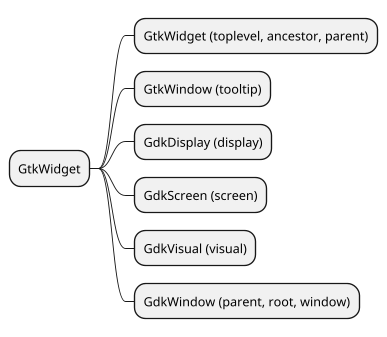
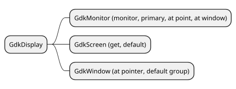
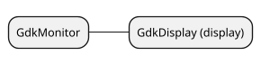
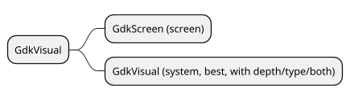
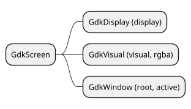
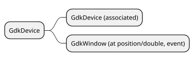

# Device Relations

How to get from one class to another. Most classes can be reached except for GdkDevice.

The only way to get a device is from an event originating from a device such as a keyboard or mouse.

