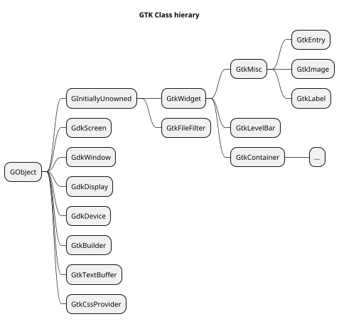
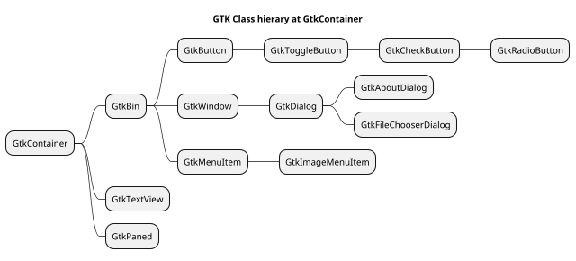
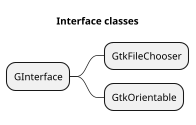
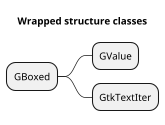

[toc]

# Types of gtk and (native) types in perl6

| GTK Type | typedef | Native Perl6 | Perl6 Type | Note |
| -------- | ------- | ------------ | ---------- | ---- |
| gboolean | gint    | int32        | Int        |
|
| gchar *  | char *  | str          | Str        |
|
| gchar    | char    | int8         | Int        | +/- n % 2**7 - 1
| gshort   | short   | int16        | Int        | +/- n % 2**15 - 1
| glong    | long    | int64        | Int        | +/- n % 2**63 - 1
| gint8    | char    | int8         | Int        | +/- n % 2**7 -1
| gint16   | short   | int16        | Int        | +/- n % 2**15 - 1
| gint32   | int     | int32        | Int        | +/- n % 2**31 - 1
| gint64   | long    | int64        | Int        | +/- n % 2**63 - 1
|
| gint     | int     | int32        | Int        | +/- n % 2**31 - 1
|
| guchar   | un. char  | uint8, byte  | Int      | n % 2**8 - 1
| gushort  | un. short | uint16       | Int      | n % 2**16 - 1
| gulong   | un. long  | uint64       | Int      | n % 2**64 - 1
| guint8   | un. char  | uint8        | Int      | n % 2**8 - 1
| guint16  | un. short | uint16       | Int      | n % 2**16 - 1
| guint32  | un. int   | uint32       | Int      | n % 2**32 - 1
| guint64  | un. long  | uint64       | Int      | n % 2**64 - 1
|
| guint    | un. int   | uint32       | Int      | +/- n % 2**31 - 1
|
| gssize   | long      | int64        | Int      |
| gsize    | un. long  | uint64       | Int      |
| goffset  | gint64    | int64        | Int      |
|
| gfloat   | float     | num32        | Num      |
| gdouble  | double    | num64        | Num      |

# Class hierargy
* Below are diagrams of what is implemented. See also the [object hierarchy in GTK docs](https://developer.gnome.org/gtk3/stable/ch02.html).










<!--
```plantuml
scale 0.7
hide members
hide circle

title Standalone classes

class X

class GMain
class GList
class GSList
class GType
class GSignal

class GtkMain
```
-->


```plantuml
scale 0.7

title Some details
class GObject {
  Bool $debug
  N-GObject $!gobject
  GSignal $!g-signal
  Array $builders
}

'hide members
class GSignal {
}

class GtkBuilder {
}

GObject *--> GSignal
GObject *--> GtkBuilder

```

<!-- Restjes ...

```plantuml
scale 0.7
hide members
hide circle

'class Gui
'class GSignal
'GSignal <|-- GtkWidget
'X <-* Gui


GtkBin <|-- GtkButton
GtkButton <|-- GtkToggleButton
GtkToggleButton <|-- GtkCheckButton
GtkCheckButton <|-- GtkRadioButton

GtkBin <|-- GtkWindow
GtkWindow <|-- GtkDialog
GtkDialog <|-- GtkAboutDialog
GtkDialog <|-- GtkFileChooserDialog

GtkWidget <|-- GtkLabel
GtkWidget <|-- GtkEntry

GtkContainer <|-- GtkBin
GtkContainer <|-- GtkTextView
GtkWidget <|-- GtkContainer

GInitiallyUnowned <|-- GtkWidget
GObject <|-- GInitiallyUnowned

GtkBin <|-- GtkMenuItem
GtkMenuItem <|-- GtkImageMenuItem

GInitiallyUnowned <|-- GtkFileFilter

```
-->
