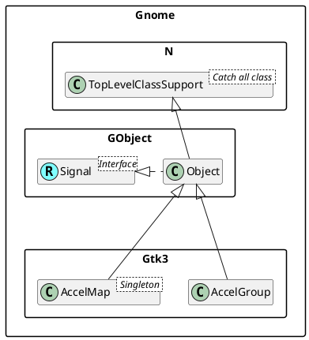

```plantuml
@startuml
'scale 0.9
skinparam packageStyle rectangle
skinparam stereotypeCBackgroundColor #80ffff
set namespaceSeparator ::
hide members


class Gnome::N::TopLevelClassSupport < Catch all class >
Gnome::N::TopLevelClassSupport <|-- Gnome::GObject::Object

Interface Gnome::GObject::Signal <Interface>
class Gnome::GObject::Signal <<(R,#80ffff)>>

'Interface Gnome::Gtk3::Buildable <Interface>
'class Gnome::Gtk3::Buildable <<(R,#80ffff)>>

class Gnome::Gtk3::AccelMap < Singleton >


Gnome::GObject::Signal <|. Gnome::GObject::Object

Gnome::GObject::Object <|--- Gnome::Gtk3::AccelMap
Gnome::GObject::Object <|--- Gnome::Gtk3::AccelGroup
@enduml
```
