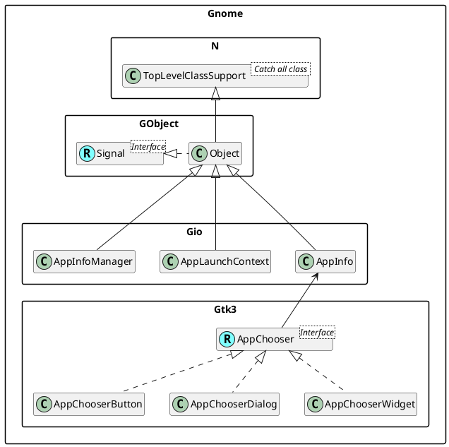

```plantuml
@startuml

skinparam packageStyle rectangle
skinparam stereotypeCBackgroundColor #80ffff
set namespaceSeparator ::
hide empty members

'Classes and interfaces
class Gnome::N::TopLevelClassSupport < Catch all class >

Interface Gnome::GObject::Signal <Interface>
class Gnome::GObject::Signal <<(R,#80ffff)>>

'Interface Gnome::Gio::AppInfo <Interface>
'class Gnome::Gio::AppInfo <<(R,#80ffff)>>

Interface Gnome::Gtk3::AppChooser <Interface>
class Gnome::Gtk3::AppChooser <<(R,#80ffff)>>


'Class connections
Gnome::N::TopLevelClassSupport <|-- Gnome::GObject::Object
Gnome::GObject::Signal <|. Gnome::GObject::Object

Gnome::GObject::Object <|--- Gnome::Gio::AppInfoManager
Gnome::GObject::Object <|--- Gnome::Gio::AppLaunchContext
Gnome::GObject::Object <|-- Gnome::Gio::AppInfo

Gnome::Gio::AppInfo <-- Gnome::Gtk3::AppChooser

Gnome::Gtk3::AppChooser <|.. Gnome::Gtk3::AppChooserButton
Gnome::Gtk3::AppChooser <|.. Gnome::Gtk3::AppChooserDialog
Gnome::Gtk3::AppChooser <|.. Gnome::Gtk3::AppChooserWidget

@enduml
```
