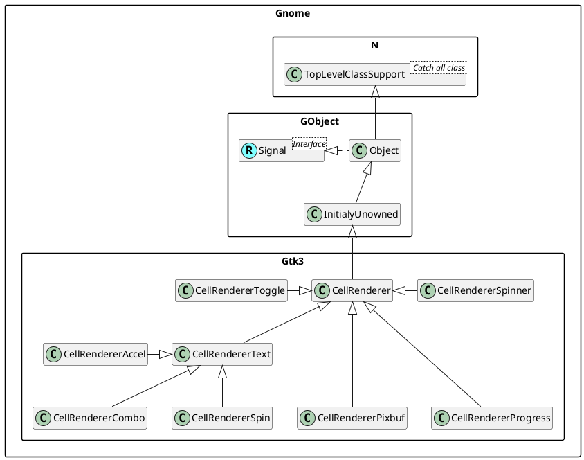

```plantuml
@startuml
'scale 0.9
skinparam packageStyle rectangle
skinparam stereotypeCBackgroundColor #80ffff
set namespaceSeparator ::
hide members


class Gnome::N::TopLevelClassSupport < Catch all class >
Gnome::N::TopLevelClassSupport <|-- Gnome::GObject::Object

Interface Gnome::GObject::Signal <Interface>
class Gnome::GObject::Signal <<(R,#80ffff)>>

Gnome::GObject::Object <|-- Gnome::GObject::InitialyUnowned


Gnome::GObject::Signal <|. Gnome::GObject::Object

Gnome::GObject::InitialyUnowned <|-- Gnome::Gtk3::CellRenderer
Gnome::Gtk3::CellRenderer <|-- Gnome::Gtk3::CellRendererText
Gnome::Gtk3::CellRenderer <|--- Gnome::Gtk3::CellRendererPixbuf
Gnome::Gtk3::CellRenderer <|--- Gnome::Gtk3::CellRendererProgress
Gnome::Gtk3::CellRenderer <|-right- Gnome::Gtk3::CellRendererSpinner
Gnome::Gtk3::CellRenderer <|-left- Gnome::Gtk3::CellRendererToggle

Gnome::Gtk3::CellRendererText <|-left- Gnome::Gtk3::CellRendererAccel
Gnome::Gtk3::CellRendererText <|-- Gnome::Gtk3::CellRendererCombo
Gnome::Gtk3::CellRendererText <|-- Gnome::Gtk3::CellRendererSpin
@enduml
```
