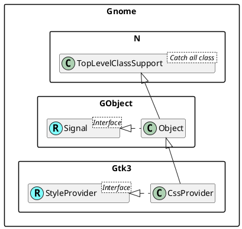

```plantuml
@startuml

skinparam packageStyle rectangle
skinparam stereotypeCBackgroundColor #80ffff
set namespaceSeparator ::
hide members

'Class and interface decorations
class Gnome::N::TopLevelClassSupport < Catch all class >

Interface Gnome::GObject::Signal <Interface>
class Gnome::GObject::Signal <<(R,#80ffff)>>

Interface Gnome::Gtk3::StyleProvider <Interface>
class Gnome::Gtk3::StyleProvider <<(R,#80ffff)>>

'Class connections
Gnome::N::TopLevelClassSupport <|-- Gnome::GObject::Object
Gnome::GObject::Signal <|. Gnome::GObject::Object

Gnome::GObject::Object <|-- Gnome::Gtk3::CssProvider
Gnome::Gtk3::StyleProvider <|. Gnome::Gtk3::CssProvider

@enduml
```
