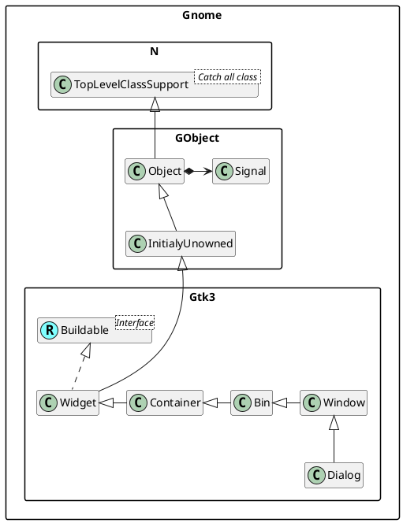

```plantuml
@startuml
'scale 0.8
skinparam packageStyle rectangle
skinparam stereotypeCBackgroundColor #80ffff
set namespaceSeparator ::
hide members

'Class and interface decorations
class Gnome::N::TopLevelClassSupport < Catch all class >

Interface Gnome::Gtk3::Buildable <Interface>
class Gnome::Gtk3::Buildable <<(R,#80ffff)>>

'Interface Gnome::Gtk3::ColorChooser <Interface>
'Interface Gnome::Gtk3::AppChooser <Interface>


'Class connections
Gnome::N::TopLevelClassSupport <|-- Gnome::GObject::Object
Gnome::GObject::Object <|-- Gnome::GObject::InitialyUnowned
Gnome::GObject::Object *-> Gnome::GObject::Signal

Gnome::GObject::InitialyUnowned <|--- Gnome::Gtk3::Widget

Gnome::Gtk3::Widget <|- Gnome::Gtk3::Container
Gnome::Gtk3::Container <|- Gnome::Gtk3::Bin
Gnome::Gtk3::Bin <|- Gnome::Gtk3::Window
Gnome::Gtk3::Window <|-- Gnome::Gtk3::Dialog

'Gnome::Gtk3::Dialog <|-- Gnome::Gtk3::AboutDialog
'Gnome::Gtk3::Dialog <|-- Gnome::Gtk3::ColorChooserDialog
'Gnome::Gtk3::Dialog <|-- Gnome::Gtk3::FileChooserDialog
'Gnome::Gtk3::Dialog <|-- Gnome::Gtk3::MessageDialog
'Gnome::Gtk3::Dialog <|-- Gnome::Gtk3::AppChooserDialog
'Gnome::Gtk3::Dialog <|-- Gnome::Gtk3::FontChooserDialog
'Gnome::Gtk3::Dialog <|-- Gnome::Gtk3::RecentChooserDialog

'Interface connections
Gnome::Gtk3::Buildable <|.. Gnome::Gtk3::Widget
'Gnome::Gtk3::ColorChooser <|- Gnome::Gtk3::ColorChooserDialog
'Gnome::Gtk3::AppChooser <|- Gnome::Gtk3::AppChooserDialog

'Some hidden connections
'Gnome::GObject <--[hidden]- Gnome::Gtk3
@enduml
```
