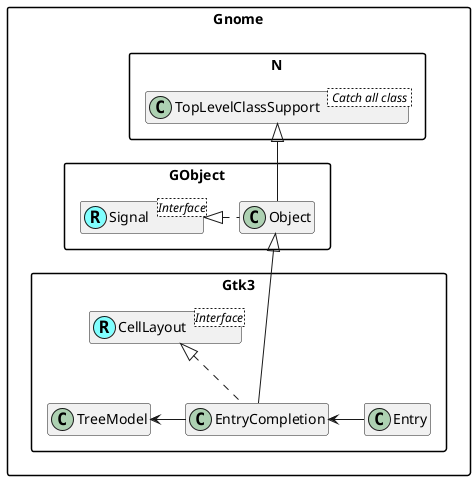

```plantuml
@startuml
'scale 0.9
skinparam packageStyle rectangle
skinparam stereotypeCBackgroundColor #80ffff
set namespaceSeparator ::
hide members


'Class and interface declarations
class Gnome::N::TopLevelClassSupport < Catch all class >

Interface Gnome::GObject::Signal <Interface>
class Gnome::GObject::Signal <<(R,#80ffff)>>

Interface Gnome::Gtk3::CellLayout <Interface>
class Gnome::Gtk3::CellLayout <<(R,#80ffff)>>


'Class connections
Gnome::N::TopLevelClassSupport <|-- Gnome::GObject::Object
Gnome::GObject::Signal <|. Gnome::GObject::Object
Gnome::GObject::Object <|--- Gnome::Gtk3::EntryCompletion

Gnome::Gtk3::EntryCompletion <- Gnome::Gtk3::Entry
Gnome::Gtk3::TreeModel <- Gnome::Gtk3::EntryCompletion
Gnome::Gtk3::CellLayout <|.. Gnome::Gtk3::EntryCompletion
@enduml
```
