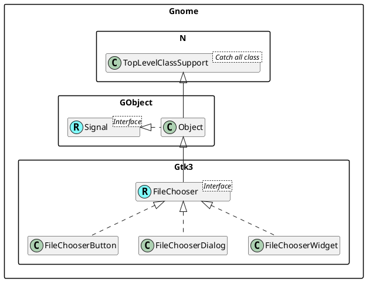

```plantuml
@startuml
'scale 0.9
skinparam packageStyle rectangle
skinparam stereotypeCBackgroundColor #80ffff
set namespaceSeparator ::
hide members


class Gnome::N::TopLevelClassSupport < Catch all class >
Gnome::N::TopLevelClassSupport <|-- Gnome::GObject::Object

Interface Gnome::GObject::Signal <Interface>
class Gnome::GObject::Signal <<(R,#80ffff)>>

Interface Gnome::Gtk3::FileChooser <Interface>
class Gnome::Gtk3::FileChooser <<(R,#80ffff)>>

Gnome::GObject::Signal <|. Gnome::GObject::Object

Gnome::GObject::Object <|-- Gnome::Gtk3::FileChooser

Gnome::Gtk3::FileChooser <|.. Gnome::Gtk3::FileChooserButton
Gnome::Gtk3::FileChooser <|.. Gnome::Gtk3::FileChooserDialog
Gnome::Gtk3::FileChooser <|.. Gnome::Gtk3::FileChooserWidget
@enduml
```
