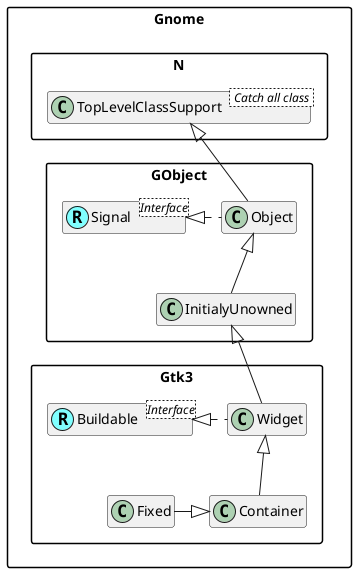

<!--

'class Gnome::GObject::InitialyUnowned
'class Gnome::GObject::Object

'Gnome::Gtk3::Button -|> Gnome::Gtk3::Bin
'Gnome::Gtk3::Bin -|> Gnome::Gtk3::Container

'Interface Gnome::Gtk3::Actionable <Interface>
'Gnome::Gtk3::Actionable <|-- Gnome::Gtk3::Button
'class Gnome::Gtk3::Button implements Gnome::Gtk3::Actionable

'Interface Gnome::Gtk3::Orientable <Interface>
'Gnome::Gtk3::Orientable <|-- Gnome::Gtk3::ScaleButton

'Interface Gnome::Gtk3::ColorChooser <Interface>
'Gnome::Gtk3::ColorChooser <|-- Gnome::Gtk3::ColorButton

'Interface Gnome::Gtk3::FontChooser <Interface>
'Gnome::Gtk3::FontChooser <|-- Gnome::Gtk3::FontButton

'Gnome::GObject <--[hidden]- Gnome::Gtk3

'Gnome::Gtk3::Button <|-- Gnome::Gtk3::ToggleButton
'Gnome::Gtk3::Button <|-- Gnome::Gtk3::ColorButton
'Gnome::Gtk3::ToggleButton <|-- Gnome::Gtk3::CheckButton
'Gnome::Gtk3::ToggleButton <|-- Gnome::Gtk3::MenuButton
'Gnome::Gtk3::CheckButton <|-- Gnome::Gtk3::RadioButton
'Gnome::Gtk3::Button <|--- Gnome::Gtk3::FontButton
'Gnome::Gtk3::Button <|-- Gnome::Gtk3::LinkButton
'Gnome::Gtk3::Button <|-- Gnome::Gtk3::LockButton
'Gnome::Gtk3::Button <|-- Gnome::Gtk3::ModelButton
'Gnome::Gtk3::Button <|-- Gnome::Gtk3::ScaleButton
'Gnome::Gtk3::ScaleButton <|-- Gnome::Gtk3::VolumeButton

-->
<!--
│   │   │   │   ├── GtkButton                   ♥ Button
│   │   │   │   │   ├── GtkToggleButton         ToggleButton
│   │   │   │   │   │   ├── GtkCheckButton      ♥ CheckButton
│   │   │   │   │   │   │   ╰── GtkRadioButton  ♥ RadioButton
│   │   │   │   │   │   ╰── GtkMenuButton       MenuButton
│   │   │   │   │   ├── GtkColorButton          ColorButton
│   │   │   │   │   ├── GtkFontButton
│   │   │   │   │   ├── GtkLinkButton
│   │   │   │   │   ├── GtkLockButton
│   │   │   │   │   ├── GtkModelButton
│   │   │   │   │   ╰── GtkScaleButton
│   │   │   │   │       ╰── GtkVolumeButton

│   │   │   │   ├── GtkButton                         b,ac
│   │   │   │   │   ├── GtkToggleButton               b,ac
│   │   │   │   │   │   ├── GtkCheckButton            b,ac
│   │   │   │   │   │   │   ╰── GtkRadioButton        b,ac
│   │   │   │   │   │   ╰── GtkMenuButton             b,ac
│   │   │   │   │   ├── GtkColorButton                b,ac,cc
│   │   │   │   │   ├── GtkFontButton                 b,ac,foc
│   │   │   │   │   ├── GtkLinkButton                 b,ac
│   │   │   │   │   ├── GtkLockButton                 b,ac
│   │   │   │   │   ├── GtkModelButton                b,ac
│   │   │   │   │   ╰── GtkScaleButton                b,o,ac
│   │   │   │   │       ╰── GtkVolumeButton           b,o,ac

├── GtkBuildable                                      b
├── GtkActionable                                     ac
├── GtkOrientable                                     o
├── GtkColorChooser                                   cc
├── GtkFontChooser                                    foc
-->
