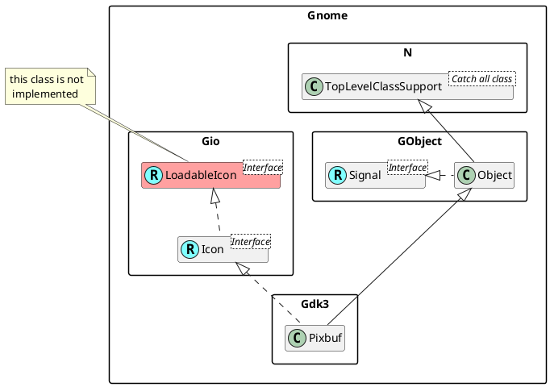

```plantuml
@startuml

skinparam packageStyle rectangle
skinparam stereotypeCBackgroundColor #80ffff
set namespaceSeparator ::
hide empty members

'Classes and interfaces
class Gnome::N::TopLevelClassSupport < Catch all class >

Interface Gnome::GObject::Signal <Interface>
class Gnome::GObject::Signal <<(R,#80ffff)>>

Interface Gnome::Gio::Icon <Interface>
class Gnome::Gio::Icon <<(R,#80ffff)>>

Interface Gnome::Gio::LoadableIcon <Interface>
class Gnome::Gio::LoadableIcon <<(R,#80ffff)>> #ffa0a0
note "this class is not\n implemented" as NLI
Gnome::Gio::LoadableIcon .up. NLI


'Class connections
Gnome::N::TopLevelClassSupport <|-- Gnome::GObject::Object
Gnome::GObject::Signal <|. Gnome::GObject::Object

Gnome::Gio::Icon <|.. Gnome::Gdk3::Pixbuf
Gnome::Gio::LoadableIcon <|.. Gnome::Gio::Icon
Gnome::GObject::Object <|--- Gnome::Gdk3::Pixbuf

@enduml
```
