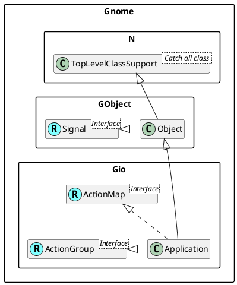

```plantuml
@startuml

skinparam packageStyle rectangle
skinparam stereotypeCBackgroundColor #80ffff
set namespaceSeparator ::
hide empty members

'Classes and interfaces
class Gnome::N::TopLevelClassSupport < Catch all class >

Interface Gnome::GObject::Signal <Interface>
class Gnome::GObject::Signal <<(R,#80ffff)>>

'Interface Gnome::Gio::Action <Interface>
'class Gnome::Gio::Action <<(R,#80ffff)>>

'Interface Gnome::Gtk3::Actionable <Interface>
'class Gnome::Gtk3::Actionable <<(R,#80ffff)>>

Interface Gnome::Gio::ActionMap <Interface>
class Gnome::Gio::ActionMap <<(R,#80ffff)>>

Interface Gnome::Gio::ActionGroup <Interface>
class Gnome::Gio::ActionGroup <<(R,#80ffff)>>


'Class connections
Gnome::N::TopLevelClassSupport <|-- Gnome::GObject::Object
Gnome::GObject::Signal <|. Gnome::GObject::Object

'Gnome::GObject::Object <|-- Gnome::Gio::SimpleAction
'Gnome::Gio::Action <|. Gnome::Gio::SimpleAction

Gnome::GObject::Object <|--- Gnome::Gio::Application
Gnome::Gio::ActionMap <|.. Gnome::Gio::Application
Gnome::Gio::ActionGroup <|. Gnome::Gio::Application

'Gnome::Gio::Application <|-- Gnome::Gtk3::Application


'Gnome::Gtk3::Application -> Gnome::Gtk3::ApplicationWindow
'Gnome::Gio::ActionMap <|.. Gnome::Gtk3::ApplicationWindow
'Gnome::Gio::Action <|.. Gnome::Gio::SimpleAction
'Gnome::Gio::ActionMap *-> "*" Gnome::Gio::SimpleAction
'Gnome::Gio::ActionGroup <|.. Gnome::Gio::SimpleActionGroup
'Gnome::Gio::ActionMap <|.. Gnome::Gio::SimpleActionGroup
'Gnome::Gio::ActionGroup -> Gnome::Gio::ActionMap
'Gnome::Gtk3::Application --> Gnome::Gtk3::Button
'Gnome::Gtk3::Button .|> Gnome::Gtk3::Actionable
'Gnome::Gtk3::Widget <|-- Gnome::Gtk3::Button
'Gnome::Gio::SimpleActionGroup "*" <--* Gnome::Gtk3::Widget

@enduml
```
