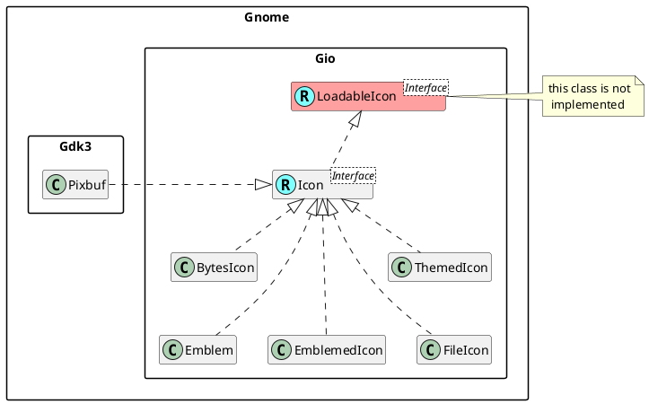

```plantuml
@startuml

skinparam packageStyle rectangle
skinparam stereotypeCBackgroundColor #80ffff
set namespaceSeparator ::
hide empty members

'Classes and interfaces
'class Gnome::N::TopLevelClassSupport < Catch all class >

'Interface Gnome::GObject::Signal <Interface>
'class Gnome::GObject::Signal <<(R,#80ffff)>>

'Interface Gnome::Gio::AppInfo <Interface>
'class Gnome::Gio::AppInfo <<(R,#80ffff)>>

Interface Gnome::Gio::LoadableIcon <Interface>
class Gnome::Gio::LoadableIcon <<(R,#80ffff)>> #ffa0a0
note "this class is not\n implemented" as NLI
Gnome::Gio::LoadableIcon .right. NLI

Interface Gnome::Gio::Icon <Interface>
class Gnome::Gio::Icon <<(R,#80ffff)>>


'Class connections
'Gnome::N::TopLevelClassSupport <|-- Gnome::GObject::Object
'Gnome::GObject::Signal <|. Gnome::GObject::Object

'Gnome::GObject::Object <|--- Gnome::Gio::AppInfoManager
'Gnome::GObject::Object <|--- Gnome::Gio::AppLaunchContext
'Gnome::GObject::Object <|-- Gnome::Gio::AppInfo

'Gnome::Gio::AppInfo <-- Gnome::Gtk3::AppChooser

Gnome::Gio::LoadableIcon <|.. Gnome::Gio::Icon

Gnome::Gio::Icon <|.. Gnome::Gio::BytesIcon
Gnome::Gio::Icon <|... Gnome::Gio::Emblem
Gnome::Gio::Icon <|... Gnome::Gio::EmblemedIcon
Gnome::Gio::Icon <|... Gnome::Gio::FileIcon
Gnome::Gio::Icon <|.. Gnome::Gio::ThemedIcon
Gnome::Gio::Icon <|.left. Gnome::Gdk3::Pixbuf

@enduml
```
