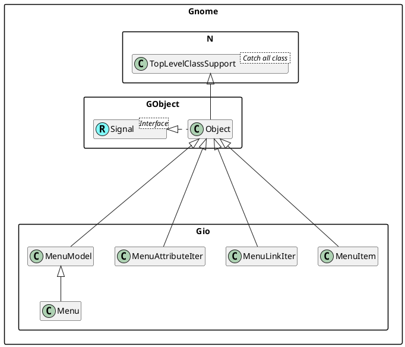

```plantuml
@startuml

skinparam packageStyle rectangle
skinparam stereotypeCBackgroundColor #80ffff
set namespaceSeparator ::
hide empty members

'Classes and interfaces
class Gnome::N::TopLevelClassSupport < Catch all class >

Interface Gnome::GObject::Signal <Interface>
class Gnome::GObject::Signal <<(R,#80ffff)>>


'Class connections
Gnome::N::TopLevelClassSupport <|-- Gnome::GObject::Object
Gnome::GObject::Signal <|. Gnome::GObject::Object

Gnome::GObject::Object <|-- Gnome::Gio::MenuModel
Gnome::GObject::Object <|-- Gnome::Gio::MenuAttributeIter
Gnome::GObject::Object <|-- Gnome::Gio::MenuLinkIter
Gnome::GObject::Object <|---- Gnome::Gio::MenuItem
'Gnome::GObject::Object <|--- Gnome::Gio::
Gnome::Gio::MenuModel <|-- Gnome::Gio::Menu
'Gnome::Gio::MenuModel <|-- Gnome::Gio::GDBusMenuModel

@enduml
```
