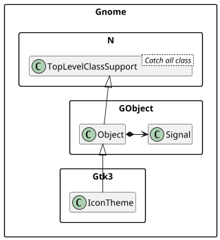

```plantuml
@startuml
scale 0.9
skinparam packageStyle rectangle
set namespaceSeparator ::
hide members


class Gnome::N::TopLevelClassSupport < Catch all class >
Gnome::N::TopLevelClassSupport <|-- Gnome::GObject::Object

Gnome::GObject::Object <|-- Gnome::Gtk3::IconTheme
Gnome::GObject::Object *-> Gnome::GObject::Signal
@enduml
```
