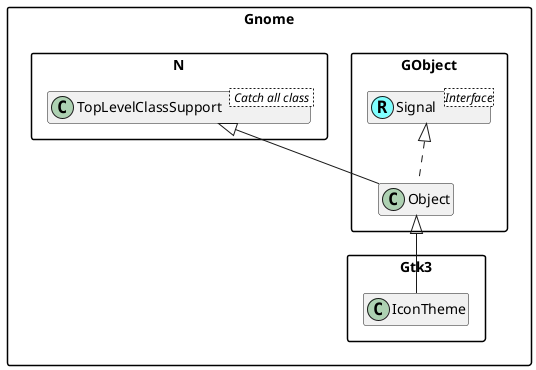

```plantuml
@startuml
'scale 0.9
skinparam packageStyle rectangle
skinparam stereotypeCBackgroundColor #80ffff
set namespaceSeparator ::
hide members

'class Gnome::Gtk3::Buildable <<(R,#80ffff)>>

Interface Gnome::GObject::Signal <Interface>
class Gnome::GObject::Signal <<(R,#80ffff)>>

class Gnome::N::TopLevelClassSupport < Catch all class >
Gnome::N::TopLevelClassSupport <|-- Gnome::GObject::Object

Gnome::GObject::Object <|-- Gnome::Gtk3::IconTheme
'Gnome::GObject::Object *-> Gnome::GObject::Signal
Gnome::GObject::Signal <|.. Gnome::GObject::Object
@enduml
```
