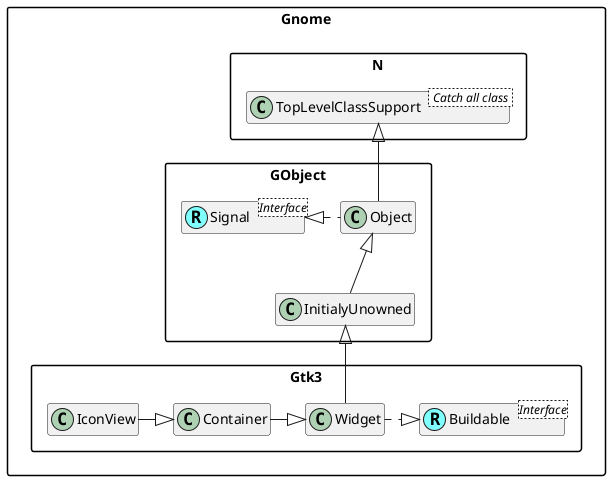

```plantuml
@startuml
'scale 0.9
skinparam packageStyle rectangle
skinparam stereotypeCBackgroundColor #80ffff
set namespaceSeparator ::
hide members

'Class and interface decorations
class Gnome::N::TopLevelClassSupport < Catch all class >

Interface Gnome::GObject::Signal <Interface>
class Gnome::GObject::Signal <<(R,#80ffff)>>

'class Gnome::GObject::InitialyUnowned
'class Gnome::GObject::Object
Gnome::N::TopLevelClassSupport <|-- Gnome::GObject::Object
Gnome::GObject::Object <|-- Gnome::GObject::InitialyUnowned
Gnome::GObject::Signal <|. Gnome::GObject::Object

Interface Gnome::Gtk3::Buildable <Interface>
class Gnome::Gtk3::Buildable <<(R,#80ffff)>>


Gnome::GObject::InitialyUnowned <|-- Gnome::Gtk3::Widget
Gnome::Gtk3::Widget .|> Gnome::Gtk3::Buildable

Gnome::Gtk3::IconView -|> Gnome::Gtk3::Container
Gnome::Gtk3::Container -|> Gnome::Gtk3::Widget
@enduml
```
