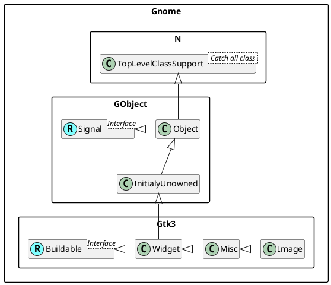

<!--
│   │   │   │   ├── GtkButton                   ♥ Button
│   │   │   │   │   ├── GtkToggleButton         ToggleButton
│   │   │   │   │   │   ├── GtkCheckButton      ♥ CheckButton
│   │   │   │   │   │   │   ╰── GtkRadioButton  ♥ RadioButton
│   │   │   │   │   │   ╰── GtkMenuButton       MenuButton
│   │   │   │   │   ├── GtkColorButton          ColorButton
│   │   │   │   │   ├── GtkFontButton
│   │   │   │   │   ├── GtkLinkButton
│   │   │   │   │   ├── GtkLockButton
│   │   │   │   │   ├── GtkModelButton
│   │   │   │   │   ╰── GtkScaleButton
│   │   │   │   │       ╰── GtkVolumeButton

│   │   │   │   ├── GtkButton                         b,ac
│   │   │   │   │   ├── GtkToggleButton               b,ac
│   │   │   │   │   │   ├── GtkCheckButton            b,ac
│   │   │   │   │   │   │   ╰── GtkRadioButton        b,ac
│   │   │   │   │   │   ╰── GtkMenuButton             b,ac
│   │   │   │   │   ├── GtkColorButton                b,ac,cc
│   │   │   │   │   ├── GtkFontButton                 b,ac,foc
│   │   │   │   │   ├── GtkLinkButton                 b,ac
│   │   │   │   │   ├── GtkLockButton                 b,ac
│   │   │   │   │   ├── GtkModelButton                b,ac
│   │   │   │   │   ╰── GtkScaleButton                b,o,ac
│   │   │   │   │       ╰── GtkVolumeButton           b,o,ac

├── GtkBuildable                                      b
├── GtkActionable                                     ac
├── GtkOrientable                                     o
├── GtkColorChooser                                   cc
├── GtkFontChooser                                    foc
-->
