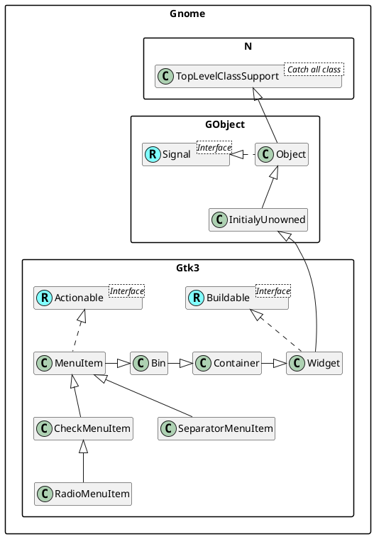

```plantuml
@startuml
'scale 0.9
skinparam packageStyle rectangle
skinparam stereotypeCBackgroundColor #80ffff
set namespaceSeparator ::
hide members

'Class and interface decorations
class Gnome::N::TopLevelClassSupport < Catch all class >

Interface Gnome::GObject::Signal <Interface>
class Gnome::GObject::Signal <<(R,#80ffff)>>

Interface Gnome::Gtk3::Buildable <Interface>
class Gnome::Gtk3::Buildable <<(R,#80ffff)>>

Interface Gnome::Gtk3::Actionable <Interface>
class Gnome::Gtk3::Actionable <<(R,#80ffff)>>


'class connections
Gnome::N::TopLevelClassSupport <|-- Gnome::GObject::Object
Gnome::GObject::Object <|-- Gnome::GObject::InitialyUnowned
Gnome::GObject::Signal <|. Gnome::GObject::Object

Gnome::GObject::InitialyUnowned <|--- Gnome::Gtk3::Widget
Gnome::Gtk3::Widget .up.|> Gnome::Gtk3::Buildable

Gnome::Gtk3::Container -|> Gnome::Gtk3::Widget
Gnome::Gtk3::Bin -|> Gnome::Gtk3::Container

Gnome::Gtk3::MenuItem -|> Gnome::Gtk3::Bin
Gnome::Gtk3::MenuItem .up.|> Gnome::Gtk3::Actionable

Gnome::Gtk3::MenuItem <|-- Gnome::Gtk3::CheckMenuItem
Gnome::Gtk3::CheckMenuItem <|-- Gnome::Gtk3::RadioMenuItem
Gnome::Gtk3::MenuItem <|-- Gnome::Gtk3::SeparatorMenuItem

@enduml
```
