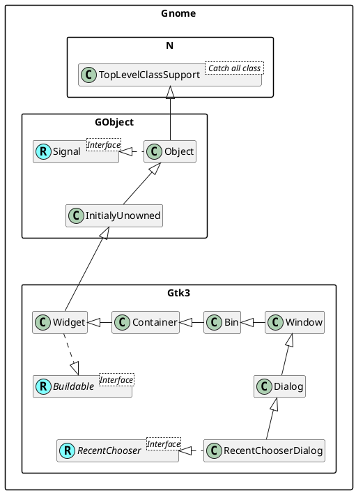

```plantuml
@startuml
skinparam packageStyle rectangle
skinparam stereotypeCBackgroundColor #80ffff
set namespaceSeparator ::
hide members

'Class and interface decorations
class Gnome::N::TopLevelClassSupport < Catch all class >

Interface Gnome::GObject::Signal <Interface>
class Gnome::GObject::Signal <<(R,#80ffff)>>

class Gnome::Gtk3::Buildable <<(R,#80ffff)>>
Interface Gnome::Gtk3::Buildable <Interface>

class Gnome::Gtk3::RecentChooser <<(R,#80ffff)>>
Interface Gnome::Gtk3::RecentChooser <Interface>


'Class connections
Gnome::N::TopLevelClassSupport <|-- Gnome::GObject::Object
Gnome::GObject::Object <|-- Gnome::GObject::InitialyUnowned
Gnome::GObject::Signal <|. Gnome::GObject::Object

Gnome::GObject::InitialyUnowned <|--- Gnome::Gtk3::Widget

Gnome::Gtk3::Widget <|- Gnome::Gtk3::Container
Gnome::Gtk3::Widget ..|> Gnome::Gtk3::Buildable

Gnome::Gtk3::Container <|- Gnome::Gtk3::Bin
Gnome::Gtk3::Bin <|- Gnome::Gtk3::Window
Gnome::Gtk3::Window <|-- Gnome::Gtk3::Dialog

Gnome::Gtk3::RecentChooser <|. Gnome::Gtk3::RecentChooserDialog
Gnome::Gtk3::Dialog <|-- Gnome::Gtk3::RecentChooserDialog

@enduml
```
