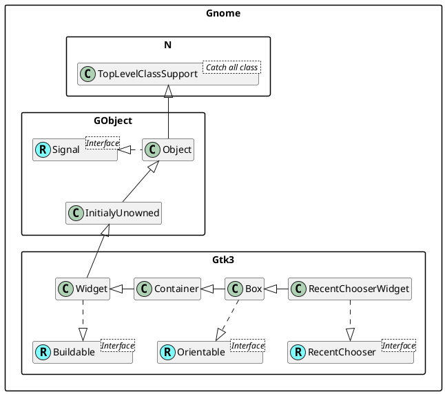

```plantuml
@startuml
'scale 0.9
skinparam packageStyle rectangle
skinparam stereotypeCBackgroundColor #80ffff
set namespaceSeparator ::
hide members


'Class and interface declarations
class Gnome::N::TopLevelClassSupport < Catch all class >

Interface Gnome::GObject::Signal <Interface>
class Gnome::GObject::Signal <<(R,#80ffff)>>

Interface Gnome::Gtk3::Buildable <Interface>
class Gnome::Gtk3::Buildable <<(R,#80ffff)>>

Interface Gnome::Gtk3::Orientable <Interface>
class Gnome::Gtk3::Orientable <<(R,#80ffff)>>

Interface Gnome::Gtk3::RecentChooser <Interface>
class Gnome::Gtk3::RecentChooser <<(R,#80ffff)>>

'Class connections
Gnome::N::TopLevelClassSupport <|-- Gnome::GObject::Object
Gnome::GObject::InitialyUnowned <|-- Gnome::Gtk3::Widget
Gnome::GObject::Object <|-- Gnome::GObject::InitialyUnowned
Gnome::GObject::Signal <|. Gnome::GObject::Object

Gnome::Gtk3::Widget <|- Gnome::Gtk3::Container
Gnome::Gtk3::Widget ..|> Gnome::Gtk3::Buildable

Gnome::Gtk3::Container <|- Gnome::Gtk3::Box
Gnome::Gtk3::Box ..|> Gnome::Gtk3::Orientable

Gnome::Gtk3::Box <|- Gnome::Gtk3::RecentChooserWidget
Gnome::Gtk3::RecentChooserWidget ..|> Gnome::Gtk3::RecentChooser

@enduml
```
