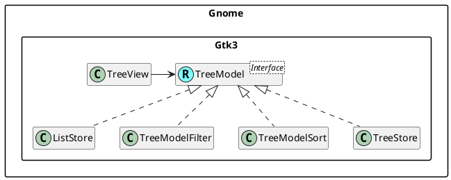

```plantuml
@startuml
'scale 0.9
skinparam packageStyle rectangle
skinparam stereotypeCBackgroundColor #80ffff
set namespaceSeparator ::
hide members


'Class and interface declarations
Interface Gnome::Gtk3::TreeModel <Interface>
class Gnome::Gtk3::TreeModel <<(R,#80ffff)>>


'Class connections
Gnome::Gtk3::TreeModel <|.. Gnome::Gtk3::ListStore
Gnome::Gtk3::TreeModel <|.. Gnome::Gtk3::TreeModelFilter
Gnome::Gtk3::TreeModel <|.. Gnome::Gtk3::TreeModelSort
Gnome::Gtk3::TreeModel <|.. Gnome::Gtk3::TreeStore

Gnome::Gtk3::TreeView -> Gnome::Gtk3::TreeModel

@enduml
```
