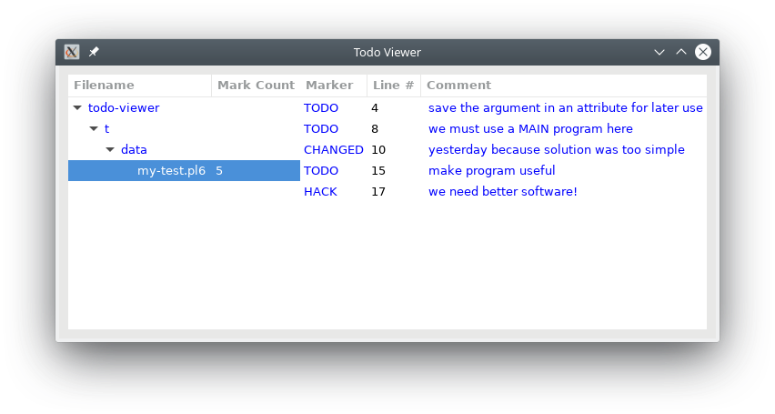

# A Todo Viewer Example

This program will read files and shows the todo remarks in a list. At first, we keep the business simple and create one test file to work on. Later, it can be extended to more files or worse.

## Download and Install




Download the archive files of your choice from below and unpack them in a directory.
* Click the icon on the right to download a zip archive: 
* Click the icon on the right to download a tar archive: 

Go into the todo-viewer directory and run `zef install .` to install the package. After testing and installing, the command `todo-viewer.pl6` should be available.

## Run

* Start program with: `todo-viewer.pl6 t/data/my-test.pl6`
* Double click on the `my-test.pl6` entry

When done with the above mentioned sample file from the test data directory you should see the following display

