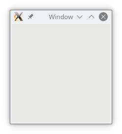

## An empty window with a title

A very basic and simple example of a window which doesn't do much and cannot be stopped by pressing the window managers kill button of the application. The program is stopped by **\<ctrl>C** on the command line.

Assume that the program is written in the file **window.pl6**.
```

```

## Command to run
```
> perl6 window.pl6
```
## Snapshot

