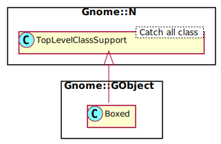

Gnome::GObject::Boxed
=====================

A mechanism to wrap opaque C structures registered by the type system

Description
===========

**Gnome::GObject::Boxed** is a generic wrapper mechanism for arbitrary C structures. The only thing the type system needs to know about the structures is how to copy and free them, beyond that they are treated as opaque chunks of memory.

Boxed types are useful for simple value-holder structures like rectangles or points.

Synopsis
========

Declaration
-----------

    unit class Gnome::GObject::Boxed:auth<github:MARTIMM>:api<1>;
    also is Gnome::N::TopLevelClassSupport;

Uml Diagram
-----------

