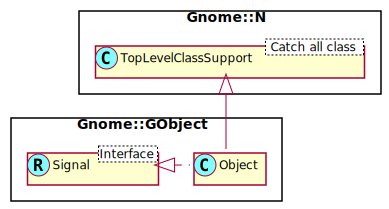

Gnome::GObject::Object
======================

The base object type

Description
===========

GObject is the fundamental type providing the common attributes and methods for all object types in GTK+, Pango and other libraries based on GObject. The GObject class provides methods for object construction and destruction, property access methods, and signal support.

Synopsis
========

Declaration
-----------

    unit class Gnome::GObject::Object;
    also is Gnome::N::TopLevelClassSupport;
    also does Gnome::GObject::Signal;

Uml Diagram
-----------

Methods
=======

new
---

Create a Raku object using a **Gnome::Gtk3::Builder**. The builder object will provide its object (self) to **Gnome::GObject::Object** when the Builder is created. The Builder object is asked to search for id's defined in the GUI glade design.

    multi method new ( Str :$build-id! )

An example

    my Gnome::Gtk3::Builder $builder .= new(:filename<my-gui.glade>);
    my Gnome::Gtk3::Button $button .= new(:build-id<my-gui-button>);

get-data
--------

Gets a named field from the objects table of associations. See `set-data()` for an example.

Returns: the data if found, or `undefined` if no such data exists.

    method get-data ( Str $key --> Pointer )

  * Str $key; name of the key for that association

get-property
------------

Gets a property of an object. The value must have been initialized to the expected type of the property (or a type to which the expected type can be transformed).

In general, a copy is made of the property contents and the caller is responsible for freeing the memory by calling `clear-object()`.

Next signature is used when no **Gnome::GObject::Value** is available. The routine will create the Value using `$gtype`.

    multi method get-property (
      Str $property_name, Int $gtype
      --> Gnome::GObject::Value
    )

The following is used when a Value object is available.

    multi method get-property (
      Str $property_name, N-GValue $value
      --> Gnome::GObject::Value
    )

  * Str $property_name; the name of the property to get.

  * Int $gtype; the type of the value, e.g. G_TYPE_INT.

  * N-GValue $value; The value is stored in a Value object. It is used to get the type of the object.

The methods always return a **Gnome::GObject::Value** with the result.

    my Gnome::Gtk3::Label $label .= new;
    my Gnome::GObject::Value $gv .= new(:init(G_TYPE_STRING));
    $label.g-object-get-property( 'label', $gv);
    $gv.g-value-set-string('my text label');

is-floating
-----------

Checks whether *object* has a floating reference.

Returns: `True` if *object* has a floating reference

    method is-floating ( --> Bool )

  * Pointer $object; (type GObject.Object): a *GObject*

ref-sink
--------

Increase the reference count of this native *object*, and possibly remove the floating reference, if *object* has a floating reference.

In other words, if the object is floating, then this call "assumes ownership" of the floating reference, converting it to a normal reference by clearing the floating flag while leaving the reference count unchanged. If the object is not floating, then this call adds a new normal reference increasing the reference count by one.

The type of *object* will be propagated to the return type under the same conditions as for `g_object_ref()`.

Returns: N-GObject

    method ref-sink ( --> N-GObject )

register-signal
---------------

Register a handler to process a signal or an event. There are several types of callbacks which can be handled by this regstration. They can be controlled by using a named argument with a special name.

    method register-signal (
      $handler-object, Str:D $handler-name,
      Str:D $signal-name, *%user-options
      --> Int
    )

  * $handler-object; The object wherein the handler is defined.

  * $handler-name; The name of the method.

  * $signal-name; The name of the event to be handled. Each gtk object has its own series of signals.

  * %user-options; Any other user data in whatever type provided as one or more named arguments. These arguments are provided to the user handler when an event for the handler is fired. The names starting with '_' are reserved to provide other info to the user.

    The following reserved named arguments are available;

      * `:$_widget`; The instance which registered the signal

      * `:$_handler-id`; The handler id which is returned from the registration

      * `:$_native-object`; The native object provided by the caller. This object sometimes is usefull when the variable `$_widget` became invalid. An easy test and repair;

          method some-handler (
            …,
            Gnome::Gtk3::Button :_widget($button) is copy,
            N-GObject :_native-object($no)
          ) {
            $button .= new(:native-object($no)) unless $button.is-valid;
            …
          }

The method returns a handler id which can be used for example to disconnect the callback later.

### Callback handlers

  * Simple handlers; e.g. a click event handler has only named arguments and are optional.

  * Complex handlers (only a bit) also have positional arguments and **MUST** be typed because they are checked to create a signature for the call to a native subroutine. You can use the raku native types like `int32` but several types are automatically converted to native types. The types such as gboolean, etc are defined in **Gnome::N::GlibToRakuTypes**.

    <table class="pod-table">
    <thead><tr>
    <th>Raku type</th> <th>Native type</th> <th>Native Raku type</th>
    </tr></thead>
    <tbody>
    <tr> <td>Bool</td> <td>gboolean</td> <td>int32</td> </tr> <tr> <td>UInt</td> <td>guint</td> <td>uint32/uint64</td> </tr> <tr> <td>Int</td> <td>gint</td> <td>int32/int64</td> </tr> <tr> <td>Num</td> <td>gfloat</td> <td>num32</td> </tr> <tr> <td>Rat</td> <td>gdouble</td> <td>num64</td> </tr>
    </tbody>
    </table>

  * Some handlers must return a value and is used by the calling process. You **MUST** describe this too in the andlers API, otherwise the returned value is thrown away.

  * Any user options are provided via named arguments from the call to `register-signal()`.

### Example 1

An example of a registration and the handlers signature to handle a button click event.

    # Handler class with callback methods
    class ButtonHandlers {
      method click-button ( :$_widget, :$_handler_id, :$my-option ) {
        …
      }
    }

    $button.register-signal(
      ButtonHandlers.new, 'click-button', 'clicked', :my-option(…)
    );

### Example 2

An example where a keyboard press is handled.

    # Handler class with callback methods
    class KeyboardHandlers {
      method keyboard-handler (
        N-GdkEvent $event, :$_widget, :$_handler_id, :$my-option
        --> gboolean
      ) {
        …
      }
    }

    $window.register-signal(
      KeyboardHandlers.new, 'keyboard-handler',
      'key-press-event', :my-option(…)
    );

set-data
--------

Each object carries around a table of associations from strings to pointers. This function lets you set an association.

If the object already had an association with that name, the old association will be destroyed.

    method set-data ( Str $key, Pointer $data )

  * Str $key; name of the key

  * Pointer $data; data to associate with that key

### Example

Here is an example to show how to associate some data to an object and to retrieve it again. You must import the raku **NativeCall** module to get access to some of the native types and routines.

    my Gnome::Gtk3::Button $button .= new(:label<Start>);
    my Gnome::Gtk3::Label $att-label .= new(:text<a-label>);
    $button.set-data(
      'attached-label-data',
      nativecast( Pointer, $att-label.get-native-object-no-reffing)
    );

    …

    my Gnome::Gtk3::Label $att-label2 .= new(
      :native-object(
        nativecast( N-GObject, $button.get-data('attached-label-data'))
      )
    );

set-property
------------

Sets a property on an object.

    method set-property ( Str $property_name, N-GValue $value )

  * Str $property_name; the name of the property to set

  * N-GObject $value; the value

start-thread
------------

Start a thread in such a way that the function can modify the user interface in a save way and that these updates are automatically made visible without explicitly process events queued and waiting in the main loop.

    method start-thread (
      $handler-object, Str:D $handler-name,
      Bool :$new-context = False, Num :$start-time = now + 1,
      *%user-options
      --> Promise
    )

  * $handler-object is the object wherein the handler is defined.

  * $handler-name is name of the method.

  * $new-context; Whether to run the handler in a new context or to run it in the context of the main loop. Default is to run in the main loop.

  * $start-time. Start time of thread. Default is now + 1 sec. Most of the time a thread starts too fast when some widget are not ready yet. All depends of course what the thread has to do.

  * %user-options; Any other user data in whatever type provided as one or more named arguments except for :start-time and :new-context. These arguments are provided to the user handler when the callback is invoked.

    There will always be one named argument `:$widget` which holds the class object on which the thread is started. The name 'widget' is therefore reserved.

    The named attribute `:$widget` will be deprecated in the future. The name will be changed into `:$_widget` to give the user a free hand in user provided named arguments. The names starting with '_' will then be reserved to provide special info to the user.

    The following named arguments can be used in the callback handler next to the other user definable options;

      * `:$_widget`; The instance which registered the signal.

Returns a `Promise` object. If the call fails, the object is undefined.

The handlers signature holds at least `:$_widget` extended with all provided named arguments to the call defined in `*%user-options`. The handler may return any value which becomes the result of the `Promise` returned from `start-thread`.

steal-data
----------

Remove a specified datum from the object's data associations, without invoking the association's destroy handler.

Returns: the data if found, or `Any` if no such data exists.

    method steal-data ( Str $key --> Pointer )

  * Str $key; name of the key

