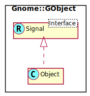

Gnome::GObject::Signal
======================

A means for customization of object behaviour and a general purpose notification mechanism

Description
===========

Synopsis
========

Declaration
-----------

    unit role Gnome::GObject::Signal;

Uml Diagram
-----------

Example
-------

    use NativeCall;
    use Gnome::N::N-GObject;
    use Gnome::Gdk3::Events;
    use Gnome::Gtk3::Window;

    # Get a window object
    my Gnome::Gtk3::Window $w .= new( ... );

    # Define proper handler. The handler API must describe all arguments
    # and their types.
    my Callable $handler = sub (
      N-GObject $native-widget, N-GdkEvent $event, OpaquePointer $ignored
    ) {
      ...
    }

    # Connect signal to the handler.
    $w.connect-object( 'button-press-event', $handler);

The other option to connect a signal is to use the `register-signal()` method defined in **Gnome::GObject::Object**. It all depends on how elaborate things are or taste.

    use Gnome::Gdk3::Events;
    use Gnome::Gtk3::Window;

    # Define handler method. The handler API must describe all positional
    # arguments and their types.
    method mouse-event ( N-GdkEvent $event, :$_widget , :$_handler-id) { ... }

    # Get a window object
    my Gnome::Gtk3::Window $w .= new( ... );

    # Then register
    $w.register-signal( self, 'mouse-event', 'button-press-event');

When some of the primitive types are needed like `gboolean` or `guint`, you can just use the module **Gnome::N::GlibToRakuTypes** and leave the types as they are found in the docs. It might be tricky to choose the proper type: e.g. is a `guint` an `unsigned int32` or `unsigned int64`? By the way, enumerations can be typed `GEnum`.

Methods
=======

[[g_] signal_] connect_object
-----------------------------

Connects a callback function to a signal for a particular object.

    method g_signal_connect_object (
      N-GObject $instance, Str $detailed-signal, Callable $handler
      --> Int
    ) {

[[g_] signal_] emit_by_name
---------------------------

Emits a signal. Note that `g_signal_emit_by_name()` resets the return value to the default if no handlers are connected.

    g_signal_emit_by_name (
      Str $detailed-signal, *@handler-arguments,
      Array :$parameters, :$return-type
    )

  * $detailed-signal; a string of the form "signal-name::detail". '::detail' part is mostly not defined such as a button click signal called 'clicked'.

  * *@handler-arguments; a series of arguments needed for the signal handler.

  * :parameters([type, ...]); a series of types, one for each argument.

  * :return-type(type); specifies the type of the return value. When there is no return value, you can omit this.

### An example

      use Gnome::N::GlibToRakuTypes;
      ...

      # The extra argument here is $toggle
      method enable-debugging-handler (
        gboolean $toggle, Gnome::Gtk3::Window :$_widget
        --> gboolean
      ) {
        ...
        1
      }

      $window.register-signal(
        self, 'enable-debugging-handler', 'enable-debugging'
      );

      ... loop started ...
      ... in another thread ...
      my Gnome::Gtk3::Main $main .= new;
      while $main.gtk-events-pending() { $main.iteration-do(False); }
      $window.emit-by-name(
        'enable-debugging', 1,
        :parameters([gboolean,]), :return-type(gboolean)
      );

      ...

[[g_] signal_] handler_disconnect
---------------------------------

Disconnects a handler from an instance so it will not be called during any future or currently ongoing emissions of the signal it has been connected to. The handler_id becomes invalid and may be reused.

The handler_id has to be a valid signal handler id, connected to a signal of instance.

    g_signal_handler_disconnect( Int $handler_id )

  * $handler_id; Handler id of the handler to be disconnected.

[g_] signal_name
----------------

Given the signal's identifier, finds its name. Two different signals may have the same name, if they have differing types.

    g_signal_name( UInt $signal-id --> Str )

  * $signal-id; the signal's identifying number.

Returns the signal name, or NULL if the signal number was invalid.

