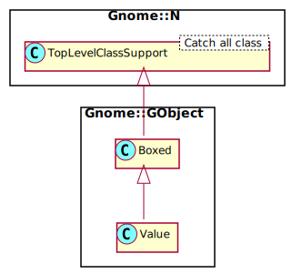

Gnome::GObject::Value
=====================

Standard Parameter and Value Types

Description
===========

This class provides an abstract container structure which can be copied, transformed and compared while holding a value of any (derived) type, which is registered as a GType with a GTypeValueTable in its GTypeInfo structure. Parameter specifications for most value types can be created as GParamSpec derived instances, to implement e.g. GObject properties which operate on GValue containers. (note that not everything is implemented in Raku)

Parameter names need to start with a letter (a-z or A-Z). Subsequent characters can be letters, numbers or a '-'. All other characters are replaced by a '-' during construction.

**N-GValue** is a polymorphic type that can hold values of any other type operations and thus can be used as a type initializer for `g_value_init()` and are defined by a separate interface. See the standard values API for details

The **N-GValue** structure is basically a variable container that consists of a type identifier and a specific value of that type. The type identifier within a **N-GValue** structure always determines the type of the associated value. To create an undefined **N-GValue** structure, simply create a zero-filled **N-GValue** structure. To initialize the **N-GValue**, use the `g_value_init()` function. A **N-GValue** cannot be used until it is initialized. The basic type operations (such as freeing and copying) are determined by the **GTypeValueTable** associated with the type ID stored in the **N-GValue**. Other **N-GValue** operations (such as converting values between types) are provided by this interface.

Synopsis
========

Declaration
-----------

    unit class Gnome::GObject::Value;
    also is Gnome::GObject::Boxed;

Uml Diagram
-----------

Types
=====

N-GValue
--------

A structure to hold a type and a value. Its type is readable from the structure as a 32 bit integer and holds type values like `G_TYPE_UCHAR` and `G_TYPE_LONG`. Dynamic types from native widgets are also used. The static type names are defined in **Gnome::GObject::Type**.

    my Gnome::GObject::Value $v .= new( :type(G_TYPE_ULONG), :value(765237654));
    say $v.get-native-object.g-type;  # 36

Methods
=======

new
---

### :init

Create a value object and initialize to type. Exampes of a type is G_TYPE_INT or G_TYPE_BOOLEAN.

    multi method new ( Int :$init! )

### :type, :value

Create a value object and initialize to type and set a value.

    multi method new ( Int :$type!, Any :$value! )

### :gvalue

Create an object using a native object from elsewhere.

    multi method new ( N-GObject :$gvalue! )

### :native-object

Create an object using a native object from elsewhere. See also **Gnome::N::TopLevelSupportClass**.

    multi method new ( N-GObject :$native-object! )

[g_] value_init
---------------

Initializes with the default value of *$g_type*.

Returns: the **N-GValue** structure that has been passed in

    method g_value_init ( UInt $g_type --> N-GValue  )

  * UInt $g_type; Type the **N-GValue** should hold values of.

[g_] value_reset
----------------

Clears the current value in this object and resets it to the default value (as if the value had just been initialized).

Returns: the **N-GValue** structure that has been passed in

    method g_value_reset ( --> N-GValue )

[g_] value_unset
----------------

Clears the current value (if any) and "unsets" the type, this releases all resources associated with this GValue. An unset value is the same as an uninitialized (zero-filled) **N-GValue** structure. The method `.is-valid()` will return False after the call.

    method g_value_unset ( )

[[g_] value_] type_compatible
-----------------------------

Returns whether a **N-GValue** of type *$src_type* can be copied into a **N-GValue** of type *$dest_type*.

Returns: `1` if `g_value_copy()` is possible with *$src_type* and *dest_type*.

    method g_value_type_compatible (
      UInt $src_type, UInt $dest_type --> Int
    )

  * UInt $src_type; source type to be copied.

  * UInt $dest_type; destination type for copying.

[[g_] value_] type_transformable
--------------------------------

Check whether `g_value_transform()` is able to transform values of type *$src_type* into values of type *$dest_type*. Note that for the types to be transformable, they must be compatible or a transformation function must be registered.

Returns: `1` if the transformation is possible, `0` otherwise.

    method g_value_type_transformable (
      UInt $src_type, UInt $dest_type --> Int
    )

  * UInt $src_type; Source type.

  * UInt $dest_type; Target type.

[g_] value_transform
--------------------

Tries to cast the contents of this value into a type appropriate to store in *$dest_value*, e.g. to transform a `G_TYPE_INT` value into a `G_TYPE_FLOAT` value. Performing transformations between value types might incur precision lossage. Especially transformations into strings might reveal seemingly arbitrary results and shouldn't be relied upon for production code (such as rcfile value or object property serialization).

Returns: Whether a transformation rule was found and could be applied. Upon failing transformations, *$dest_value* is left untouched and `0` is returned.

    method g_value_transform ( N-GValue $dest_value --> Int )

  * N-GValue $dest_value; Target value.

[g_] value_set_schar
--------------------

Set the contents of a `G_TYPE_CHAR` typed **N-GValue** to *$v_char*.

    method g_value_set_schar ( Int $v_char )

  * Int $v_char; signed 8 bit integer to be set

[g_] value_get_schar
--------------------

Get the signed 8 bit integer contents of a `G_TYPE_CHAR` typed **N-GValue**.

    method g_value_get_schar ( --> Int  )

[g_] value_set_uchar
--------------------

Set the contents of a `G_TYPE_UCHAR` typed **N-GValue** to *$v_uchar*.

    method g_value_set_uchar ( UInt $v_uchar )

  * UInt $v_uchar; unsigned character value to be set

[g_] value_get_uchar
--------------------

Get the contents of a `G_TYPE_UCHAR` typed **N-GValue**.

    method g_value_get_uchar ( --> UInt  )

[g_] value_set_boolean
----------------------

Set the contents of a `G_TYPE_BOOLEAN` typed **N-GValue** to *$v_boolean*.

    method g_value_set_boolean ( Bool $v_boolean )

  * Int $v_boolean; boolean value to be set

[g_] value_get_boolean
----------------------

Get the contents of a `G_TYPE_BOOLEAN` typed **N-GValue**. Returns 0 or 1.

    method g_value_get_boolean ( --> Int  )

[g_] value_set_int
------------------

Set the contents of a `G_TYPE_INT` typed **N-GValue** to *$v_int*.

    method g_value_set_int ( Int $v_int )

  * Int $v_int; integer value to be set

[g_] value_get_int
------------------

Get the contents of a `G_TYPE_INT` typed **N-GValue**.

    method g_value_get_int ( --> Int  )

[g_] value_set_uint
-------------------

Set the contents of a `G_TYPE_UINT` typed **N-GValue** to *$v_uint*.

    method g_value_set_uint ( UInt $v_uint )

  * gUInt $v_uint; unsigned integer value to be set

[g_] value_get_uint
-------------------

Get the contents of a `G_TYPE_UINT` typed **N-GValue**.

    method g_value_get_uint ( --> UInt  )

[g_] value_set_long
-------------------

Set the contents of a `G_TYPE_LONG` typed **N-GValue** to *$v_long*.

    method g_value_set_long ( Int $v_long )

  * Int $v_long; long integer value to be set

[g_] value_get_long
-------------------

Get the contents of a `G_TYPE_LONG` typed **N-GValue**.

    method g_value_get_long ( --> Int  )

[g_] value_set_ulong
--------------------

Set the contents of a `G_TYPE_ULONG` typed **N-GValue** to *$v_ulong*.

    method g_value_set_ulong ( UInt $v_ulong )

  * UInt $v_ulong; unsigned long integer value to be set

[g_] value_get_ulong
--------------------

Get the contents of a `G_TYPE_ULONG` typed **N-GValue**.

    method g_value_get_ulong ( --> UInt  )

[g_] value_set_int64
--------------------

Set the contents of a `G_TYPE_INT64` typed **N-GValue** to *$v_int64*.

    method g_value_set_int64 ( Int $v_int64 )

  * Int $v_int64; 64bit integer value to be set

[g_] value_get_int64
--------------------

Get the contents of a `G_TYPE_INT64` typed **N-GValue**.

    method g_value_get_int64 ( --> Int  )

[g_] value_set_uint64
---------------------

Set the contents of a `G_TYPE_UINT64` typed **N-GValue** to *$v_uint64*.

    method g_value_set_uint64 ( UInt $v_uint64 )

  * gUInt $v_uint64; unsigned 64bit integer value to be set

[[g_] value_] get_uint64
------------------------

Get the contents of a `G_TYPE_UINT64` typed **N-GValue**.

    method g_value_get_uint64 ( --> gUInt  )

[[g_] value_] set_float
-----------------------

Set the contents of a `G_TYPE_FLOAT` typed **N-GValue** to *$v_float*.

    method g_value_set_float ( Num $v_float )

  * Num $v_float; float value to be set

[[g_] value_] get_float
-----------------------

Get the contents of a `G_TYPE_FLOAT` typed **N-GValue**.

    method g_value_get_float ( --> Num )

[[g_] value_] set_double
------------------------

Set the contents of a `G_TYPE_DOUBLE` typed **N-GValue** to *$v_double*.

    method g_value_set_double ( Num $v_double )

  * Num $v_double; double value to be set

[[g_] value_] get_double
------------------------

Get the contents of a `G_TYPE_DOUBLE` typed **N-GValue**.

    method g_value_get_double ( --> Num  )

[[g_] value_] set_string
------------------------

Set the contents of a `G_TYPE_STRING` typed **N-GValue** to *$v_string*.

    method g_value_set_string ( Str $v_string )

  * Str $v_string; caller-owned string to be duplicated for the **N-GValue**

[[g_] value_] get_string
------------------------

Get the contents of a `G_TYPE_STRING` typed **N-GValue**.

Returns: string content of *$value*

    method g_value_get_string ( --> Str  )

[[g_] value_] set_gtype
-----------------------

Set the contents of a `G_TYPE_GTYPE` **N-GValue** to *v_gtype*.

    method g_value_set_gtype ( UInt $v_gtype )

  * UInt $v_gtype; **GType** to be set

[[g_] value_] get_gtype
-----------------------

Get the type of **N-GValue**.

    method g_value_get_gtype ( --> UInt  )

