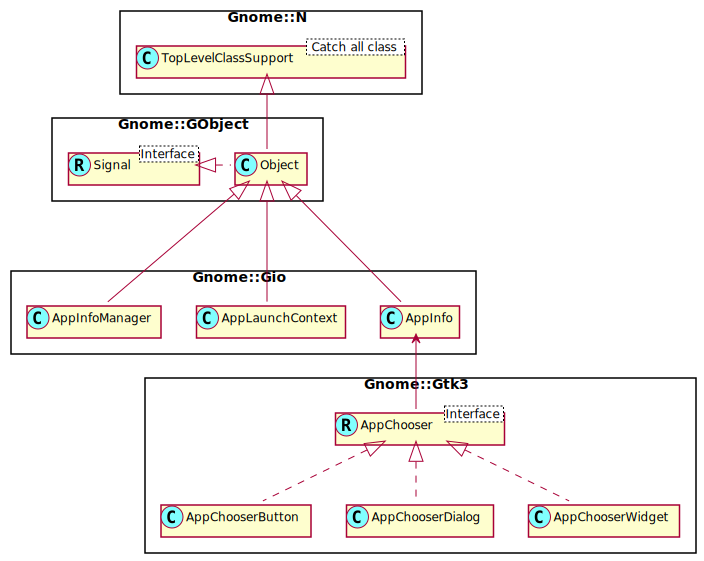

Gnome::Gio::AppInfo
===================

Application information and launch contexts

Description
===========

**Gnome::Gio::AppInfo** and **Gnome::Gio::AppLaunchContext** are used for describing and launching applications installed on the system.

As of GLib 2.20, URIs will always be converted to POSIX paths (using `Gnome::Gio::File.get-path()`) when using `launch()` even if the application requested a URI and not a POSIX path. For example, for a desktop-file based application with the `Exec` key `totem %U` and a single URI, `sftp://foo/file.avi`, then `/home/user/.gvfs/sftp` on `foo/file.avi` will be passed. This will only work if a set of suitable GIO extensions (such as gvfs 2.26 compiled with FUSE support), is available and operational; if this is not the case, the URI will be passed unmodified to the application. Some URIs, such as `mailto:`, of course cannot be mapped to a POSIX path (in gvfs there's no FUSE mount for it); such URIs will be passed unmodified to the application.

See Also
--------

**Gnome::Gio::AppInfoMonitor** and **Gnome::Gio::AppLaunchContext**

Synopsis
========

Declaration
-----------

    unit class Gnome::Gio::AppInfo;
    also is Gnome::GObject::Object;

Uml Diagram
-----------

Note
----

**Gnome::Gio::AppInfo** is defined as an interface in the Gnome libraries and therefore should be defined as a Raku role. However, the Gtk modules like **Gnome::Gtk3::AppChooser ** returns **Gnome::Gio::AppInfo** objects as if they are class objects. The only one which use the module as an interface, is GDesktopAppInfo which will not be implemented for the time being. When it does, it will inherit it as a class.

Example
-------

Below code will work when both `cdda://sr0/Track 1.wav` and `/home/user/.gvfs/cdda on sr0/Track 1.wav` is passed to the application. It should be noted that it's generally not safe for applications to rely on the format of a particular URIs. Different launcher applications (e.g. file managers) may have different ideas of what a given URI means.

    my Gnome::Gio::File $file .= new(
      :commandline-arg($uri-from-commandline)
    );

    # you might compare $uri with $uri-from-commandline
    # to see that they are equal;
    my Str $uri = $file.get-uri;

    if ( $file.has-uri-scheme('cdda') ) {
        … do something special with uri …
    }

    $file.clear-object;

Methods
=======

new
---

### :command-line, :application-name, :flags

Create a new **Gnome::Gio::AppInfo** object. Note that for commandline, the quoting rules of the Exec key of the freedesktop.org Desktop Entry Specification are applied. For example, if the commandline contains percent-encoded URIs, the percent-character must be doubled in order to prevent it from being swallowed by Exec key unquoting. See the specification for exact quoting rules.

    multi method new (
      Str :$command-line!, Str :$application-name!,
      UInt :$flags = G_APP_INFO_CREATE_NONE
    )

### :native-object

Create a **Gnome::Gio::AppInfo** object using a native object from elsewhere. See also **Gnome::N::TopLevelClassSupport**.

    multi method new ( N-GObject :$native-object! )

add-supports-type
-----------------

Adds a content type to the application information to indicate the application is capable of opening files with the given content type.

Returns `True` if successful, `False` if an error is set. When False, Check the error attribute `$.last-error` for failures.

    method add-supports-type ( Str $content-type --> Bool )

  * Str $content-type; a string.

can-delete
----------

Obtains the information whether the **Gnome::Gio::AppInfo** can be deleted. See `delete()`.

Returns: `True` if *appinfo* can be deleted

    method can-delete ( --> Bool )

can-remove-supports-type
------------------------

Checks if a supported content type can be removed from an application.

Returns: `True` if it is possible to remove supported content types from a given *appinfo*, `False` if not.

    method can-remove-supports-type ( --> Bool )

delete
------

Tries to delete a **Gnome::Gio::AppInfo**.

On some platforms, there may be a difference between user-defined **Gnome::Gio::AppInfos** which can be deleted, and system-wide ones which cannot. See `can-delete()`.

Returns: `True` if *appinfo* has been deleted

    method delete ( --> Bool )

get-all
-------

Gets a list of all of the applications currently registered on this system.

For desktop files, this includes applications that have NoDisplay=true set or are excluded from display by means of OnlyShowIn or NotShowIn. See `.should-show()`. The returned list does not include applications which have the Hidden key set.

Returns a newly allocated list of references to **Gnome::Gio::AppInfo**s.

    method get-all ( --> Gnome::Glib::List )

get-all-for-type
----------------

Gets a list of all **Gnome::Gio::AppInfo**s for a given content type, including the recommended and fallback GAppInfos. See `.get-recommended-for-type()` and `get-fallback-for-type()`.

    method get-all-for-type ( Str $content-type --> Gnome::Glib::List )

  * Str $content-type;

get-commandline
---------------

Gets the commandline with which the application will be started.

Returns: (type filename): a string containing the *appinfo*'s commandline, or `undefined` if this information is not available

    method get-commandline ( --> Str )

get-default-for-type
--------------------

Gets the default **Gnome::Gio::AppInfo** for a given content type.

    method get-default-for-type (
      Str $content-type, Bool $must_support_uris
      --> N-GObject
    )

  * Str $content-type;

  * Bool $must_support_uris;

get-default-for-uri-scheme
--------------------------

Gets the default application for handling URIs with the given URI scheme. A URI scheme is the initial part of the URI, up to but not including the ':', e.g. "http", "ftp" or "sip".

    method get-default-for-uri-scheme ( Str $uri_scheme --> N-GObject )

  * Str $uri_scheme;

get-description
---------------

Gets a human-readable description of an installed application.

Returns: a string containing a description of the application *appinfo*, or `undefined` if none.

    method get-description ( --> Str )

get-display-name
----------------

Gets the display name of the application. The display name is often more descriptive to the user than the name itself.

Returns: the display name of the application for *appinfo*, or the name if no display name is available.

    method get-display-name ( --> Str )

get-executable
--------------

Gets the executable's name for the installed application.

Returns: (type filename): a string containing the *appinfo*'s application binaries name

    method get-executable ( --> Str )

get-fallback-for-type
---------------------

Gets a list of fallback **Gnome::Gio::AppInfo**s for a given content type, i.e. those applications which claim to support the given content type by MIME type subclassing and not directly.

    method get-fallback-for-type ( Str $content-type --> Gnome::Glib::List )

  * Str $content-type;

get-icon
--------

Gets the icon for the application.

Returns: the default **Gnome::Gio::Icon** for *appinfo* or `undefined` if there is no default icon.

    method get-icon ( --> N-GObject )

get-id
------

Gets the ID of an application. An id is a string that identifies the application. The exact format of the id is platform dependent. For instance, on Unix this is the desktop file id from the xdg menu specification.

Note that the returned ID may be `undefined`, depending on how the *appinfo* has been constructed.

Returns: a string containing the application's ID.

    method get-id ( --> Str )

get-name
--------

Gets the installed name of the application.

Returns: the name of the application for *appinfo*.

    method get-name ( --> Str )

get-recommended-for-type
------------------------

Gets a list of recommended **Gnome::Gio::AppInfo**s for a given content type, i.e. those applications which claim to support the given content type exactly, and not by MIME type subclassing. Note that the first application of the list is the last used one, i.e. the last one for which `set_as_last_used_for_type()` has been called.

    method get-recommended-for-type ( Str $content-type --> Gnome::Glib::List )

  * Str $content-type;

get-supported-types
-------------------

Retrieves the list of content types that *app-info* claims to support. If this information is not provided by the environment, this function will return `undefined`. This function does not take in consideration associations added with `add-supports-type()`, but only those exported directly by the application.

Returns: a list of content types.

    method get-supported-types ( --> Array )

launch
------

Launches the application. Passes *f@iles* to the launched application as arguments, using the optional *$context* to get information about the details of the launcher (like what screen it is on). On error, *error* will be set accordingly.

To launch the application without arguments pass an empty *@files* list.

Note that even if the launch is successful the application launched can fail to start if it runs into problems during startup. There is no way to detect this.

The launched application inherits the environment of the launching process, but it can be modified with `Gnome::Gio::AppLaunchContext.setenv()` and `Gnome::Gio::AppLaunchContext.unsetenv()`.

On UNIX, this function sets the `GIO-LAUNCHED-DESKTOP-FILE` environment variable with the path of the launched desktop file and `GIO-LAUNCHED-DESKTOP-FILE-PID` to the process id of the launched process. This can be used to ignore `GIO-LAUNCHED-DESKTOP-FILE`, should it be inherited by further processes. The `DISPLAY` and `DESKTOP-STARTUP-ID` environment variables are also set, based on information provided in *context*.

Returns `True` if the launch was successful, `False` if an error is set. When False, Check the error attribute `$.last-error` for failures.

    method launch (
      @files, N-GObject $context --> Bool
    )

  * Str @files; list of filenames

  * N-GObject $context; a native **Gnome::Gio::AppLaunchContext** or `undefined`

launch-default-for-uri
----------------------

Utility function that launches the default application registered to handle the specified uri. Synchronous I/O is done on the uri to detect the type of the file if required.

The D-Bus–activated applications don't have to be started if your application terminates too soon after this function. To prevent this, use `launch-default-for-uri-async()` instead.

Returns `True` if the launch was successful, `False` if an error is set. When False, Check the error attribute `$.last-error` for failures.

    method launch-default-for-uri (
      Str $uri, N-GObject $context --> Bool
    )

  * Str $uri; the uri to show

  * N-GObject $context; an optional **Gnome::Gio::AppLaunchContext**

  * N-GError $error; return location for an error, or `undefined`

**Note** There are situations where a `False` value is returned but the error object was not set. `False` is returned correctly in those cases and there is really something wrong but the function doesn't reveal what.

launch-uris
-----------

Launches the application. This passes the *uris* to the launched application as arguments, using the optional *context* to get information about the details of the launcher (like what screen it is on). On error, *error* will be set accordingly.

To launch the application without arguments pass a `undefined` *uris* list.

Note that even if the launch is successful the application launched can fail to start if it runs into problems during startup. There is no way to detect this.

Returns `True` if the launch was successful, `False` if an error is set. When False, Check the error attribute `$.last-error` for failures.

    method launch-uris ( @uris, N-GObject $context --> Bool )

  * Str @uris; an array containing URIs to launch.

  * N-GObject $context; a **Gnome::Gio::AppLaunchContext** or `undefined`

remove-supports-type
--------------------

Removes a supported type from an application, if possible.

Returns: `True` on success, `False` on error.

    method remove-supports-type ( Str $content-type --> Bool )

Returns `True` if successful, `False` if an error is set. When False, Check the error attribute `$.last-error` for failures.

  * Str $content-type; a string.

reset-type-associations
-----------------------

Removes all changes to the type associations done by `.set_as_default_for_type()`, `.set_as_default_for_extension()`, `.add_supports_type()` or `.remove_supports_type()`.

    method reset-type-associations ( Str $content-type )

  * Str $content-type;

set-as-default-for-extension
----------------------------

Sets the application as the default handler for the given file extension.

Returns: `True` on success, `False` on error. When False, Check the error attribute `$.last-error` for failures.

    method set-as-default-for-extension ( Str $extension --> Bool )

  * Str $extension; a string containing the file extension (without the dot).

set-as-default-for-type
-----------------------

Sets the application as the default handler for a given type.

Sets the `$.last-error` attribute which will be invalid on successful launch, valid otherwise and the error object must be checked for the error. Check the `.message()` of this object to see what happened.

    method set-as-default-for-type ( Str $content-type --> Bool )

### Example

This example shows how to set the default command of a jpeg image to the execution of `ls -m`, a unix directory list command.

    $ai .= new( :command-line('ls -m'), :application-name('ls'));
    die $ai.last-error.message
      unless $ai.set-as-default-for-type('image/jpeg');

  * Str $content-type; the content type.

set-as-last-used-for-type
-------------------------

Sets the application as the last used application for a given type. This will make the application appear as first in the list returned by `get-recommended-for-type()`, regardless of the default application for that content type.

Returns `True` if successful, `False` if an error is set. When False, Check the error attribute `$.last-error` for failures.

    method set-as-last-used-for-type ( Str $content-type --> Bool )

  * Str $content-type; the content type.

should-show
-----------

Checks if the application info should be shown in menus that list available applications.

Returns: `True` if the *appinfo* should be shown, `False` otherwise.

    method should-show ( --> Bool )

supports-files
--------------

Checks if the application accepts files as arguments.

Returns: `True` if the *appinfo* supports files.

    method supports-files ( --> Bool )

supports-uris
-------------

Checks if the application supports reading files and directories from URIs.

Returns: `True` if the *appinfo* supports URIs.

    method supports-uris ( --> Bool )

