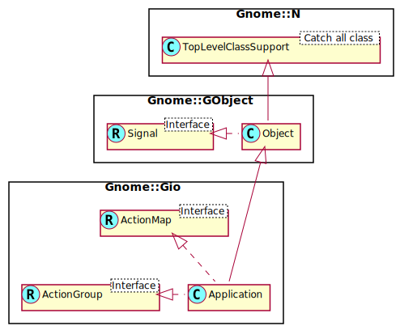

Gnome::Gio::Application
=======================

Core application class

Description
===========

A **Gnome::Gio::Application** is the foundation of an application. It wraps some low-level platform-specific services and is intended to act as the foundation for higher-level application classes such as **Gnome::Gtk3::Application**. In general, you should not use this class outside of a higher level framework.

**Gnome::Gio::Application** provides convenient life cycle management by maintaining a "use count" for the primary application instance. The use count can be changed using `hold()` and `release()`. If it drops to zero, the application exits. Higher-level classes such as **Gnome::Gtk3::Application** employ the use count to ensure that the application stays alive as long as it has any opened windows.

Another feature that **Gnome::Gio::Application** (optionally) provides is process uniqueness. Applications can make use of this functionality by providing a unique application ID. If given, only one application with this ID can be running at a time per session. The session concept is platform-dependent, but corresponds roughly to a graphical desktop login. When your application is launched again, its arguments are passed through platform communication to the already running program. The already running instance of the program is called the "primary instance"; for non-unique applications this is the always the current instance. On Linux, the D-Bus session bus is used for communication.

The use of **Gnome::Gio::Application** differs from some other commonly-used uniqueness libraries (such as libunique) in important ways. The application is not expected to manually register itself and check if it is the primary instance. Instead, the Raku main program of a **Gnome::Gio::Application** based application should do very little more than instantiating the application instance, possibly connecting signal handlers, then calling `run()`. All checks for uniqueness are done internally. If the application is the primary instance then the startup signal is emitted and the mainloop runs. If the application is not the primary instance then a signal is sent to the primary instance and `run()` promptly returns.

If used, the expected form of an application identifier is the same as that of of a [D-Bus well-known bus name](https://dbus.freedesktop.org/doc/dbus-specification.html#message-protocol-names-bus). Examples include: `com.example.MyApp`, `org.example.internal_apps.Calculator`, `org._7_zip.Archiver`. For details on valid application identifiers, see `id-is-valid()`. Note; the Raku implementation of `new(:app-id)` checks the id using that routine.

On Linux, the application identifier is claimed as a well-known bus name on the user's session bus. This means that the uniqueness of your application is scoped to the current session. It also means that your application may provide additional services (through registration of other object paths) at that bus name. The registration of these object paths should be done with the shared GDBus session bus. Note that due to the internal architecture of GDBus, method calls can be dispatched at any time (even if a main loop is not running). For this reason, you must ensure that any object paths that you wish to register are registered before **Gnome::Gio::Application** attempts to acquire the bus name of your application (which happens in `register()`). Unfortunately, this means that you cannot use `get-is-remote()` to decide if you want to register object paths.

**Gnome::Gio::Application** also implements the **Gnome::Gio::ActionGroup** and **Gnome::Gio::ActionMap** interfaces and lets you easily export actions by adding them with `add-action()`. When invoking an action by calling `activate-action()` on the application, it is always invoked in the primary instance. The actions are also exported on the session bus, and GIO provides the **Gnome::Gio::DBusActionGroup** wrapper to conveniently access them remotely. GIO provides a **Gnome::Gio::DBusMenuModel** wrapper for remote access to exported GMenuModels.

There is a number of different entry points into a **Gnome::Gio::Application**:

  * via 'Activate' (i.e. just starting the application)

  * by handling a command-line

  * via activating an action

The *startup* signal lets you handle the application initialization for all of these in a single place.

When dealing with **Gnome::Gio::ApplicationCommandLine** objects, the platform data is directly available via `get-cwd()`, `get-environ()` and `get-platform-data()` in that object.

As the name indicates, the platform data may vary depending on the operating system, but it always includes the current directory

See Also
--------

  * [Application tutorial](/gnome-gtk3/content-docs/tutorial/Application/introduction.html)

Synopsis
========

Declaration
-----------

    unit class Gnome::Gio::Application;
    also is Gnome::GObject::Object;
    also does Gnome::Gio::ActionMap;
    also does Gnome::Gio::ActionGroup;

Uml Diagram 
-----------------------------------------

Methods
=======

new
---

### default, no options

Create a new Application object with an empty application id and flags set to G_APPLICATION_FLAGS_NONE.

    multi method new ( )

### :default

Sets the default **GApplication** instance for this process.

Normally there is only one **GApplication** per process and it becomes the default when it is created. You can exercise more control over this by using `set-default()`. If there is no default application then this object becomes invalid.

    multi method new ( :default! )

### :app-id, :flags

Create a new object with a valid application id and a mask of GApplicationFlags values.

    multi method new (
      Bool :$app-id!, Int :$flags = G_APPLICATION_FLAGS_NONE
    )

### :native-object

Create an object using a native object from elsewhere.

    multi method new ( N-GObject :$native-object! )

activate
--------

Activates the application. In essence, this results in the *activate* signal being emitted in the primary instance. The application must be registered before calling this function.

    method activate ( )

get-application-id
------------------

Gets the unique identifier for the application.

Returns: the identifier for the application, owned by the application

    method get-application-id ( --> Str )

get-dbus-object-path
--------------------

Gets the D-Bus object path being used by the application, or `undefined`. If **GApplication** is using its D-Bus backend then this function will return the D-Bus object path that **GApplication** is using. If the application is the primary instance then there is an object published at this path. If the application is not the primary instance then the result of this function is undefined. If **GApplication** is not using D-Bus then this function will return `undefined`. This includes the situation where the D-Bus backend would normally be in use but we were unable to connect to the bus. This function must not be called before the application has been registered. See `g_application_get_is_registered()`.

Returns: the object path, or `undefined`

    method get-dbus-object-path ( --> Str )

get-flags
---------

Gets the flags for the application. See **GApplicationFlags**.

Returns: a mask of ored GApplicationFlags flags for the application

    method get-flags ( --> Int )

get-inactivity-timeout
----------------------

Gets the current inactivity timeout for the application. This is the amount of time (in milliseconds) after the last call to `release()` before the application stops running.

Returns: the timeout, in milliseconds

    method get-inactivity-timeout ( --> UInt )

get-is-busy
-----------

Gets the application's current busy state, as set through `g_application_mark_busy()` or `g_application_bind_busy_property()`.

Returns: `True` if the application is currenty marked as busy

    method get-is-busy ( --> Int )

get-is-registered
-----------------

Checks if the application is registered. An application is registered if `g_application_register()` has been successfully called.

Returns: `True` if the application is registered

    method get-is-registered ( --> Bool )

get-is-remote
-------------

Checks if the application is remote. If the application is remote then it means that another instance of application already exists (the 'primary' instance). Calls to perform actions on the application will result in the actions being performed by the primary instance. The value of this property cannot be accessed before `register()` has been called. See `get-is-registered()`.

Returns: `True` if the application is remote

    method get-is-remote ( --> Bool )

get-resource-base-path
----------------------

Gets the resource base path of the application. See `g_application_set_resource_base_path()` for more information.

Returns: (nullable): the base resource path, if one is set

    method get-resource-base-path ( --> Str )

hold
----

Increases the use count of the application. Use this function to indicate that the application has a reason to continue to run. For example, `hold()` is called by GTK+ when a toplevel window is on the screen. To cancel the hold, call `release()`.

    method hold ( )

id-is-valid
-----------

Checks if *$application_id* is a valid application identifier. A valid ID is required for calls to `new(:app-id)` and `set-application-id()`. Application identifiers follow the same format as [D-Bus well-known bus names](https://dbus.freedesktop.org/doc/dbus-specification.html#message-protocol-names-bus). For convenience, the restrictions on application identifiers are reproduced here:

  * Application identifiers are composed of 1 or more elements separated by a period (`.`) character. All elements must contain at least one character.

  * Each element must only contain the ASCII characters `[A-Z][a-z][0-9]_-`, with `-` discouraged in new application identifiers. Each element must not begin with a digit.

  * Application identifiers must contain at least one `.` (period) character (and thus at least two elements).

  * Application identifiers must not begin with a `.` (period) character.

  * Application identifiers must not exceed 255 characters.

Note that the hyphen (`-`) character is allowed in application identifiers, but is problematic or not allowed in various specifications and APIs that refer to D-Bus, such as [Flatpak application IDs](http://docs.flatpak.org/en/latest/introduction.html#identifiers), the [DBusActivatable interface in the Desktop Entry Specification](https://specifications.freedesktop.org/desktop-entry-spec/desktop-entry-spec-latest.html#dbus), and the convention that an application's "main" interface and object path resemble its application identifier and bus name. To avoid situations that require special-case handling, it is recommended that new application identifiers consistently replace hyphens with underscores.

Like D-Bus interface names, application identifiers should start with the reversed DNS domain name of the author of the interface (in lower-case), and it is conventional for the rest of the application identifier to consist of words run together, with initial capital letters.

As with D-Bus interface names, if the author's DNS domain name contains hyphen/minus characters they should be replaced by underscores, and if it contains leading digits they should be escaped by prepending an underscore. For example, if the owner of 7-zip.org used an application identifier for an archiving application, it might be named `org._7_zip.Archiver`.

Returns: `True` if *$application_id* is valid

    method id-is-valid ( Str $application_id --> Bool )

  * Str $application_id; a potential application identifier

mark-busy
---------

Increases the busy count of the application. Use this function to indicate that the application is busy, for instance while a long running operation is pending. The busy state will be exposed to other processes, so a session shell will use that information to indicate the state to the user (e.g. with a spinner). To cancel the busy indication, use `g_application_unmark_busy()`.

    method mark-busy ( )

open
----

Opens the given files. In essence, this results in the *open* signal being emitted in the primary instance. *$hint* is simply passed through to the *open* signal. It is intended to be used by applications that have multiple modes for opening files (eg: "view" vs "edit", etc). Unless you have a need for this functionality, you should use "". The application must be registered before calling this function and it must have the `G_APPLICATION_HANDLES_OPEN` flag set.

    method open ( Array[Str] $files, Str $hint )

  * Array[Str] $files; an array of filenames to open

  * Str $hint; a hint (or ""), but never `undefined`.

quit
----

Immediately quits the application. Upon return to the mainloop, `run()` will return, calling only the 'shutdown' function before doing so. The hold count is ignored. Take care if your code has called `hold()` on the application and is therefore still expecting it to exist. (Note that you may have called `hold()` indirectly, for example through `add-window()`.) The result of calling `run()` again after it returns is unspecified.

    method quit ( )

register
--------

Attempts registration of the application. This is the point at which the application discovers if it is the primary instance or merely acting as a remote for an already-existing primary instance.

This is implemented by attempting to acquire the application identifier as a unique bus name on the session bus using GDBus. If there is no application ID or if `G_APPLICATION_NON_UNIQUE` was given, then this process will always become the primary instance. Due to the internal architecture of GDBus, method calls can be dispatched at any time (even if a main loop is not running). For this reason, you must ensure that any object paths that you wish to register are registered before calling this function. If the application has already been registered then an invalid error object is returned with no work performed.

The *startup* signal is emitted if registration succeeds and the application is the primary instance (including the non-unique case). In the event of an error (such as *cancellable* being cancelled, or a failure to connect to the session bus), then the error object is set appropriately. Note: the return value of this function is not an indicator that this instance is or is not the primary instance of the application. See `get-is-remote()` for that.

Returns: Gnome::Glib::Error. if registration succeeded the error object is invalid.

    method register ( N-GObject $cancellable --> Gnome::Glib::Error )

  * N-GObject $cancellable; a **N-GObject**, or `undefined`

release
-------

Decrease the use count of the application. When the use count reaches zero, the application will stop running. Never call this function except to cancel the effect of a previous call to `hold()`.

    method release ( )

run
---

Runs the application.

This function is intended to be run from `main()` and its return value is intended to be returned by your main program.

**Gnome::Gio::Application** will attempt to parse the commandline arguments read from `@*ARGS`. You can add commandline flags to the list of recognized options by way of `add-main-option-entries()`. After this, the *handle-local-options* signal is emitted, from which the application can inspect the values of its **N-GOptionEntrys**.

*handle-local-options* is a good place to handle options such as `--version`, where an immediate reply from the local process is desired (instead of communicating with an already-running instance). A *handle-local-options* handler can stop further processing by returning a non-negative value, which then becomes the exit status of the process.

What happens next depends on the flags: if `G_APPLICATION_HANDLES_COMMAND_LINE` was specified then the remaining commandline arguments are sent to the primary instance, where a *command-line* signal is emitted. Otherwise, the remaining commandline arguments are assumed to be a list of files. If there are no files listed, the application is activated via the *activate* signal. If there are one or more files, and `G_APPLICATION_HANDLES_OPEN` was specified then the files are opened via the *open* signal.

If, after the above is done, the use count of the application is zero then the exit status is returned immediately. If the use count is non-zero then the default main context is iterated until the use count falls to zero, at which point 0 is returned.

If the `G_APPLICATION_IS_SERVICE` flag is set, then the service will run for as much as 10 seconds with a use count of zero while waiting for the message that caused the activation to arrive. When a message arrives, the use count is increased. After that, if the use count falls back to zero or stays zero, the application will exit immediately, except in the case that `g_application_set_inactivity_timeout()` is in use.

Much like `run()` from **Gnome::Glib::MainLoop**, this function will acquire the main context for the duration that the application is running.

Applications that are not explicitly flagged as services or launchers will check if "--gapplication-service" was given in the command line. If this flag is present then normal commandline processing is interrupted and the `G_APPLICATION_IS_SERVICE` flag is set. This provides a "compromise" solution whereby running an application directly from the commandline will invoke it in the normal way (which can be useful for debugging) while still allowing applications to be D-Bus activated in service mode. The D-Bus service file should invoke the executable with "--gapplication-service" as the sole commandline argument. This approach is suitable for use by most graphical applications but should not be used from applications like editors that need precise control over when processes invoked via the commandline will exit and what their exit status will be.

Returns: the exit status

    method run ( --> Int )

send-notification
-----------------

Sends a notification on behalf of the application to the desktop shell. There is no guarantee that the notification is displayed immediately, or even at all. Notifications may persist after the application exits. It will be D-Bus-activated when the notification or one of its actions is activated. Modifying *notification* after this call has no effect. However, the object can be reused for a later call to this function. *id* may be any string that uniquely identifies the event for the application. It does not need to be in any special format. For example, "new-message" might be appropriate for a notification about new messages. If a previous notification was sent with the same *id*, it will be replaced with *notification* and shown again as if it was a new notification. This works even for notifications sent from a previous execution of the application, as long as *id* is the same string. *id* may be `undefined`, but it is impossible to replace or withdraw notifications without an id. If *notification* is no longer relevant, it can be withdrawn with `g_application_withdraw_notification()`.

    method send-notification ( Str $id, N-GObject $notification )

  * Str $id; id of the notification, or `undefined`

  * N-GObject $notification; the **GNotification** to send

set-application-id
------------------

Sets the unique identifier for the application. The application id can only be modified if the application has not yet been registered. If defined, the application id must be valid. See `id-is-valid()`.

    method set-application-id (Str$application_id )

  * Str $application_id; the identifier for the application

set-default
-----------

Sets or unsets the default application for the process, as returned by `g_application_get_default()`. This function does not take its own reference on the application. If the application is destroyed then the default application will revert back to `undefined`.

    method set-default ( )

set-flags
---------

Sets the flags for the application. The flags can only be modified if the application has not yet been registered. See **GApplicationFlags**.

    method set-flags ( Int $flags )

  * Int $flags; an ored mask of GApplicationFlags for the application

set-inactivity-timeout
----------------------

Sets the current inactivity timeout for the application. This is the amount of time (in milliseconds) after the last call to `g_application_release()` before the application stops running. This call has no side effects of its own. The value set here is only used for next time `g_application_release()` drops the use count to zero. Any timeouts currently in progress are not impacted.

    method set-inactivity-timeout ( UInt $inactivity_timeout )

  * UInt $inactivity_timeout; the timeout, in milliseconds

set-resource-base-path
----------------------

Sets (or unsets) the base resource path of the application. The path is used to automatically load various [application resources][gresource] such as menu layouts and action descriptions. The various types of resources will be found at fixed names relative to the given base path. By default, the resource base path is determined from the application ID by prefixing '/' and replacing each '.' with '/'. This is done at the time that the **GApplication** object is constructed. Changes to the application ID after that point will not have an impact on the resource base path. As an example, if the application has an ID of "org.example.app" then the default resource base path will be "/org/example/app". If this is a **Gnome::Gtk3::Application** (and you have not manually changed the path) then **Gnome::Gtk3:: will** then search for the menus of the application at "/org/example/app/gtk/menus.ui". See **GResource** for more information about adding resources to your application. You can disable automatic resource loading functionality by setting the path to `undefined`. Changing the resource base path once the application is running is not recommended. The point at which the resource path is consulted for forming paths for various purposes is unspecified. When writing a sub-class of **GApplication** you should either set the *resource-base-path* property at construction time, or call this function during the instance initialization. Alternatively, you can call this function in the **GApplicationClass**.startup virtual function, before chaining up to the parent implementation.

    method set-resource-base-path ( Str $resource_path )

  * Str $resource_path; (nullable): the resource path to use

unbind-busy-property
--------------------

Destroys a binding between *property* and the busy state of the application that was previously created with `g_application_bind_busy_property()`.

    method unbind-busy-property ( Pointer $object, Str $property )

  * Pointer $object; (type GObject.Object): a **GObject**

  * Str $property; the name of a boolean property of *object*

unmark-busy
-----------

Decreases the busy count of the application. When the busy count reaches zero, the new state will be propagated to other processes. This function must only be called to cancel the effect of a previous call to `g_application_mark_busy()`.

    method unmark-busy ( )

withdraw-notification
---------------------

Withdraws a notification that was sent with `g_application_send_notification()`. This call does nothing if a notification with *id* doesn't exist or the notification was never sent. This function works even for notifications sent in previous executions of this application, as long *id* is the same as it was for the sent notification. Note that notifications are dismissed when the user clicks on one of the buttons in a notification or triggers its default action, so there is no need to explicitly withdraw the notification in that case.

    method withdraw-notification ( Str $id )

  * Str $id; id of a previously sent notification

Signals
=======

There are two ways to connect to a signal. The first option you have is to use `register-signal()` from **Gnome::GObject::Object**. The second option is to use `connect-object()` directly from **Gnome::GObject::Signal**.

First method
------------

The positional arguments of the signal handler are all obligatory as well as their types. The named attributes `:$widget` and user data are optional.

    # handler method
    method mouse-event ( GdkEvent $event, :$widget ) { ... }

    # connect a signal on window object
    my Gnome::Gtk3::Window $w .= new( ... );
    $w.register-signal( self, 'mouse-event', 'button-press-event');

Second method
-------------

    my Gnome::Gtk3::Window $w .= new( ... );
    my Callable $handler = sub (
      N-GObject $native, GdkEvent $event, OpaquePointer $data
    ) {
      ...
    }

    $w.connect-object( 'button-press-event', $handler);

Also here, the types of positional arguments in the signal handler are important. This is because both methods `register-signal()` and `connect-object()` are using the signatures of the handler routines to setup the native call interface.

Supported signals
-----------------

### activate

The *activate* signal is emitted on the primary instance when an activation occurs. See `activate()`.

    method handler (
      Int :$_handle_id,
      Gnome::GObject::Object :_widget($application),
      *%user-options
    );

  * $application; the application

### command-line

The *command-line* signal is emitted on the primary instance when a commandline is not handled locally. See `run()` and the **GApplicationCommandLine** documentation for more information.

Returns: An integer that is set as the exit status for the calling process. See `g_application_command_line_set_exit_status()`.

    method handler (
      N-GObject $command_line,
      Int :$_handle_id,
      Gnome::GObject::Object :_widget($application),
      *%user-options
      --> Int
    );

  * $application; the application, a **Gnome::Gio::Application** object.

  * N-GObject $command_line; A native **Gnome::Gio::ApplicationCommandLine** representing the # A native Gnome::Gio::ApplicationCommandLine object passed commandline

### handle-local-options

The *handle-local-options* signal is emitted on the local instance after the parsing of the commandline options has occurred.

You can add options to be recognised during commandline option parsing using `g_application_add_main_option_entries()` and `g_application_add_option_group()`.

Signal handlers can inspect *options* (along with values pointed to from the *arg_data* of an installed **GOptionEntrys**) in order to decide to perform certain actions, including direct local handling (which may be useful for options like --version).

In the event that the application is marked `G_APPLICATION_HANDLES_COMMAND_LINE` the "normal processing" will send the *options* dictionary to the primary instance where it can be read with `g_application_command_line_get_options_dict()`. The signal handler can modify the dictionary before returning, and the modified dictionary will be sent.

In the event that `G_APPLICATION_HANDLES_COMMAND_LINE` is not set, "normal processing" will treat the remaining uncollected command line arguments as filenames or URIs. If there are no arguments, the application is activated by `g_application_activate()`. One or more arguments results in a call to `g_application_open()`.

If you want to handle the local commandline arguments for yourself by converting them to calls to `g_application_open()` or `g_action_group_activate_action()` then you must be sure to register the application first. You should probably not call `g_application_activate()` for yourself, however: just return -1 and allow the default handler to do it for you. This will ensure that the `--gapplication-service` switch works properly (i.e. no activation in that case).

Note that this signal is emitted from the default implementation of `local_command_line()`. If you override that function and don't chain up then this signal will never be emitted.

You can override `local_command_line()` if you need more powerful capabilities than what is provided here, but this should not normally be required.

Returns: an exit code. If you have handled your options and want to exit the process, return a non-negative option, 0 for success, and a positive value for failure. To continue, return -1 to let the default option processing continue.

    method handler (
      N-GObject $options,
      Int :$_handle_id,
      Gnome::GObject::Object :_widget($application),
      *%user-options
      --> Int
    );

  * $application; the application

  * $options; the options dictionary

### name-lost

The *name-lost* signal is emitted only on the registered primary instance when a new instance has taken over. This can only happen if the application is using the `G_APPLICATION_ALLOW_REPLACEMENT` flag.

The default handler for this signal calls `g_application_quit()`.

Returns: `True` if the signal has been handled

    method handler (
      Int :$_handle_id,
      Gnome::GObject::Object :_widget($application),
      *%user-options
      --> Int
    );

  * $application; the application

### open

The *open* signal is emitted on the primary instance when there are files to open. See `open()` for more information.

    method handler (
      CArray[N-GFile] $files, Int $n_files, Str $hint,
      Int :$_handle_id,
      Gnome::GObject::Object :_widget($application),
      *%user-options
    );

  * $application; the application

  * $files; (array length=n_files) an array of **N-GFiles**

  * $n_files; the length of *files*

  * $hint; a hint provided by the calling instance

### shutdown

The *shutdown* signal is emitted only on the registered primary instance immediately after the main loop terminates.

    method handler (
      Int :$_handle_id,
      Gnome::GObject::Object :_widget($application),
      *%user-options
    );

  * $application; the application

### startup

The *startup* signal is emitted on the primary instance immediately after registration. See `g_application_register()`.

    method handler (
      Int :$_handle_id,
      Gnome::GObject::Object :_widget($application),
      *%user-options
    );

  * $application; the application

Properties
==========

An example of using a string type property of a **Gnome::Gtk3::Label** object. This is just showing how to set/read a property, not that it is the best way to do it. This is because a) The class initialization often provides some options to set some of the properties and b) the classes provide many methods to modify just those properties. In the case below one can use **new(:label('my text label'))** or **gtk_label_set_text('my text label')**.

    my Gnome::Gtk3::Label $label .= new;
    my Gnome::GObject::Value $gv .= new(:init(G_TYPE_STRING));
    $label.g-object-get-property( 'label', $gv);
    $gv.g-value-set-string('my text label');

Supported properties
--------------------

### Action group: action-group

The group of actions that the application exports Widget type: G-TYPE-ACTION-GROUP

The **Gnome::GObject::Value** type of property *action-group* is `G_TYPE_OBJECT`.

### Application identifier: application-id

The unique identifier for the application Default value: Any

The **Gnome::GObject::Value** type of property *application-id* is `G_TYPE_STRING`.

### Application flags: flags

The **Gnome::GObject::Value** type of property *flags* is `G_TYPE_FLAGS`.

### Inactivity timeout: inactivity-timeout

The **Gnome::GObject::Value** type of property *inactivity-timeout* is `G_TYPE_UINT`.

### Is busy: is-busy

Whether the application is currently marked as busy

The **Gnome::GObject::Value** type of property *is-busy* is `G_TYPE_BOOLEAN`.

### Is registered: is-registered

If register( has been called) Default value: False

The **Gnome::GObject::Value** type of property *is-registered* is `G_TYPE_BOOLEAN`.

### Is remote: is-remote

If this application instance is remote Default value: False

The **Gnome::GObject::Value** type of property *is-remote* is `G_TYPE_BOOLEAN`.

### Resource base path: resource-base-path

The base resource path for the application Default value: Any

The **Gnome::GObject::Value** type of property *resource-base-path* is `G_TYPE_STRING`.

