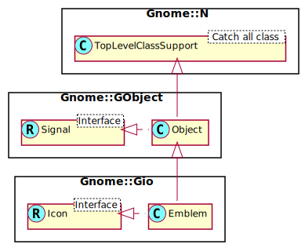

Gnome::Gio::Emblem
==================

An object for emblems

Description
===========

**Gnome::Gio::Emblem** is an implementation of **Gnome::Gio::Icon** that supports having an emblem, which is an icon with additional properties. It can than be added to a **Gnome::Gio::EmblemedIcon**.

Currently, only metainformation about the emblem's origin is supported. More may be added in the future.

See Also
--------

**Gnome::Gio::Icon**, **Gnome::Gio::EmblemedIcon**, **Gnome::Gio::LoadableIcon**, **Gnome::Gio::ThemedIcon**

Synopsis
========

Declaration
-----------

    unit class Gnome::Gio::Emblem;
    also is Gnome::GObject::Object;
    also does Gnome::Gio::Icon;

Uml Diagram
-----------

Methods
=======

new
---

### :icon

Create a new Emblem object.

    multi method new ( N-GObject :$icon!, UInt :$origin? )

  * N-GObject $icon; an object containing the icon.

  * UInt $origin; a GEmblemOrigin enum defining the emblem's origin

### :string

Generate a **Gnome::Gio::FileIcon** instance from a string. This function can fail if the string is not valid - see `Gnome::Gio::Icon.to-string()` for discussion. When it fails, the error object in the attribute `$.last-error` will be set.

    method new ( Str :$string! )

  * Str $string; A string obtained via `Gnome::Gio::Icon.to-string()`.

### :native-object

Create a Emblem object using a native object from elsewhere. See also **Gnome::N::TopLevelClassSupport**.

    multi method new ( N-GObject :$native-object! )

get-icon, get-icon-rk
---------------------

Gives back the icon from this *emblem*.

Returns: a **Gnome::Gio::Emblem**. The returned object belongs to the emblem and should not be modified or freed.

    method get-icon ( --> N-GObject )
    method get-icon-rk ( --> Gnome::Gio::Emblem )

get-origin
----------

Gets the origin of the emblem.

Returns: the origin of the emblem as an GEmblemOrigin enum

    method get-origin ( --> GEmblemOrigin )

Properties
==========

An example of using a string type property of a **Gnome::Gtk3::Label** object. This is just showing how to set/read a property, not that it is the best way to do it. This is because a) The class initialization often provides some options to set some of the properties and b) the classes provide many methods to modify just those properties. In the case below one can use **new(:label('my text label'))** or **.set-text('my text label')**.

    my Gnome::Gtk3::Label $label .= new;
    my Gnome::GObject::Value $gv .= new(:init(G_TYPE_STRING));
    $label.get-property( 'label', $gv);
    $gv.set-string('my text label');

Supported properties
--------------------

### The icon of the emblem: icon

The actual icon of the emblem Widget type: G-TYPE-OBJECT

The **Gnome::GObject::Value** type of property *icon* is `G_TYPE_OBJECT`.

### GEmblem’s origin: origin

Tells which origin the emblem is derived from Default value: False

The **Gnome::GObject::Value** type of property *origin* is `G_TYPE_ENUM`.

