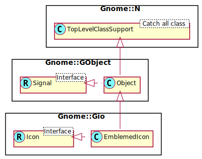

Gnome::Gio::EmblemedIcon
========================

Icon with emblems

Description
===========

*include*: gio/gio.h

**Gnome::Gio::EmblemedIcon** is an implementation of **Gnome::Gio::Icon** that supports adding an emblem to an icon. Adding multiple emblems to an icon is ensured via `add-emblem()`.

Note that **Gnome::Gio::EmblemedIcon** allows no control over the position of the emblems. See also **Gnome::Gio::Emblem** for more information.

See Also
--------

**Gnome::Gio::Icon**, **Gnome::Gio::LoadableIcon**, **Gnome::Gio::ThemedIcon**, **Gnome::Gio::Emblem**

Synopsis
========

Declaration
-----------

    unit role Gnome::Gio::EmblemedIcon;
    also is Gnome::GObject::Object;
    also does Gnome::Gio::Icon;

Uml Diagram
-----------

Methods
=======

new
---

### :icon, :emblem

Create a new EmblemedIcon object.

    multi method new ( N-GObject :$icon!, N-GObject :$emblem! )

  * N-GObject $icon; an object containing the icon.

  * UInt $origin; a GEmblemOrigin enum defining the emblem's origin

### :string

Generate a **Gnome::Gio::FileIcon** instance from a string. This function can fail if the string is not valid - see `Gnome::Gio::Icon.to-string()` for discussion. When it fails, the error object in the attribute `$.last-error` will be set.

    method new ( Str :$string! )

  * Str $string; A string obtained via `Gnome::Gio::Icon.to-string()`.

### :native-object

Create a EmblemedIcon object using a native object from elsewhere. See also **Gnome::N::TopLevelClassSupport**.

    multi method new ( N-GObject :$native-object! )

add-emblem
----------

Adds *emblem* to the **Gnome::Gio::List** of **Gnome::Gio::Emblems**.

    method add-emblem ( N-GObject $emblem )

  * N-GObject $emblem; a **Gnome::Gio::Emblem**

clear-emblems
-------------

Removes all the emblems from *icon*.

    method clear-emblems ( )

get-emblems, get-emblems-rk
---------------------------

Gets the list a **Gnome::Glib::List** of emblems for the *icon*.

    method get-emblems ( --> N-GList )
    method get-emblems-rk ( --> Gnome::Glib::List )

get-icon
--------

Gets the main icon for *emblemed*.

    method get-icon ( --> N-GObject )
    method get-icon-rk ( --> Gnome::Gio::EmblemedIcon )

Properties
==========

An example of using a string type property of a **Gnome::Gtk3::Label** object. This is just showing how to set/read a property, not that it is the best way to do it. This is because a) The class initialization often provides some options to set some of the properties and b) the classes provide many methods to modify just those properties. In the case below one can use **new(:label('my text label'))** or **.set-text('my text label')**.

    my Gnome::Gtk3::Label $label .= new;
    my Gnome::GObject::Value $gv .= new(:init(G_TYPE_STRING));
    $label.get-property( 'label', $gv);
    $gv.set-string('my text label');

Supported properties
--------------------

### The base GIcon: gicon

The GIcon to attach emblems to Widget type: G-TYPE-ICON

The **Gnome::GObject::Value** type of property *gicon* is `G_TYPE_OBJECT`.

