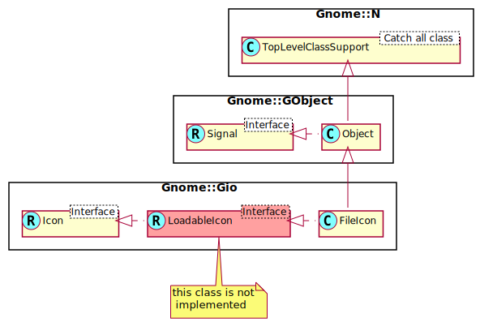

Gnome::Gio::FileIcon
====================

Icons pointing to an image file

Description
===========

*include*: gio/gio.h

**Gnome::Gio::FileIcon** specifies an icon by pointing to an image file to be used as icon.

See Also
--------

**Gnome::Gio::Icon**, **Gnome::Gio::LoadableIcon**

Synopsis
========

Declaration
-----------

    unit class Gnome::Gio::FileIcon;
    also is Gnome::GObject::Object;
    also does Gnome::Gio::Icon;

Uml Diagram
-----------

Methods
=======

new
---

### :file

Create a new FileIcon object.

    multi method new ( N-GObject :$file! )

### :string

Generate a **Gnome::Gio::FileIcon** instance from a string. This function can fail if the string is not valid - see `Gnome::Gio::Icon.to-string()` for discussion. When it fails, the error object in the attribute `$.last-error` will be set.

    method new ( Str :$strinng! )

  * Str $string; A string obtained via `Gnome::Gio::Icon.to-string()`.

### :native-object

Create a FileIcon object using a native object from elsewhere. See also **Gnome::N::TopLevelClassSupport**.

    multi method new ( N-GObject :$native-object! )

get-file, get-file-rk
---------------------

Gets the **Gnome::Gio::File** associated with the given *icon*.

Returns: a **Gnome::Gio::File**, or `undefined`.

    method get-file ( --> N-GFile )
    method get-file-rk ( --> Gnome::Gio::File )

Properties
==========

An example of using a string type property of a **Gnome::Gtk3::Label** object. This is just showing how to set/read a property, not that it is the best way to do it. This is because a) The class initialization often provides some options to set some of the properties and b) the classes provide many methods to modify just those properties. In the case below one can use **new(:label('my text label'))** or **.set-text('my text label')**.

    my Gnome::Gtk3::Label $label .= new;
    my Gnome::GObject::Value $gv .= new(:init(G_TYPE_STRING));
    $label.get-property( 'label', $gv);
    $gv.set-string('my text label');

Supported properties
--------------------

### file: file

The file containing the icon.Widget type: G_TYPE_FILE

The **Gnome::GObject::Value** type of property *file* is `G_TYPE_OBJECT`.

