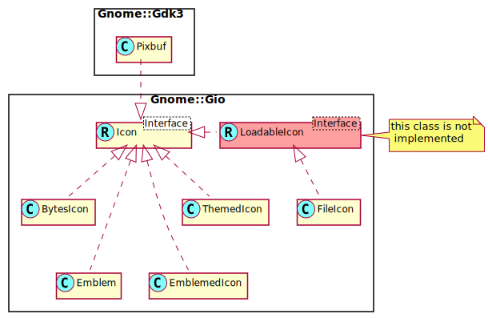

Gnome::Gio::Icon
================

Interface for icons

Description
===========

**Gnome::Gio::Icon** is a very minimal interface for icons. It provides functions for checking the equality of two icons, hashing of icons and serializing an icon to and from strings.

**Gnome::Gio::Icon** does not provide the actual pixmap for the icon as this is out of GIO's scope, however implementations of **Gnome::Gio::Icon** may contain the name of an icon (see **Gnome::Gio::ThemedIcon**), or the path to an icon (see **Gnome::Gio::LoadableIcon**).

To check if two **Gnome::Gio::Icons** are equal, see `equal()`.

Synopsis
========

Declaration
-----------

    unit role Gnome::Gio::Icon;

Uml Diagram
-----------

Methods
=======

deserialize
-----------

Deserializes a **Gnome::Gio::Icon** previously serialized using `serialize()`.

Returns: a **Gnome::Gio::Icon**, or `undefined` when deserialization fails.

    method deserialize ( N-GObject $value --> N-GObject )

  * $value; a **Gnome::Glib::Variant** created with `serialize()`

equal
-----

Checks if two icons are equal.

Returns: `True` if the icon is equal to *$icon*. `False` otherwise.

    method equal ( N-GObject $icon --> Bool )

  * $icon; pointer to the other **Gnome::Gio::Icon**.

serialize
---------

Serializes a **Gnome::Gio::Icon** into a **Gnome::Glib::Variant**. An equivalent **Gnome::Gio::Icon** can be retrieved back by calling `deserialize()` on the returned value. As serialization will avoid using raw icon data when possible, it only makes sense to transfer the **Gnome::Glib::Variant** between processes on the same machine, (as opposed to over the network), and within the same file system namespace.

Returns: a **Gnome::Glib::Variant**, or `undefined` when serialization fails.

    method serialize ( --> N-GObject )

to-string
---------

Generates a textual representation of this *icon* that can be used for serialization such as when passing an *icon* to a different process or saving it to persistent storage. Use `Some-Icon-Child.new(:string)` to get this *icon* back from the returned string.

The encoding of the returned string is proprietary to **Gnome::Gio::Icon** except in the following two cases

  * If the icon is a **Gnome::Gio::FileIcon**, the returned string is a native path (such as `/path/to/my icon.png`) without escaping if the **Gnome::Gio::File** for this icon is a native file. If the file is not native, the returned string is the result of `.get-uri()` (such as `sftp://path/to/my`20icon`.png`).

  * If *icon* is a **Gnome::Gio::ThemedIcon** with exactly one name and no fallbacks, the encoding is simply the name (such as `network-server`).

Returns: A UTF8 string or `undefined` if *icon* can't be serialized.

    method to-string ( --> Str )

### Example

    my Gnome::Gio::File $file .= new(:path<LICENSE>);
    my Gnome::Gio::FileIcon $fi .= new(:$file);
    my Str $fstring = $fi.to-string;
    …
    my Gnome::Gio::FileIcon $fi2 .= new(:string($fstring));

