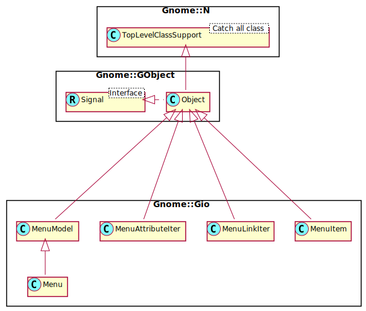

Gnome::Gio::MenuItem
====================

An entry in a menu

Description
===========

**Gnome::Gio::Menu** is a simple implementation of **Gnome::Gio::MenuModel**. You populate a **Gnome::Gio::Menu** by adding **Gnome::Gio::MenuItem** instances to it.

Synopsis
========

Declaration
-----------

    unit class Gnome::Gio::MenuItem;
    also is Gnome::GObject::Object;

Uml Diagram
-----------

Methods
=======

new
---

### :label

Creates a menu item. Call one of `set-action-and-target-value`, `set-detailed-action`, `set-section`, `set-submenu` to set purpose of this menu item.

    multi method new ( Str :$label! )

  * $label; the section label, or `undefined`

### :label, :action

Creates a new **Gnome::Gio::MenuItem**.

If *$label* is defined, then it is used to set the "label" attribute of the new item.

*$action* is used to set the "action" and possibly the "target" attribute of the new item. See `set-detailed-action()` for more information.

    multi method new ( Str :$label?, Str :$action! )

### :model, :item-index

Creates a **Gnome::Gio::MenuItem** as an exact copy of an existing menu item in a **Gnome::Gio::MenuModel**.

*$item-index* must be valid (ie: be sure to call `model-get-n-items()` first).

    multi method new ( N-GObject :$model!, Int :$item-index! )

### :section, :label

Creates a new **Gnome::Gio::MenuItem** representing a section.

This is a convenience API around `new()` followed by `set-section()`.

The effect of having one menu appear as a section of another is exactly as it sounds: the items from *$section* become a direct part of the menu that *menu-item* is added to.

Visual separation is typically displayed between two non-empty sections. If *$label* is defined then it will be encorporated into this visual indication. This allows for labeled subsections of a menu.

As a simple example, consider a typical "Edit" menu from a simple program. It probably contains an "Undo" and "Redo" item, followed by a separator, followed by "Cut", "Copy" and "Paste".

This would be accomplished by creating three **Gnome::Gio::Menu** instances. The first would be populated with the "Undo" and "Redo" items, and the second with the "Cut", "Copy" and "Paste" items. The first and second menus would then be added as submenus of the third. In XML format, this would look something like the following:

    <menu id='edit-menu'>
      <section>
        <item label='Undo'/>
        <item label='Redo'/>
      </section>
      <section>
        <item label='Cut'/>
        <item label='Copy'/>
        <item label='Paste'/>
      </section>
    </menu>

The following example is exactly equivalent. It is more illustrative of the exact relationship between the menus and items (keeping in mind that the 'link' element defines a new menu that is linked to the containing one). The style of the second example is more verbose and difficult to read (and therefore not recommended except for the purpose of understanding what is really going on).

    <menu id='edit-menu'>
      <item>
        <link name='section'>
          <item label='Undo'/>
          <item label='Redo'/>
        </link>
      </item>
      <item>
        <link name='section'>
          <item label='Cut'/>
          <item label='Copy'/>
          <item label='Paste'/>
        </link>
      </item>
    </menu>

The method is defined as

    multi method new ( Str :$label?, N-GObject :$section! )

### :submenu, :label

Creates a new **Gnome::Gio::MenuItem** representing a submenu.

This is a convenience API around `new()` followed by `set-submenu()`.

    method item-new-submenu ( Str :$label?, N-GObject :$submenu! )

### :native-object

Create a Menu object using a native object from elsewhere. See also **Gnome::N::TopLevelClassSupport**.

    multi method new ( N-GObject :$native-object! )

### :build-id

Create a Menu object using a native object returned from a builder. See also **Gnome::GObject::Object**.

    multi method new ( Str :$build-id! )

get-attribute-value
-------------------

Queries the named *attribute* on *menu_item*.

If *expected_type* is specified and the attribute does not have this type, `undefined` is returned. `undefined` is also returned if the attribute simply does not exist.

Returns: the attribute value, or `undefined`

    method get-attribute-value (
      Str $attribute, N-GObject() $expected_type
      --> N-GObject
    )

  * $attribute; the attribute name to query

  * $expected_type; the expected type of the attribute

get-link
--------

Queries the named *link* on *menu_item*.

Returns: the link, or `undefined`

    method get-link ( Str $link --> N-GObject )

  * $link; the link name to query

set-action-and-target-value
---------------------------

Sets or unsets the "action" and "target" attributes of *menu_item*.

If *action* is `undefined` then both the "action" and "target" attributes are unset (and *target_value* is ignored).

If *action* is defined then the "action" attribute is set. The "target" attribute is then set to the value of *target_value* if it is defined or unset otherwise.

Normal menu items (ie: not submenu, section or other custom item types) are expected to have the "action" attribute set to identify the action that they are associated with. The state type of the action help to determine the disposition of the menu item. See **Gnome::Gio::Action** and **Gnome::Gio::ActionGroup** for an overview of actions.

In general, clicking on the menu item will result in activation of the named action with the "target" attribute given as the parameter to the action invocation. If the "target" attribute is not set then the action is invoked with no parameter.

If the action has no state then the menu item is usually drawn as a plain menu item (ie: with no additional decoration).

If the action has a boolean state then the menu item is usually drawn as a toggle menu item (ie: with a checkmark or equivalent indication). The item should be marked as 'toggled' or 'checked' when the boolean state is `True`.

If the action has a string state then the menu item is usually drawn as a radio menu item (ie: with a radio bullet or equivalent indication). The item should be marked as 'selected' when the string state is equal to the value of the *target* property.

See `set_action_and_target()` or `set_detailed_action()` for two equivalent calls that are probably more convenient for most uses.

    method set-action-and-target-value ( Str $action, N-GObject() $target_value )

  * $action; the name of the action for this item

  * $target_value; a **Gnome::Gio::Variant** to use as the action target

set-attribute-value
-------------------

Sets or unsets an attribute on *menu_item*.

The attribute to set or unset is specified by *attribute*. This can be one of the standard attribute names `G_MENU_ATTRIBUTE_LABEL`, `G_MENU_ATTRIBUTE_ACTION`, `G_MENU_ATTRIBUTE_TARGET`, or a custom attribute name. Attribute names are restricted to lowercase characters, numbers and '-'. Furthermore, the names must begin with a lowercase character, must not end with a '-', and must not contain consecutive dashes.

must consist only of lowercase ASCII characters, digits and '-'.

If *value* is defined then it is used as the new value for the attribute. If *value* is `undefined` then the attribute is unset. If the *value* **Gnome::Gio::Variant** is floating, it is consumed.

See also `set_attribute()` for a more convenient way to do the same.

    method set-attribute-value ( Str $attribute, N-GObject() $value )

  * $attribute; the attribute to set

  * $value; a **Gnome::Gio::Variant** to use as the value, or `undefined`

set-detailed-action
-------------------

Sets the "action" and possibly the "target" attribute of *menu_item*.

The format of *detailed_action* is the same format parsed by `Gnome::Gio::Action.parse_detailed_name()`.

See `set_action_and_target()` or `set_action_and_target_value()` for more flexible (but slightly less convenient) alternatives.

See also `set_action_and_target_value()` for a description of the semantics of the action and target attributes.

    method set-detailed-action ( Str $detailed_action )

  * $detailed_action; the "detailed" action string

set-icon
--------

Sets (or unsets) the icon on *menu_item*.

This call is the same as calling `Gnome::Gio::Icon.serialize()` and using the result as the value to `set_attribute_value()` for `G_MENU_ATTRIBUTE_ICON`.

This API is only intended for use with "noun" menu items; things like bookmarks or applications in an "Open With" menu. Don't use it on menu items corresponding to verbs (eg: stock icons for 'Save' or 'Quit').

If *icon* is `undefined` then the icon is unset.

    method set-icon ( N-GObject() $icon )

  * $icon; a **Gnome::Gio::Icon**, or `undefined`

set-label
---------

Sets or unsets the "label" attribute of *menu_item*.

If *label* is defined it is used as the label for the menu item. If it is `undefined` then the label attribute is unset.

    method set-label ( Str $label )

  * $label; the label to set, or `undefined` to unset

set-link
--------

Creates a link from *menu_item* to *model* if defined, or unsets it.

Links are used to establish a relationship between a particular menu item and another menu. For example, `G_MENU_LINK_SUBMENU` is used to associate a submenu with a particular menu item, and `G_MENU_LINK_SECTION` is used to create a section. Other types of link can be used, but there is no guarantee that clients will be able to make sense of them. Link types are restricted to lowercase characters, numbers and '-'. Furthermore, the names must begin with a lowercase character, must not end with a '-', and must not contain consecutive dashes.

    method set-link ( Str $link, N-GObject() $model )

  * $link; type of link to establish or unset

  * $model; the **Gnome::Gio::MenuModel** to link to (or `undefined` to unset)

set-section
-----------

Sets or unsets the "section" link of *menu_item* to *section*.

The effect of having one menu appear as a section of another is exactly as it sounds: the items from *section* become a direct part of the menu that *menu_item* is added to. See `new_section()` for more information about what it means for a menu item to be a section.

    method set-section ( N-GObject() $section )

  * $section; a **Gnome::Gio::MenuModel**, or `undefined`

set-submenu
-----------

Sets or unsets the "submenu" link of *menu_item* to *submenu*.

If *submenu* is defined, it is linked to. If it is `undefined` then the link is unset.

The effect of having one menu appear as a submenu of another is exactly as it sounds.

    method set-submenu ( N-GObject() $submenu )

  * $submenu; a **Gnome::Gio::MenuModel**, or `undefined`

