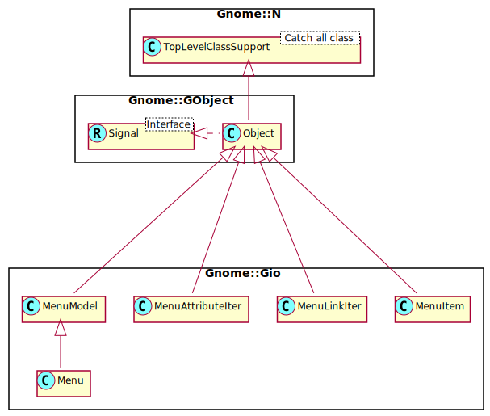

Gnome::Gio::MenuLinkIter
========================

An iterator for attributes

Synopsis
========

Declaration
-----------

    unit class Gnome::Gio::MenuLinkIter;
    also is Gnome::GObject::Object;

Uml Diagram
-----------

Methods
=======

new
---

### :native-object

Create a Menu object using a native object from elsewhere. See also **Gnome::N::TopLevelClassSupport**.

    multi method new ( N-GObject :$native-object! )

get-name
--------

Gets the name of the link at the current iterator position. The iterator is not advanced.

Returns: the type of the link

    method get-name ( --> Str )

get-next
--------

This function combines `next()` with `get-name()` and `get-value()`.

First the iterator is advanced to the next (possibly first) link. If that fails, then an empty `List` is returned and there are no other effects.

If successful, The list is filled with the name and value, a native **Gnome::Gio::MenuModel** of the link that has just been advanced to. At this point, `get-name()` and `get-value()` will return the same values again.

The values returned in the `List` remains valid for as long as the iterator remains at the current position. The value returned in *value* must be cleared using `clear-object()` when it is no longer in use.

Returns: A two element list on success, or an empty List if there is no additional link

    method get-next ( --> List )

The List contains

  * Str; the name of the link

  * N-GObject; the native linked **Gnome::Gio::MenuModel**

get-value
---------

Gets the linked **Gnome::Gio::MenuModel** at the current iterator position. The iterator is not advanced.

Returns: the native **Gnome::Gio::MenuModel** that is linked to. (Cannot return a Raku object bacause of circular dependency)

    method get-value ( --> N-GObject )

next
----

Attempts to advance the iterator to the next (possibly first) link. `True` is returned on success, or `False` if there are no more links.

You must call this function when you first acquire the iterator to advance it to the first link (and determine if the first link exists at all).

Returns: `True` on success, or `False` when there are no more links

    method next ( --> Bool )

