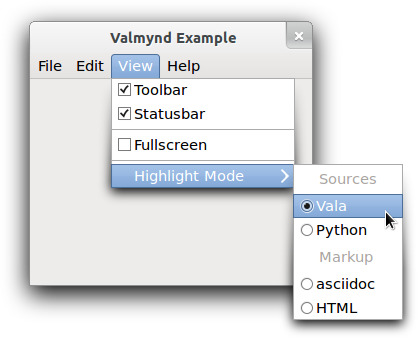
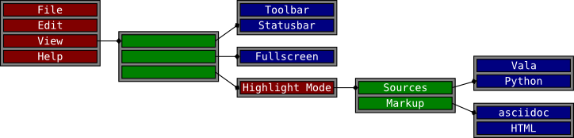

Gnome::Gio::MenuModel
=====================

An abstract class representing the contents of a menu

Description
===========

**GMenuModel** represents the contents of a menu -- an ordered list of menu items. The items are associated with actions, which can be activated through them. Items can be grouped in sections, and may have submenus associated with them. Both items and sections usually have some representation data, such as labels or icons. The type of the associated action (ie whether it is stateful, and what kind of state it has) can influence the representation of the item.

The conceptual model of menus in **GMenuModel** is hierarchical: sections and submenus are again represented by **GMenuModel**s. Menus themselves do not define their own roles. Rather, the role of a particular **GMenuModel** is defined by the item that references it (or, in the case of the 'root' menu, is defined by the context in which it is used).

As an example, consider the visible portions of this menu:

An example menu
---------------

There are 8 "menus" visible in the screenshot: one menubar, two submenus and 5 sections:

  * the toplevel menubar (containing 4 items)

  * the View submenu (containing 3 sections)

  * the first section of the View submenu (containing 2 items)

  * the second section of the View submenu (containing 1 item)

  * the final section of the View submenu (containing 1 item)

  * the Highlight Mode submenu (containing 2 sections)

  * the Sources section (containing 2 items)

  * the Markup section (containing 2 items)

The example illustrates the conceptual connection between these 8 menus. Each large block in the figure represents a menu and the smaller blocks within the large block represent items in that menu. Some items contain references to other menus.

Notice that the separators visible in the example appear nowhere in the [menu model][menu-model]. This is because separators are not explicitly represented in the menu model. Instead, a separator is inserted between any two non-empty sections of a menu. Section items can have labels just like any other item. In that case, a display system may show a section header instead of a separator.

The motivation for this abstract model of application controls is that modern user interfaces tend to make these controls available outside the application. Examples include global menus, jumplists, dash boards, etc. To support such uses, it is necessary to 'export' information about actions and their representation in menus, which is exactly what the **GActionGroup** exporter and the **GMenuModel** exporter do for **GActionGroup** and **GMenuModel**. The client-side counterparts to make use of the exported information are **GDBusActionGroup** and **GDBusMenuModel**.

The API of **GMenuModel** is very generic, with iterators for the attributes and links of an item, see `g_menu_model_iterate_item_attributes()` and `g_menu_model_iterate_item_links()`. The 'standard' attributes and link types have predefined names: `G_MENU_ATTRIBUTE_LABEL`, `G_MENU_ATTRIBUTE_ACTION`, `G_MENU_ATTRIBUTE_TARGET`, `G_MENU_LINK_SECTION` and `G_MENU_LINK_SUBMENU`.

Items in a **GMenuModel** represent active controls if they refer to an action that can get activated when the user interacts with the menu item. The reference to the action is encoded by the string id in the `G_MENU_ATTRIBUTE_ACTION` attribute. An action id uniquely identifies an action in an action group. Which action group(s) provide actions depends on the context in which the menu model is used. E.g. when the model is exported as the application menu of a **Gnome::Gtk3::Application**, actions can be application-wide or window-specific (and thus come from two different action groups). By convention, the application-wide actions have names that start with "app.", while the names of window-specific actions start with "win.".

While a wide variety of stateful actions is possible, the following is the minimum that is expected to be supported by all users of exported menu information:

  * an action with no parameter type and no state

  * an action with no parameter type and boolean state

  * an action with string parameter type and string state

Stateless
---------

A stateless action typically corresponds to an ordinary menu item. Selecting such a menu item will activate the action (with no parameter).

Boolean State
-------------

An action with a boolean state will most typically be used with a "toggle" or "switch" menu item. The state can be set directly, but activating the action (with no parameter) results in the state being toggled.

Selecting a toggle menu item will activate the action. The menu item should be rendered as "checked" when the state is true.

String Parameter and State
--------------------------

Actions with string parameters and state will most typically be used to represent an enumerated choice over the items available for a group of radio menu items. Activating the action with a string parameter is equivalent to setting that parameter as the state.

Radio menu items, in addition to being associated with the action, will have a target value. Selecting that menu item will result in activation of the action with the target value as the parameter. The menu item should be rendered as "selected" when the state of the action is equal to the target value of the menu item.

See Also
--------

**GActionGroup**

Synopsis
========

Declaration
-----------

    unit class Gnome::Gio::MenuModel;
    also is Gnome::GObject::Object;

Types
=====

class N-GMenuAttributeIter
--------------------------

Methods
=======

new
---

Create an object using a native object from elsewhere. See also **Gnome::GObject::Object**.

    multi method new ( N-GObject :$native-object! )

Create an object using a native object from a builder. See also **Gnome::GObject::Object**.

    multi method new ( Str :$build-id! )

[g_menu_model_] is_mutable
--------------------------

Queries if *model* is mutable.

An immutable **GMenuModel** will never emit the *items-changed* signal. Consumers of the model may make optimisations accordingly.

Returns: `1` if the model is mutable (ie: "items-changed" may be emitted).

Since: 2.32

    method g_menu_model_is_mutable ( --> Int  )

[g_menu_model_] get_n_items
---------------------------

Query the number of items in *model*.

Returns: the number of items

Since: 2.32

    method g_menu_model_get_n_items ( --> Int  )

[g_menu_model_] iterate_item_attributes
---------------------------------------

Creates a **N-GMenuAttributeIter** to iterate over the attributes of the item at position *item_index* in *model*.

You must free the iterator with `g_object_unref()` when you are done.

Returns: (transfer full): a new **N-GMenuAttributeIter**

Since: 2.32

    method g_menu_model_iterate_item_attributes ( Int $item_index --> N-GMenuAttributeIter  )

  * Int $item_index; the index of the item

[g_menu_model_] get_item_attribute_value
----------------------------------------

Queries the item at position *item_index* in *model* for the attribute specified by *attribute*.

If *expected_type* is non-`Any` then it specifies the expected type of the attribute. If it is `Any` then any type will be accepted.

If the attribute exists and matches *expected_type* (or if the expected type is unspecified) then the value is returned.

If the attribute does not exist, or does not match the expected type then `Any` is returned.

Returns: (transfer full): the value of the attribute

Since: 2.32

    method g_menu_model_get_item_attribute_value ( Int $item_index, Str $attribute, N-GObject $expected_type --> N-GObject  )

  * Int $item_index; the index of the item

  * Str $attribute; the attribute to query

  * N-GObject $expected_type; (nullable): the expected type of the attribute, or `Any`

[g_menu_model_] iterate_item_links
----------------------------------

Creates a **N-GMenuLinkIter** to iterate over the links of the item at position *item_index* in *model*.

You must free the iterator with `g_object_unref()` when you are done.

Returns: (transfer full): a new **N-GMenuLinkIter**

Since: 2.32

    method g_menu_model_iterate_item_links ( Int $item_index --> N-GMenuLinkIter  )

  * Int $item_index; the index of the item

[g_menu_model_] get_item_link
-----------------------------

Queries the item at position *item_index* in *model* for the link specified by *link*.

If the link exists, the linked **GMenuModel** is returned. If the link does not exist, `Any` is returned.

Returns: (transfer full): the linked **GMenuModel**, or `Any`

Since: 2.32

    method g_menu_model_get_item_link ( Int $item_index, Str $link --> N-GObject  )

  * Int $item_index; the index of the item

  * Str $link; the link to query

[g_menu_model_] items_changed
-----------------------------

Requests emission of the *items-changed* signal on *model*.

This function should never be called except by **GMenuModel** subclasses. Any other calls to this function will very likely lead to a violation of the interface of the model.

The implementation should update its internal representation of the menu before emitting the signal. The implementation should further expect to receive queries about the new state of the menu (and particularly added menu items) while signal handlers are running.

The implementation must dispatch this call directly from a mainloop entry and not in response to calls -- particularly those from the **GMenuModel** API. Said another way: the menu must not change while user code is running without returning to the mainloop.

Since: 2.32

    method g_menu_model_items_changed ( Int $position, Int $removed, Int $added )

  * Int $position; the position of the change

  * Int $removed; the number of items removed

  * Int $added; the number of items added

g_menu_attribute_iter_get_next
------------------------------

This function combines `g_menu_attribute_iter_next()` with `g_menu_attribute_iter_get_name()` and `g_menu_attribute_iter_get_value()`.

First the iterator is advanced to the next (possibly first) attribute. If that fails, then `0` is returned and there are no other effects.

If successful, *name* and *value* are set to the name and value of the attribute that has just been advanced to. At this point, `g_menu_attribute_iter_get_name()` and `g_menu_attribute_iter_get_value()` will return the same values again.

The value returned in *name* remains valid for as long as the iterator remains at the current position. The value returned in *value* must be unreffed using `g_variant_unref()` when it is no longer in use.

Returns: `1` on success, or `0` if there is no additional attribute

Since: 2.32

    method g_menu_attribute_iter_get_next ( N-GMenuAttributeIter $iter, CArray[Str] $out_name, N-GObject $value --> Int  )

  * N-GMenuAttributeIter $iter; a **N-GMenuAttributeIter**

  * CArray[Str] $out_name; (out) (optional) (transfer none): the type of the attribute

  * N-GObject $value; (out) (optional) (transfer full): the attribute value

g_menu_attribute_iter_next
--------------------------

Attempts to advance the iterator to the next (possibly first) attribute.

`1` is returned on success, or `0` if there are no more attributes.

You must call this function when you first acquire the iterator to advance it to the first attribute (and determine if the first attribute exists at all).

Returns: `1` on success, or `0` when there are no more attributes

Since: 2.32

    method g_menu_attribute_iter_next ( N-GMenuAttributeIter $iter --> Int  )

  * N-GMenuAttributeIter $iter; a **N-GMenuAttributeIter**

g_menu_attribute_iter_get_name
------------------------------

Gets the name of the attribute at the current iterator position, as a string.

The iterator is not advanced.

Returns: the name of the attribute

Since: 2.32

    method g_menu_attribute_iter_get_name ( N-GMenuAttributeIter $iter --> Str  )

  * N-GMenuAttributeIter $iter; a **N-GMenuAttributeIter**

g_menu_attribute_iter_get_value
-------------------------------

Gets the value of the attribute at the current iterator position.

The iterator is not advanced.

Returns: (transfer full): the value of the current attribute

Since: 2.32

    method g_menu_attribute_iter_get_value ( N-GMenuAttributeIter $iter --> N-GObject  )

  * N-GMenuAttributeIter $iter; a **N-GMenuAttributeIter**

g_menu_link_iter_get_next
-------------------------

This function combines `g_menu_link_iter_next()` with `g_menu_link_iter_get_name()` and `g_menu_link_iter_get_value()`.

First the iterator is advanced to the next (possibly first) link. If that fails, then `0` is returned and there are no other effects.

If successful, *out_link* and *value* are set to the name and **GMenuModel** of the link that has just been advanced to. At this point, `g_menu_link_iter_get_name()` and `g_menu_link_iter_get_value()` will return the same values again.

The value returned in *out_link* remains valid for as long as the iterator remains at the current position. The value returned in *value* must be unreffed using `g_object_unref()` when it is no longer in use.

Returns: `1` on success, or `0` if there is no additional link

Since: 2.32

    method g_menu_link_iter_get_next ( N-GMenuLinkIter $iter, CArray[Str] $out_link, N-GObject $value --> Int  )

  * N-GMenuLinkIter $iter; a **N-GMenuLinkIter**

  * CArray[Str] $out_link; (out) (optional) (transfer none): the name of the link

  * N-GObject $value; (out) (optional) (transfer full): the linked **GMenuModel**

g_menu_link_iter_next
---------------------

Attempts to advance the iterator to the next (possibly first) link.

`1` is returned on success, or `0` if there are no more links.

You must call this function when you first acquire the iterator to advance it to the first link (and determine if the first link exists at all).

Returns: `1` on success, or `0` when there are no more links

Since: 2.32

    method g_menu_link_iter_next ( N-GMenuLinkIter $iter --> Int  )

  * N-GMenuLinkIter $iter; a **N-GMenuLinkIter**

g_menu_link_iter_get_name
-------------------------

Gets the name of the link at the current iterator position.

The iterator is not advanced.

Returns: the type of the link

Since: 2.32

    method g_menu_link_iter_get_name ( N-GMenuLinkIter $iter --> Str  )

  * N-GMenuLinkIter $iter; a **N-GMenuLinkIter**

g_menu_link_iter_get_value
--------------------------

Gets the linked **GMenuModel** at the current iterator position.

The iterator is not advanced.

Returns: (transfer full): the **GMenuModel** that is linked to

Since: 2.32

    method g_menu_link_iter_get_value ( N-GMenuLinkIter $iter --> N-GObject  )

  * N-GMenuLinkIter $iter; a **N-GMenuLinkIter**

Signals
=======

There are two ways to connect to a signal. The first option you have is to use `register-signal()` from **Gnome::GObject::Object**. The second option is to use `g_signal_connect_object()` directly from **Gnome::GObject::Signal**.

First method
------------

The positional arguments of the signal handler are all obligatory as well as their types. The named attributes `:$widget` and user data are optional.

    # handler method
    method mouse-event ( GdkEvent $event, :$widget ) { ... }

    # connect a signal on window object
    my Gnome::Gtk3::Window $w .= new( ... );
    $w.register-signal( self, 'mouse-event', 'button-press-event');

Second method
-------------

    my Gnome::Gtk3::Window $w .= new( ... );
    my Callable $handler = sub (
      N-GObject $native, GdkEvent $event, OpaquePointer $data
    ) {
      ...
    }

    $w.connect-object( 'button-press-event', $handler);

Also here, the types of positional arguments in the signal handler are important. This is because both methods `register-signal()` and `g_signal_connect_object()` are using the signatures of the handler routines to setup the native call interface.

Supported signals
-----------------

### items-changed

Emitted when a change has occured to the menu.

The only changes that can occur to a menu is that items are removed or added. Items may not change (except by being removed and added back in the same location). This signal is capable of describing both of those changes (at the same time).

The signal means that starting at the index *position*, *removed* items were removed and *added* items were added in their place. If *removed* is zero then only items were added. If *added* is zero then only items were removed.

As an example, if the menu contains items a, b, c, d (in that order) and the signal (2, 1, 3) occurs then the new composition of the menu will be a, b, _, _, _, d (with each _ representing some new item).

Signal handlers may query the model (particularly the added items) and expect to see the results of the modification that is being reported. The signal is emitted after the modification.

    method handler (
      Int $position,
      Int $removed,
      Int $added,
      Int :$_handler_id,
      Gnome::GObject::Object :_widget($model),
      *%user-options
    );

  * $model; the **GMenuModel** that is changing

  * $position; the position of the change

  * $removed; the number of items removed

  * $added; the number of items added

