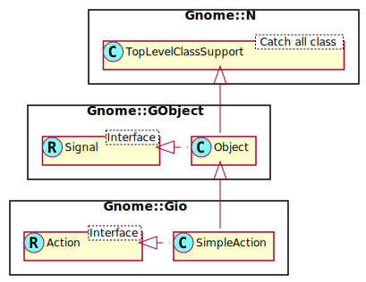

Gnome::Gio::SimpleAction
========================

A simple **Gnome::Gio::Action** implementation

Description
===========

A **Gnome::Gio::SimpleAction** is the obvious simple implementation of the **Gnome::Gio::Action** interface. This is the easiest way to create an action for purposes of adding it to a **Gnome::Gio::SimpleActionGroup**.

See also **Gnome::Gio::Action**.

Synopsis
========

Declaration
-----------

    unit class Gnome::Gio::SimpleAction;
    also is Gnome::GObject::Object;
    also does Gnome::Gio::Action;

Uml Diagram
-----------

Methods
=======

new
---

### :name, :parameter-type

Create a new stateless SimpleAction object.

    multi method new ( Str :$name!, N-GVariantType :$parameter-type )

  * Str $name; the name of the action

  * N-GVariantType $parameter_type; the type of parameter that will be passed to handlers for the *activate* signal, or `undefined` for no parameter

### :name, :parameter-type, :state

Create a new stateful SimpleAction object. All future state values must have the same **N-GVariantType** as the initial *$state* variant object.

    multi method new (
      Str :$name!, N-GVariantType :$parameter_type, N-GVariant :$state!
    )

  * Str $name; the name of the action

  * N-GVariantType $parameter_type; the type of the parameter that will be passed to handlers for the *activate* signal, or `undefined` for no parameter

  * N-GVariant $state; the initial state value of the action

### :native-object

Create a SimpleAction object using a native object from elsewhere. See also **Gnome::GObject::Object**.

    multi method new ( N-GObject :$native-object! )

set-enabled
-----------

Sets the action as enabled or not. An action must be enabled in order to be activated or in order to have its state changed from outside callers. This should only be called by the implementor of the action. Users of the action should not attempt to modify its enabled flag.

    method set-enabled ( Bool $enabled )

  * Int $enabled; whether the action is enabled

set-state
---------

Sets the state of the action. This directly updates the 'state' property to the given value. This should only be called by the implementor of the action. Users of the action should not attempt to directly modify the 'state' property. Instead, they should call `change-state()` to request the change.

    method set-state ( N-GVariant $value )

  * N-GVariant $value; the new **N-GVariant** for the state

set-state-hint
--------------

Sets the state hint for the action. See `get_state_hint()` in **Gnome::Gio::Action** for more information about action state hints.

    method set-state-hint ( N-GVariant $state_hint )

  * N-GVariant $state_hint; a **N-GVariant** representing the state hint, may be an undefined value.

Signals
=======

There are two ways to connect to a signal. The first option you have is to use `register-signal()` from **Gnome::GObject::Object**. The second option is to use `g_signal_connect_object()` directly from **Gnome::GObject::Signal**.

First method
------------

The positional arguments of the signal handler are all obligatory as well as their types. The named attributes `:$widget` and user data are optional.

    # handler method
    method mouse-event ( GdkEvent $event, :$widget ) { ... }

    # connect a signal on window object
    my Gnome::Gtk3::Window $w .= new( ... );
    $w.register-signal( self, 'mouse-event', 'button-press-event');

Second method
-------------

    my Gnome::Gtk3::Window $w .= new( ... );
    my Callable $handler = sub (
      N-GObject $native, GdkEvent $event, OpaquePointer $data
    ) {
      ...
    }

    $w.connect-object( 'button-press-event', $handler);

Also here, the types of positional arguments in the signal handler are important. This is because both methods `register-signal()` and `g_signal_connect_object()` are using the signatures of the handler routines to setup the native call interface.

Supported signals
-----------------

### activate

Indicates that the action was just activated.

*parameter* will always be of the expected type, i.e. the parameter type specified when the action was created. If an incorrect type is given when activating the action, this signal is not emitted.

If no handler is connected to this signal then the default behaviour for boolean-stated actions with a `undefined` parameter type is to toggle them via the *change-state* signal. For stateful actions where the state type is equal to the parameter type, the default is to forward them directly to *change-state*. This should allow almost all users of **N-GSimpleAction** to connect only one handler or the other.

    method handler (
      N-GVariant $parameter,
      Int :$_handle_id,
      Gnome::Gio::SimpleAction :_widget($simple),
      *%user-options
    );

  * $simple; the **Gnome::Gio::SimpleAction**

  * $parameter; the parameter to the activation, or `undefined` if it has no parameter

### change-state

Indicates that the action just received a request to change its state.

*value* will always be of the correct state type, i.e. the type of the initial state passed to `g_simple_action_new_stateful()`. If an incorrect type is given when requesting to change the state, this signal is not emitted.

If no handler is connected to this signal then the default behaviour is to call `set-state()` to set the state to the requested value. If you connect a signal handler then no default action is taken. If the state should change then you must call `set-state()` from the handler.

    method handler (
      N-GVariant $value,
      Int :$_handle_id,
      Gnome::Gio::SimpleAction :_widget($simple),
      *%user-options
    );

  * $simple; the **GSimpleAction**

  * $value; the requested value for the state

Properties
==========

An example of using a string type property of a **Gnome::Gtk3::Label** object. This is just showing how to set/read a property, not that it is the best way to do it. This is because a) The class initialization often provides some options to set some of the properties and b) the classes provide many methods to modify just those properties. In the case below one can use **new(:label('my text label'))** or **gtk_label_set_text('my text label')**.

    my Gnome::Gtk3::Label $label .= new;
    my Gnome::GObject::Value $gv .= new(:init(G_TYPE_STRING));
    $label.g-object-get-property( 'label', $gv);
    $gv.g-value-set-string('my text label');

Supported properties
--------------------

### Action Name

The name of the action. This is mostly meaningful for identifying the action once it has been added to a **GSimpleActionGroup**.

The **Gnome::GObject::Value** type of property *name* is `G_TYPE_STRING`.

### Parameter Type

The type of the parameter that must be given when activating the action.

The **Gnome::GObject::Value** type of property *parameter-type* is `G_TYPE_BOXED`.

### Enabled

If *action* is currently enabled.

If the action is disabled then calls to `g_action_activate()` and `g_action_change_state()` have no effect.

The **Gnome::GObject::Value** type of property *enabled* is `G_TYPE_BOOLEAN`.

### Action Name

The name of the action. This is mostly meaningful for identifying the action once it has been added to a **GSimpleActionGroup**.

The **Gnome::GObject::Value** type of property *name* is `G_TYPE_STRING`.

### Action Name

The name of the action. This is mostly meaningful for identifying the action once it has been added to a **GSimpleActionGroup**.

The **Gnome::GObject::Value** type of property *name* is `G_TYPE_STRING`.

### Parameter Type

The type of the parameter that must be given when activating the action.

The **Gnome::GObject::Value** type of property *parameter-type* is `G_TYPE_BOXED`.

### Action Name

The name of the action. This is mostly meaningful for identifying the action once it has been added to a **GSimpleActionGroup**.

The **Gnome::GObject::Value** type of property *name* is `G_TYPE_STRING`.

### Parameter Type

The type of the parameter that must be given when activating the action.

The **Gnome::GObject::Value** type of property *parameter-type* is `G_TYPE_BOXED`.

### Enabled

If *action* is currently enabled.

If the action is disabled then calls to `g_action_activate()` and `g_action_change_state()` have no effect.

The **Gnome::GObject::Value** type of property *enabled* is `G_TYPE_BOOLEAN`.

### State Type

The **N-GVariantType** of the state that the action has, or `undefined` if the action is stateless.

The **Gnome::GObject::Value** type of property *state-type* is `G_TYPE_BOXED`.

### State

The state of the action, or `undefined` if the action is stateless.

The **Gnome::GObject::Value** type of property *state* is `G_TYPE_VARIANT`.

### Action Name

The name of the action. This is mostly meaningful for identifying the action once it has been added to a **GSimpleActionGroup**.

The **Gnome::GObject::Value** type of property *name* is `G_TYPE_STRING`.

### Parameter Type

The type of the parameter that must be given when activating the action.

The **Gnome::GObject::Value** type of property *parameter-type* is `G_TYPE_BOXED`.

### Enabled

If *action* is currently enabled.

If the action is disabled then calls to `g_action_activate()` and `g_action_change_state()` have no effect.

The **Gnome::GObject::Value** type of property *enabled* is `G_TYPE_BOOLEAN`.

### State Type

The **N-GVariantType** of the state that the action has, or `undefined` if the action is stateless.

The **Gnome::GObject::Value** type of property *state-type* is `G_TYPE_BOXED`.

