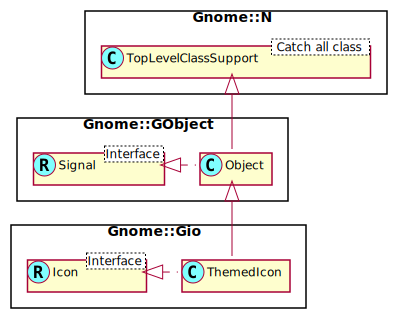

Gnome::Gio::ThemedIcon
======================

Icon theming support

Description
===========

*include*: gio/gio.h

**Gnome::Gio::ThemedIcon** is an implementation of **Gnome::Gio::Icon** that supports icon themes. **Gnome::Gio::ThemedIcon** contains a list of all of the icons present in an icon theme, so that icons can be looked up quickly. **Gnome::Gio::ThemedIcon** does not provide actual pixmaps for icons, just the icon names. Ideally something like `gtk-icon-theme-choose-icon()` should be used to resolve the list of names so that fallback icons work nicely with themes that inherit other themes.

See Also
--------

**Gnome::Gio::Icon**, **Gnome::Gio::LoadableIcon**

Synopsis
========

Declaration
-----------

    unit class Gnome::Gio::ThemedIcon;
    also is Gnome::GObject::Object;
    also does Gnome::Gio::Icon;

Uml Diagram
-----------

Methods
=======

new
---

### :iconname

Creates a new themed icon for *iconname*.

    method new ( Str :$iconname! )

  * Str $iconname; A string.

### :iconnames

Creates a new themed icon for *iconnames*.

    method new ( Str :@iconnames! )

  * Str @iconnames; An array of strings.

### :fallbacks

Creates a new themed icon for *iconname*, and all the names that can be created by shortening *iconname* at '-' characters.

    method new( Str :$fallbacks! )

#### Example

In the following example, *$icon1* and *$icon2* are equivalent:

    my @names = < gnome-dev-cdrom-audio gnome-dev-cdrom gnome-dev gnome >;
    my Gnome::Gio::ThemedIcon ( $icon1, $icon2);
    $icon1 .= new(:iconnames(@names));
    $icon2 .= new(:fallbacks<gnome-dev-cdrom-audio>);

### :string

Generate a **Gnome::Gio::FileIcon** instance from a string. This function can fail if the string is not valid - see `Gnome::Gio::Icon.to-string()` for discussion. When it fails, the error object in the attribute `$.last-error` will be set.

    method new ( Str :$string! )

  * Str $string; A string obtained via `Gnome::Gio::Icon.to-string()`.

### :native-object

Create a ThemedIcon object using a native object from elsewhere. See also **Gnome::N::TopLevelClassSupport**.

    multi method new ( N-GObject :$native-object! )

append-name
-----------

Append a name to the list of icons from within *icon*.

    method append-name ( Str $iconname )

  * Str $iconname; name of icon to append to list of icons from within *icon*.

get-names
---------

Gets the names of icons from within *icon*.

    method get-names ( --> Array )

prepend-name
------------

Prepend a name to the list of icons from within *icon*.

Note that doing so invalidates the hash computed by prior calls to `g-icon-hash()`.

    method prepend-name ( Str $iconname )

  * Str $iconname; name of icon to prepend to list of icons from within *icon*.

Properties
==========

An example of using a string type property of a **Gnome::Gtk3::Label** object. This is just showing how to set/read a property, not that it is the best way to do it. This is because a) The class initialization often provides some options to set some of the properties and b) the classes provide many methods to modify just those properties. In the case below one can use **new(:label('my text label'))** or **.set-text('my text label')**.

    my Gnome::Gtk3::Label $label .= new;
    my Gnome::GObject::Value $gv .= new(:init(G_TYPE_STRING));
    $label.get-property( 'label', $gv);
    $gv.set-string('my text label');

Supported properties
--------------------

### name: name

The icon name.

The **Gnome::GObject::Value** type of property *name* is `G_TYPE_STRING`.

### names: names

A `null`-terminated array of icon names.

The **Gnome::GObject::Value** type of property *names* is `G_TYPE_BOXED`.

### use default fallbacks: use-default-fallbacks

Whether to use the default fallbacks found by shortening the icon name at '-' characters. If the "names" array has more than one element, ignores any past the first.

The **Gnome::GObject::Value** type of property *use-default-fallbacks* is `G_TYPE_BOOLEAN`.

