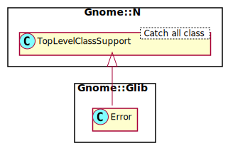

Gnome::Glib::Error
==================

A system for reporting errors

Description
===========

GLib provides a standard method of reporting errors from a called method to the calling code. Methods that can fail return an `N-GError` object. On error, a defined `N-GError` instance will be returned to the caller. After handling the error, the error object must be freed using `clear-object()`.

The `N-GError` object contains three fields: *domain* indicates the module the error-reporting function is located in, *code* indicates the specific error that occurred, and *message* is a user-readable error message with as many details as possible. Several functions are provided to deal with an error received from a called function: `matches()` returns `True` if the error matches a given domain and code. To display an error to the user, simply call the `message()` method, perhaps along with additional context known only to the calling function.

This class is greatly simplified because in Raku one can use Exception classes to throw any errors. It exists mainly to handle errors coming from other methods in the Gio, Glib, Gtk and Gdk libraries.

Error domains and codes are conventionally named as follows:

  * The error domain is called *NAMESPACE*_*MODULE*_ERROR. For instance glib file utilities uses G_FILE_ERROR.

  * The quark function for the error domain is called <namespace>_<module>_error_quark

  * The error codes are in an enumeration called <Namespace><Module>Error, for example `GFileError`.

  * Members of the error code enumeration are called <NAMESPACE>_<MODULE>_ERROR_<CODE>

  * If there's a "generic" or "unknown" error code for unrecoverable errors it doesn't make sense to distinguish with specific codes, it should be called <NAMESPACE>_<MODULE>_ERROR_FAILED, for example `G_SPAWN_ERROR_FAILED`. In the case of error code enumerations that may be extended in future releases, you should generally not handle this error code explicitly, but should instead treat any unrecognized error code as equivalent to FAILED.

Synopsis
========

Declaration
-----------

    unit class Gnome::Glib::Error;
    also is Gnome::N::TopLevelClassSupport;

Uml Diagram
-----------

Example
-------

    my Gnome::Gtk3::Builder $builder .= new;

    # Try to read non existing file
    my Gnome::Glib::Error $e = $builder.add-from-file('x.glade');
    die $e.message if $e.is-valid;

Types
=====

class N-GError;
---------------

  * has GQuark $.domain; The set domain.

  * has Int $.code; The set error code.

  * has Str $.message; The error message.

Methods
=======

new
---

### :domain, :code, :error-message

Create a new Error object. A domain, which is a string must be converted to an unsigned integer with one of the Quark conversion methods. See **Gnome::Glib::Quark**.

    multi method new ( GQuark :$domain!, Int :$code!, Str :$error-message! )

### :native-object

Create a new Error object using an other native error object.

    multi method new ( N-GError() :$native-object! )

code
----

Return the error code of the error. Returns `Int` if object is invalid.

    method code ( --> Int )

copy
----

Makes a copy of the native error object.

    # create or get the error object from somewhere
    my Gnome::Glib::Error $e = …;

    # later on, you can copy the error if needed and create a second object
    my Gnome::Glib::Error() $e2 = $e.copy;

Returns: a new `N-GError`

    method copy ( --> N-GError )

domain
------

Get the domain code from the error object. Use `to-string()` from *Gnome::Glib::Quark* to get the domain text representation of it. Returns `UInt` if object is invalid.

    method domain ( --> GQuark )

message
-------

Return the error message in the error object. Returns `Str` if object is invalid.

    method message ( --> Str )

matches
-------

Returns `1` if Gnome::Glib::Error> matches *$domain* and *$code*, `0` otherwise. In particular, when *error* is `Any`, `0` will be returned.

    method matches ( GQuark $domain, Int $code --> Bool )

  * $domain; an error domain

  * $code; an error code

prefix-error-literal
--------------------

Prefix `$prefix` to an existing error message. This error must be a valid error to work, nothing will be done otherwise.

    method prefix_error-literal ( Str $prefix )

  * $prefix; a string to prefix the error. The message of this error is modified. If you want to keep the original message, make a copy first.

set-error-literal
-----------------

Does nothing if *err* is `undefined`; if *err* is non-`undefined`, then **err* must be `undefined`. A new **Gnome::Glib::Error** is created and assigned to **err*. Unlike `g_set_error()`, *message* is not a `printf()`-style format string. Use this function if *message* contains text you don't have control over, that could include `printf()` escape sequences.

    method set-error-literal ( GQuark $domain, Int() $code, Str $message )

  * $domain; error domain

  * $code; error code

  * $message; error message

