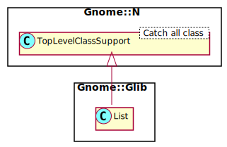

Gnome::Glib::List
=================

linked lists that can be iterated over in both directions

Description
===========

The **Gnome::Glib::List** structure and its associated functions provide a standard doubly-linked list data structure.

Each element in the list contains a piece of data, together with pointers which link to the previous and next elements in the list. Using these pointers it is possible to move through the list in both directions (unlike the singly-linked list, which only allows movement through the list in the forward direction).

The double linked list does not keep track of the number of items and does not keep track of both the start and end of the list. The data contained in each element can be either simple values like integer or real numbers or pointers to any type of data.

Note that most of the list functions expect to be passed a pointer to the first element in the list.

Raku does have plenty ways of its own two handle data for any kind of problem so a doubly linked list is not really needed. This class, however, is provided to handle returned information from other GTK+ methods. E.g. A Container can return child widgets in a List like this. If you really, really want to use this module for your own data, please study the test program in `t/List.t`. It is important for instance to gard your data against Raku's garbage collecting. Your data gets corrupted before you can say `Oh! my program runs ok … (His Famous Last Words)`.

To create an empty list just call `.new`.

To remove elements, use `remove()`.

To navigate in a list, use `first()`, `last()`, `next()`, `previous()`, etc.

To find elements in the list use `nth()`, `nth_data()`, `foreach()` and `find_custom()`.

To find the index of an element use `position()` and `index()`.

To free the entire list, use `clear-object()`.

When methods return lists, the list might be empty if e.g., things can not be found. You can test for its validity.

Synopsis
========

Declaration
-----------

    unit class Gnome::Glib::List;
    also is Gnome::N::TopLevelClassSupport;

Uml Diagram
-----------

Example 1, a while loop to visit all widgets in a grid
------------------------------------------------------

    # Get the objects from the grid in a list
    my Gnome::Glib::List $list .= new(
      :native-object($grid.get-children)
    );

    while $list.is-valid {
      # Do something with data at $list.data
      my N-GObject $no = $list.data;
      my Gnome::Gtk3::Widget $w .= new(:native-object($no));

      # Names can be set but are like 'GtkLabel', GtkButton', etc. by default
      given $w.get-name {
        when 'GtkLabel' {
          my Gnome::Gtk3::Label $hl .= new(:native-object($no));
          …
        }
        …
      }

      $list .= next;
    }

    $list.clear-object;

Example 2, using foreach() to visit all items in the list
---------------------------------------------------------

    use NativeCall;

    class ListManagement {
      method list-handler ( Pointer $item ) {
        # do something with the data $item
        my Gnome::Gtk3::Widget $w .= new(:native-object($item));
        given $w.get-name {
          when 'GtkLabel' {
            my Gnome::Gtk3::Label $lbl .= new(:native-object($item));
            …
          }
          …
        }
      }
    }

    # Get the objects from the grid in a list
    my Gnome::Glib::List $list .= new(
      :native-object($grid.get-children)
    );

    # work through all items in this list
    $list.foreach( ListManagement.new, 'list-handler');
    $list.clear-object;

Types
=====

class N-GList
-------------

Structure to create a doubly linked list.

Methods
=======

new
---

### Default, no options

Create a new plain object.

    multi method new ( )

### :native-object

Create a new list object using an other native list object.

    multi method new ( N-GList :$native-object! )

append
------

Adds a new element on to the end of the list.

Note that the return value is the new start of the list, if *list* was empty; make sure you store the new value.

`append()` has to traverse the entire list to find the end, which is inefficient when adding multiple elements. A common idiom to avoid the inefficiency is to use `prepend()` and reverse the list with `reverse()` when all elements have been added.

Returns: either *list* or the new start of the **Gnome::Glib::List** if *list* was `undefined`

    method append ( Pointer $data --> Gnome::Glib::List )

  * Pointer $data; the data for the new element

concat
------

Adds the provided **Gnome::Glib::List** onto the end of this list. Note that the elements of the given **Gnome::Glib::List** are not copied. They are used directly.

This function is for example used to move an element in the list.

Returns: the start of the new **Gnome::Glib::List**, which equals *list1* if not `undefined`

    method concat ( N-GList $list --> Gnome::Glib::List )

  * N-GList $list; the **Gnome::Glib::List** to add to the end of this list **Gnome::Glib::List**, this must point to the top of the list

copy
----

Copies a **Gnome::Glib::List**.

Note that this is a "shallow" copy. If the list elements consist of pointers to data, the pointers are copied but the actual data is not.

Returns: the start of the new list that holds the same data as *list*

    method copy ( --> Gnome::Glib::List )

data
----

Gets the data from the current **Gnome::Glib::List** position.

    method data ( --> Pointer )

delete-link
-----------

Removes the node link- from the list and frees it. Compare this to `remove-link()` which removes the node without freeing it.

Returns: the (possibly changed) start of the **Gnome::Glib::List**

    method delete-link ( N-GList $link --> Gnome::Glib::List )

  * N-GList $link_; node to delete from *list*

find
----

Finds the element in a **Gnome::Glib::List** which contains the given data.

Returns: the found **Gnome::Glib::List** element, or `undefined` if it is not found

    method find ( Pointer $data --> Gnome::Glib::List )

  * Pointer $data; the element data to find

find-custom
-----------

Finds an element in a **Gnome::Glib::List**, using a supplied function to find the desired element. It iterates over the list, calling the given function which should return 0 when the desired element is found.

Returns: the found **Gnome::Glib::List** element, or `empty` if it is not found. You can check for its validity.

    method find-custom (
      $handler-object, $method, *%user-data
      --> Gnome::Glib::List
    )

  * $handler-object; Object where method is defined.

  * $method; Name of method to call for each element in the list.

  * %user-data; optional data provided as named arguments

The method must be defined as follows;

    method search-handler ( Pointer $list-data, *%user-data --> int )

An example where a search is done through a list of widgets returned from, for example, a grid. Such a search could be started after an 'ok' or 'apply' button is clicked on a configuration screen.

    class MySearchEngine {
      method search ( Pointer $item, :$widget-name --> int ) {
        my Gnome::Gtk3::Widget $w .= new(:native-object($item));

        # stop when specified widget is found
        $w.widget-get-name eq $widget-name ?? 0 !! 1
      }
      …
    }

    # prepare grid
    my Gnome::Gtk3::Grid $g .= new;
    … a label …
    … then an input field …
    my Gnome::Gtk3::Entry $e .= new;
    $e.set-name('db-username');
    $g.attach( $e, 1, 0, 1, 1);
    … more fields to specify …

    # search for an item (in a button click handler)
    my Gnome::Glib::List $list .= new(:native-object($g.get-children));
    if my N-GList $sloc = $list.find-custom(
      MySearchEngine.new, 'search', :widget-name('db-username')
    ) {
      … do something with found widget …
    }

This example might not be the best choice when all fields are searched through this way because most elements are passed multiple times after all tests. To prevent this, one could continue the search from where it returned a defined list. The other option is to use `foreach()`.

first
-----

Gets the first element in a **Gnome::Glib::List**.

Returns: the first element in the **Gnome::Glib::List**, or `empty` if the **Gnome::Glib::List** has no elements. You can check for its validity.

    method first ( --> Gnome::Glib::List )

foreach
-------

Calls a function for each element of a **Gnome::Glib::List**.

    method foreach ( Any:D $handler-object, Str:D $method, *%user-data )

  * $handler-object; Object where method is defined.

  * $method; Name of method to call for each element in the list.

  * %user-data; optional data provided as named arguments

The method must be defined as follows;

    method foreach-handler ( Pointer $list-data, *%user-data )

index
-----

Gets the position of the element containing the given data (starting from 0).

Returns: the index of the element containing the data, or -1 if the data is not found

    method index ( Pointer $data --> Int )

  * Pointer $data; the data to find

insert
------

Inserts a new element into the list at the given position.

Returns: the (possibly changed) start of the **Gnome::Glib::List**

    method insert ( Pointer $data, Int $position --> Gnome::Glib::List )

  * Pointer $data; the data for the new element

  * Int $position; the position to insert the element. If this is negative, or is larger than the number of elements in the list, the new element is added on to the end of the list.

insert-before
-------------

Inserts a new element into the list before the given position.

Returns: the (possibly changed) start of the **Gnome::Glib::List**

    method insert-before ( N-GList $sibling, Pointer $data --> Gnome::Glib::List )

  * N-GList $sibling; the list element before which the new element is inserted or `undefined` to insert at the end of the list

  * Pointer $data; the data for the new element

last
----

Gets the last element in a **Gnome::Glib::List**.

Returns: the last element in the **Gnome::Glib::List**, or `undefined` if the **Gnome::Glib::List** has no elements

    method last ( --> Gnome::Glib::List )

length
------

Gets the number of elements in a **Gnome::Glib::List**.

This function iterates over the whole list to count its elements.

Returns: the number of elements in the **Gnome::Glib::List**

    method length ( --> UInt )

next
----

Gets the next element in a **Gnome::Glib::List**, or undefined if the **Gnome::Glib::List** has no more elements.

    method next ( --> Gnome::Glib::List )

nth
---

Gets the element at the given position in a **Gnome::Glib::List**.

This iterates over the list until it reaches the *n*-th position. If you intend to iterate over every element, it is better to use a for-loop as described in the **Gnome::Glib::List** introduction.

Returns: the element, or `undefined` if the position is off the end of the **Gnome::Glib::List**

    method nth ( UInt $n --> Gnome::Glib::List )

  * UInt $n; the position of the element, counting from 0

nth-data
--------

Gets the data of the element at the given position.

This iterates over the list until it reaches the *n*-th position. If you intend to iterate over every element, it is better to use a for-loop as described in the **Gnome::Glib::List** introduction.

Returns: the element's data, or `undefined` if the position is off the end of the **Gnome::Glib::List**

    method nth-data ( UInt $n --> Pointer )

  * UInt $n; the position of the element

nth-prev
--------

Gets the element *n* places before *list*.

Returns: the element, or `undefined` if the position is off the end of the **Gnome::Glib::List**

    method nth-prev ( UInt $n --> Gnome::Glib::List )

  * UInt $n; the position of the element, counting from 0

position
--------

Gets the position of the given element in the **Gnome::Glib::List** (starting from 0).

Returns: the position of the element in the **Gnome::Glib::List**, or -1 if the element is not found

    method position ( N-GList $llink --> Int )

  * N-GList $llink; an element in the **Gnome::Glib::List**

prepend
-------

Prepends a new element on to the start of the list.

Note that the return value is the new start of the list, which will have changed, so make sure you store the new value.

|[<!-- language="C" --> // Notice that it is initialized to the empty list. GList *list = NULL;

list = prepend (list, "last"); list = g-list-prepend (list, "first"); ]|

Do not use this function to prepend a new element to a different element than the start of the list. Use `g-list-insert-before()` instead.

Returns: a pointer to the newly prepended element, which is the new start of the **Gnome::Glib::List**

    method prepend ( Pointer $data --> Gnome::Glib::List )

  * Pointer $data; the data for the new element

previous
--------

Gets the previous element in a **Gnome::Glib::List**, or undefined if the **Gnome::Glib::List** is at the beginning of the list.

    method previous ( --> Gnome::Glib::List )

remove
------

Removes an element from a **Gnome::Glib::List**. If two elements contain the same data, only the first is removed. If none of the elements contain the data, the **Gnome::Glib::List** is unchanged.

Returns: the (possibly changed) start of the **Gnome::Glib::List**

    method remove ( Pointer $data --> Gnome::Glib::List )

  * Pointer $data; the data of the element to remove

remove-all
----------

Removes all list nodes with data equal to *data*. Returns the new head of the list. Contrast with `remove()` which removes only the first node matching the given data.

Returns: the (possibly changed) start of the **Gnome::Glib::List**

    method remove-all ( Pointer $data --> Gnome::Glib::List )

  * Pointer $data; data to remove

remove-link
-----------

Removes an element from a **Gnome::Glib::List**, without freeing the element. The removed element's prev and next links are set to `undefined`, so that it becomes a self-contained list with one element.

This function is for example used to move an element in the list (see the example for `concat()`) or to remove an element in the list before freeing its data.

Returns: the (possibly changed) start of the **Gnome::Glib::List**

    method remove-link ( N-GList $llink --> Gnome::Glib::List )

  * N-GList $llink; an element in the **Gnome::Glib::List**

reverse
-------

Reverses a **Gnome::Glib::List**. It simply switches the next and prev pointers of each element.

Returns: the start of the reversed **Gnome::Glib::List**

    method reverse ( --> Gnome::Glib::List )

sort
----

Sorts a **Gnome::Glib::List** using the given comparison function. The algorithm used is a stable sort.

Returns: the (possibly changed) start of the **Gnome::Glib::List**

    method sort (
      Any:D $user-object, Str:D $method
      --> Gnome::Glib::List
    )

  * $user-object is object wherein the compare method is defined.

  * $method is the the comparison function used to sort the **Gnome::Glib::List**. This function is passed the data from 2 elements of the **Gnome::Glib::List** and should return 0 if they are equal, a negative value if the first element comes before the second, or a positive value if the first element comes after the second.

The method must be defined as follows;

    method compare-handler ( Pointer $a, Pointer $b --> int )

The method must return -1 when $a is less than $b, 0 when equal or 1 when $a is greater than $b.

