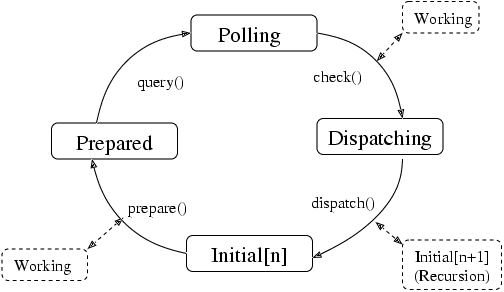

Gnome::Glib::Error
==================

The Main Event Loop — manages all available sources of events

Description
===========

Note that this is a low level module, please take a look at **Gnome::Gtk3::Main** first.

The main event loop manages all the available sources of events for GLib and GTK+ applications. These events can come from any number of different types of sources such as file descriptors (plain files, pipes or sockets) and timeouts. New types of event sources can also be added using `g_source_attach()`.

To allow multiple independent sets of sources to be handled in different threads, each source is associated with a N-GMainContext. A N-GMainContext can only be running in a single thread, but sources can be added to it and removed from it from other threads. All functions which operate on a N-GMainContext or a built-in N-GSource are thread-safe.

Each event source is assigned a priority. The default priority, G_PRIORITY_DEFAULT, is 0. Values less than 0 denote higher priorities. Values greater than 0 denote lower priorities. Events from high priority sources are always processed before events from lower priority sources.

Idle functions can also be added, and assigned a priority. These will be run whenever no events with a higher priority are ready to be processed.

The N-GMainLoop data type represents a main event loop. A N-GMainLoop is created with g_main_loop_new(). After adding the initial event sources, g_main_loop_run() is called. This continuously checks for new events from each of the event sources and dispatches them. Finally, the processing of an event from one of the sources leads to a call to g_main_loop_quit() to exit the main loop, and g_main_loop_run() returns.

It is possible to create new instances of N-GMainLoop recursively. This is often used in GTK+ applications when showing modal dialog boxes. Note that event sources are associated with a particular N-GMainContext, and will be checked and dispatched for all main loops associated with that N-GMainContext.

GTK+ contains wrappers of some of these functions, e.g. gtk_main(), gtk_main_quit() and gtk_events_pending(). Creating new source types

Single iterations of a N-GMainContext can be run with g_main_context_iteration(). In some cases, more detailed control of exactly how the details of the main loop work is desired, for instance, when integrating the N-GMainLoop with an external main loop. In such cases, you can call the component functiN-GMainContextons of g_main_context_iteration() directly. These functions are g_main_context_prepare(), g_main_context_query(), g_main_context_check() and g_main_context_dispatch(). State of a Main Context

The operation of these functions can best be seen in terms of a state diagram, as shown in this image.

On UNIX, the GLib mainloop is incompatible with fork(). Any program using the mainloop must either exec() or exit() from the child without returning to the mainloop. Memory management of sources

There are two options for memory management of the user data passed to a N-GSource to be passed to its callback on invocation. This data is provided in calls to g_timeout_add(), g_timeout_add_full(), g_idle_add(), etc. and more generally, using g_source_set_callback(). This data is typically an object which ‘owns’ the timeout or idle callback, such as a widget or a network protocol implementation. In many cases, it is an error for the callback to be invoked after this owning object has been destroyed, as that results in use of freed memory.

The first, and preferred, option is to store the source ID returned by functions such as g_timeout_add() or g_source_attach(), and explicitly remove that source from the main context using g_source_remove() when the owning object is finalized. This ensures that the callback can only be invoked while the object is still alive.

The second option is to hold a strong reference to the object in the callback, and to release it in the callback’s GDestroyNotify. This ensures that the object is kept alive until after the source is finalized, which is guaranteed to be after it is invoked for the final time. The GDestroyNotify is another callback passed to the ‘full’ variants of N-GSource functions (for example, g_timeout_add_full()). It is called when the source is finalized, and is designed for releasing references like this.

One important caveat of this second approach is that it will keep the object alive indefinitely if the main loop is stopped before the N-GSource is invoked, which may be undesirable.

Synopsis
========

Declaration
-----------

    unit class Gnome::Glib::Main;

Types
=====

Constants
---------

  * G_PRIORITY_HIGH; Use this for high priority event sources. It is not used within GLib or GTK+.

  * G_PRIORITY_DEFAULT; Use this for default priority event sources. In GLib this priority is used when adding timeout functions with g_timeout_add(). In GDK this priority is used for events from the X server.

  * G_PRIORITY_HIGH_IDLE; Use this for high priority idle functions. GTK+ uses G_PRIORITY_HIGH_IDLE + 10 for resizing operations, and G_PRIORITY_HIGH_IDLE + 20 for redrawing operations. (This is done to ensure that any pending resizes are processed before any pending redraws, so that widgets are not redrawn twice unnecessarily.)

  * G_PRIORITY_DEFAULT_IDLE; Use this for default priority idle functions. In GLib this priority is used when adding idle functions with g_idle_add().

  * G_PRIORITY_LOW; Use this for very low priority background tasks. It is not used within GLib or GTK+.

class N-GMainContext
--------------------

The N-GMainContext struct is an opaque data type representing a set of sources to be handled in a main loop.

class N-GSource
---------------

The N-GSource struct is an opaque data type representing a set of sources to be handled in a main loop.

class N-GMainLoop
-----------------

The N-GSource struct is an opaque data type representing a set of sources to be handled in a main loop.

Methods
=======

new
---

### default, no options

Create a new Main object.

    multi method new ( )

[[g_] main_] context_new
------------------------

Creates a new **N-GMainContext** structure.

Returns: the new **N-GMainContext**

    method g_main_context_new ( --> N-GMainContext )

[[g_] main_] context_ref
------------------------

Increases the reference count on a **N-GMainContext** object by one.

Returns: the *context* that was passed in (since 2.6)

    method g_main_context_ref ( N-GMainContext $context --> N-GMainContext )

  * N-GMainContext $context; a **N-GMainContext**

[[g_] main_] context_unref
--------------------------

Decreases the reference count on a **N-GMainContext** object by one. If the result is zero, free the context and free all associated memory.

    method g_main_context_unref ( N-GMainContext $context )

  * N-GMainContext $context; a **N-GMainContext**

[[g_] main_] context_default
----------------------------

Returns the global default main context. This is the main context used for main loop functions when a main loop is not explicitly specified, and corresponds to the "main" main loop. See also `g_main_context_get_thread_default()`.

Returns: (transfer none): the global default main context.

    method g_main_context_default ( --> N-GMainContext )

[[g_] main_] context_iteration
------------------------------

Runs a single iteration for the given main loop. This involves checking to see if any event sources are ready to be processed, then if no events sources are ready and *may_block* is `1`, waiting for a source to become ready, then dispatching the highest priority events sources that are ready. Otherwise, if *may_block* is `0` sources are not waited to become ready, only those highest priority events sources will be dispatched (if any), that are ready at this given moment without further waiting. Note that even when *may_block* is `1`, it is still possible for `g_main_context_iteration()` to return `0`, since the wait may be interrupted for other reasons than an event source becoming ready.

Returns: `1` if events were dispatched.

    method g_main_context_iteration ( N-GMainContext $context, Int $may_block --> Int )

  * N-GMainContext $context; (nullable): a **N-GMainContext** (if `Any`, the default context will be used)

  * Int $may_block; whether the call may block.

[[g_] main_] context_pending
----------------------------

Checks if any sources have pending events for the given context.

Returns: `1` if events are pending.

    method g_main_context_pending ( N-GMainContext $context --> Int )

  * N-GMainContext $context; (nullable): a **N-GMainContext** (if `Any`, the default context will be used)

[[g_] main_] context_find_source_by_id
--------------------------------------

Finds a **N-GSource** given a pair of context and ID. It is a programmer error to attempt to lookup a non-existent source. More specifically: source IDs can be reissued after a source has been destroyed and therefore it is never valid to use this function with a source ID which may have already been removed. An example is when scheduling an idle to run in another thread with `g_idle_add()`: the idle may already have run and been removed by the time this function is called on its (now invalid) source ID. This source ID may have been reissued, leading to the operation being performed against the wrong source.

Returns: (transfer none): the **N-GSource**

    method g_main_context_find_source_by_id ( N-GMainContext $context, UInt $source_id --> N-GSource )

  * N-GMainContext $context; (nullable): a **N-GMainContext** (if `Any`, the default context will be used)

  * UInt $source_id; the source ID, as returned by `g_source_get_id()`.

[[g_] main_] context_find_source_by_user_data
---------------------------------------------

Finds a source with the given user data for the callback. If multiple sources exist with the same user data, the first one found will be returned.

Returns: (transfer none): the source, if one was found, otherwise `Any`

    method g_main_context_find_source_by_user_data ( N-GMainContext $context, Pointer $user_data --> N-GSource )

  * N-GMainContext $context; a **N-GMainContext**

  * Pointer $user_data; the user_data for the callback.

[[g_] main_] context_wakeup
---------------------------

If *context* is currently blocking in `g_main_context_iteration()` waiting for a source to become ready, cause it to stop blocking and return. Otherwise, cause the next invocation of `g_main_context_iteration()` to return without blocking. This API is useful for low-level control over **N-GMainContext**; for example, integrating it with main loop implementations such as **N-GMainLoop**. Another related use for this function is when implementing a main loop with a termination condition, computed from multiple threads: |[<!-- language="C" --> **define** NUM_TASKS 10 static volatile gint tasks_remaining = NUM_TASKS; ... while (g_atomic_int_get (&tasks_remaining) != 0) g_main_context_iteration (NULL, TRUE); ]| Then in a thread: |[<!-- language="C" --> `perform_work()`; if (g_atomic_int_dec_and_test (&tasks_remaining)) g_main_context_wakeup (NULL); ]|

    method g_main_context_wakeup ( N-GMainContext $context )

  * N-GMainContext $context; a **N-GMainContext**

[[g_] main_] context_acquire
----------------------------

Tries to become the owner of the specified context. If some other thread is the owner of the context, returns `0` immediately. Ownership is properly recursive: the owner can require ownership again and will release ownership when `g_main_context_release()` is called as many times as `g_main_context_acquire()`. You must be the owner of a context before you can call `g_main_context_prepare()`, `g_main_context_query()`, `g_main_context_check()`, `g_main_context_dispatch()`.

Returns: `1` if the operation succeeded, and this thread is now the owner of *context*.

    method g_main_context_acquire ( N-GMainContext $context --> Int )

  * N-GMainContext $context; a **N-GMainContext**

[[g_] main_] context_release
----------------------------

Releases ownership of a context previously acquired by this thread with `g_main_context_acquire()`. If the context was acquired multiple times, the ownership will be released only when `g_main_context_release()` is called as many times as it was acquired.

    method g_main_context_release ( N-GMainContext $context )

  * N-GMainContext $context; a **N-GMainContext**

[[g_] main_] context_is_owner
-----------------------------

Determines whether this thread holds the (recursive) ownership of this **N-GMainContext**. This is useful to know before waiting on another thread that may be blocking to get ownership of *context*.

Returns: `1` if current thread is owner of *context*.

    method g_main_context_is_owner ( N-GMainContext $context --> Int )

  * N-GMainContext $context; a **N-GMainContext**

[[g_] main_] context_prepare
----------------------------

Prepares to poll sources within a main loop. The resulting information for polling is determined by calling `g_main_context_query()`. You must have successfully acquired the context with `g_main_context_acquire()` before you may call this function.

Returns: `1` if some source is ready to be dispatched prior to polling.

    method g_main_context_prepare ( N-GMainContext $context, Int-ptr $priority --> Int )

  * N-GMainContext $context; a **N-GMainContext**

  * Int-ptr $priority; location to store priority of highest priority source already ready.

[[g_] main_] context_dispatch
-----------------------------

Dispatches all pending sources. You must have successfully acquired the context with `g_main_context_acquire()` before you may call this function.

    method g_main_context_dispatch ( N-GMainContext $context )

  * N-GMainContext $context; a **N-GMainContext**

[g_] main_depth
---------------

Returns the depth of the stack of calls to `g_main_context_dispatch()` on any **N-GMainContext** in the current thread. That is, when called from the toplevel, it gives 0. When called from within a callback from `g_main_context_iteration()` (or `g_main_loop_run()`, etc.) it returns 1. When called from within a callback to a recursive call to `g_main_context_iteration()`, it returns 2. And so forth. This function is useful in a situation like the following: Imagine an extremely simple "garbage collected" system. |[<!-- language="C" --> static GList *free_list; gpointer allocate_memory (gsize size) { gpointer result = g_malloc (size); free_list = g_list_prepend (free_list, result); return result; } void free_allocated_memory (void) { GList *l; for (l = free_list; l; l = l->next); g_free (l->data); g_list_free (free_list); free_list = NULL; } [...] while (TRUE); { g_main_context_iteration (NULL, TRUE); `free_allocated_memory()`; } ]| This works from an application, however, if you want to do the same thing from a library, it gets more difficult, since you no longer control the main loop. You might think you can simply use an idle function to make the call to `free_allocated_memory()`, but that doesn't work, since the idle function could be called from a recursive callback. This can be fixed by using `g_main_depth()` |[<!-- language="C" --> gpointer allocate_memory (gsize size) { FreeListBlock *block = g_new (FreeListBlock, 1); block->mem = g_malloc (size); block->depth = `g_main_depth()`; free_list = g_list_prepend (free_list, block); return block->mem; } void free_allocated_memory (void) { GList *l; int depth = `g_main_depth()`; for (l = free_list; l; ); { GList *next = l->next; FreeListBlock *block = l->data; if (block->depth > depth) { g_free (block->mem); g_free (block); free_list = g_list_delete_link (free_list, l); } l = next; } } ]| There is a temptation to use `g_main_depth()` to solve problems with reentrancy. For instance, while waiting for data to be received from the network in response to a menu item, the menu item might be selected again. It might seem that one could make the menu item's callback return immediately and do nothing if `g_main_depth()` returns a value greater than 1. However, this should be avoided since the user then sees selecting the menu item do nothing. Furthermore, you'll find yourself adding these checks all over your code, since there are doubtless many, many things that the user could do. Instead, you can use the following techniques: 1. Use `gtk_widget_set_sensitive()` or modal dialogs to prevent the user from interacting with elements while the main loop is recursing. 2. Avoid main loop recursion in situations where you can't handle arbitrary callbacks. Instead, structure your code so that you simply return to the main loop and then get called again when there is more work to do.

Returns: The main loop recursion level in the current thread

    method g_main_depth ( --> Int )

[[g_] main_] current_source
---------------------------

Returns the currently firing source for this thread.

Returns: (transfer none): The currently firing source or `Any`.

    method g_main_current_source ( --> N-GSource )

[[g_] main_] context_push_thread_default
----------------------------------------

Acquires *context* and sets it as the thread-default context for the current thread. This will cause certain asynchronous operations (such as most [gio][gio]-based I/O) which are started in this thread to run under *context* and deliver their results to its main loop, rather than running under the global default context in the main thread. Note that calling this function changes the context returned by `g_main_context_get_thread_default()`, not the one returned by `g_main_context_default()`, so it does not affect the context used by functions like `g_idle_add()`. Normally you would call this function shortly after creating a new thread, passing it a **N-GMainContext** which will be run by a **N-GMainLoop** in that thread, to set a new default context for all async operations in that thread. In this case you may not need to ever call `g_main_context_pop_thread_default()`, assuming you want the new **N-GMainContext** to be the default for the whole lifecycle of the thread. If you don't have control over how the new thread was created (e.g. in the new thread isn't newly created, or if the thread life cycle is managed by a **GThreadPool**), it is always suggested to wrap the logic that needs to use the new **N-GMainContext** inside a `g_main_context_push_thread_default()` / `g_main_context_pop_thread_default()` pair, otherwise threads that are re-used will end up never explicitly releasing the **N-GMainContext** reference they hold. In some cases you may want to schedule a single operation in a non-default context, or temporarily use a non-default context in the main thread. In that case, you can wrap the call to the asynchronous operation inside a `g_main_context_push_thread_default()` / `g_main_context_pop_thread_default()` pair, but it is up to you to ensure that no other asynchronous operations accidentally get started while the non-default context is active. Beware that libraries that predate this function may not correctly handle being used from a thread with a thread-default context. Eg, see `g_file_supports_thread_contexts()`.

    method g_main_context_push_thread_default ( N-GMainContext $context )

  * N-GMainContext $context; (nullable): a **N-GMainContext**, or `Any` for the global default context

[[g_] main_] context_pop_thread_default
---------------------------------------

Pops *context* off the thread-default context stack (verifying that it was on the top of the stack).

    method g_main_context_pop_thread_default ( N-GMainContext $context )

  * N-GMainContext $context; (nullable): a **N-GMainContext** object, or `Any`

[[g_] main_] context_get_thread_default
---------------------------------------

Gets the thread-default **N-GMainContext** for this thread. Asynchronous operations that want to be able to be run in contexts other than the default one should call this method or `g_main_context_ref_thread_default()` to get a **N-GMainContext** to add their **N-GSources** to. (Note that even in single-threaded programs applications may sometimes want to temporarily push a non-default context, so it is not safe to assume that this will always return `Any` if you are running in the default thread.) If you need to hold a reference on the context, use `g_main_context_ref_thread_default()` instead.

Returns: (transfer none): the thread-default **N-GMainContext**, or `Any` if the thread-default context is the global default context.

    method g_main_context_get_thread_default ( --> N-GMainContext )

[[g_] main_] context_ref_thread_default
---------------------------------------

Gets the thread-default **N-GMainContext** for this thread, as with `g_main_context_get_thread_default()`, but also adds a reference to it with `g_main_context_ref()`. In addition, unlike `g_main_context_get_thread_default()`, if the thread-default context is the global default context, this will return that **N-GMainContext** (with a ref added to it) rather than returning `Any`.

Returns: (transfer full): the thread-default **N-GMainContext**. Unref with `g_main_context_unref()` when you are done with it.

    method g_main_context_ref_thread_default ( --> N-GMainContext )

[[g_] main_] loop_new
---------------------

Creates a new **N-GMainLoop** structure.

Returns: a new **N-GMainLoop**.

    method g_main_loop_new ( N-GMainContext $context, Int $is_running --> N-GMainLoop )

  * N-GMainContext $context; (nullable): a **N-GMainContext** (if `Any`, the default context will be used).

  * Int $is_running; set to `1` to indicate that the loop is running. This is not very important since calling `g_main_loop_run()` will set this to `1` anyway.

[[g_] main_] loop_run
---------------------

Runs a main loop until `g_main_loop_quit()` is called on the loop. If this is called for the thread of the loop's **N-GMainContext**, it will process events from the loop, otherwise it will simply wait.

    method g_main_loop_run ( N-GMainLoop $loop )

  * N-GMainLoop $loop; a **N-GMainLoop**

[[g_] main_] loop_quit
----------------------

Stops a **N-GMainLoop** from running. Any calls to `g_main_loop_run()` for the loop will return. Note that sources that have already been dispatched when `g_main_loop_quit()` is called will still be executed.

    method g_main_loop_quit ( N-GMainLoop $loop )

  * N-GMainLoop $loop; a **N-GMainLoop**

[[g_] main_] loop_ref
---------------------

Increases the reference count on a **N-GMainLoop** object by one.

Returns: *loop*

    method g_main_loop_ref ( N-GMainLoop $loop --> N-GMainLoop )

  * N-GMainLoop $loop; a **N-GMainLoop**

[[g_] main_] loop_unref
-----------------------

Decreases the reference count on a **N-GMainLoop** object by one. If the result is zero, free the loop and free all associated memory.

    method g_main_loop_unref ( N-GMainLoop $loop )

  * N-GMainLoop $loop; a **N-GMainLoop**

[[g_] main_] loop_is_running
----------------------------

Checks to see if the main loop is currently being run via `g_main_loop_run()`.

Returns: `1` if the mainloop is currently being run.

    method g_main_loop_is_running ( N-GMainLoop $loop --> Int )

  * N-GMainLoop $loop; a **N-GMainLoop**.

[[g_] main_] loop_get_context
-----------------------------

Returns the **N-GMainContext** of *loop*.

Returns: (transfer none): the **N-GMainContext** of *loop*

    method g_main_loop_get_context ( N-GMainLoop $loop --> N-GMainContext )

  * N-GMainLoop $loop; a **N-GMainLoop**.

[[g_] main_] context_invoke_full
--------------------------------

Invokes a function in such a way that *context* is owned during the invocation of *function*. This function is the same as `g_main_context_invoke()` except that it lets you specify the priority in case *function* ends up being scheduled as an idle and also lets you give a **GDestroyNotify** for *data*. *notify* should not assume that it is called from any particular thread or with any particular context acquired.

    method g_main_context_invoke_full (
      N-GMainContext $context, Int $priority,
      GSourceFunc $function, Pointer $data,
      GDestroyNotify $notify
    )

  * N-GMainContext $context; (nullable): a **N-GMainContext**, or `Any`

  * Int $priority; the priority at which to run *function*

  * GSourceFunc $function; function to call

  * Pointer $data; data to pass to *function*

  * GDestroyNotify $notify; (nullable): a function to call when *data* is no longer in use, or `Any`.

