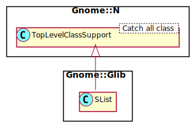

Gnome::Glib::SList
==================

Linked lists that can be iterated in one direction

Description
===========

The `N-GSList` structure and its associated functions provide a standard singly-linked list data structure.

Each element in the list contains a piece of data, together with a pointer which links to the next element in the list. Using this pointer it is possible to move through the list in one direction only (unlike the double-linked lists, which allow movement in both directions).

Note that most of the `N-GSList` functions expect to be passed a pointer to the first element in the list. The functions which insert elements set the new start of the list, which may have changed.

To free the entire list, use `clear-gslist()`.

Many methods are not needed in simple Raku use. Most of the time you get a list from a method to process. For example, retrieving information from a widget path, See the example below.

Uml Diagram
-----------

Synopsis
========

Declaration
-----------

    unit class Gnome::Glib::SList;
    also is Gnome::N::TopLevelClassSupport;

Example
-------

This example shows how to get and show some information from a widget path.

    # Build a gui; a button in a grid
    my Gnome::Gtk3::Window $w .= new;
    $w.set-name('top-level-window');

    my Gnome::Gtk3::Grid $g .= new();
    $w.container-add($g);

    my Gnome::Gtk3::Button $b1 .= new(:label<Start>);
    $g.grid-attach( $b1, 0, 0, 1, 1);

    # Get class names of the button in the widget path
    my Gnome::Gtk3::WidgetPath $wp .= new(:native-object($b1.get-path));
    my Gnome::Glib::SList $l .= new(:native-object($wp.iter-list-classes(2)));
    is $l.slist-length, 1, 'list contains one class';
    is $l.nth-data-str(0), 'text-button', "class is a 'text-button'";

Types
=====

class N-GSList
--------------

Structure to create a single linked list. This native object is stored here to prevent circular dependencies.

Methods
=======

new
---

### default, no options

Create a new plain object.

    multi method new ( )

### :native-object

Create an object using a native object from elsewhere.

    multi method new ( N-GSList :$native-object! )

[g_] slist_reverse
------------------

Reverses a `N-GSList`.

Returns: the start of the reversed `N-GSList`

    method g_slist_reverse ( N-GSList $list --> N-GSList  )

  * N-GSList $list; a `N-GSList`

[g_] slist_copy
---------------

Copies a `N-GSList`.

Note that this is a "shallow" copy. If the list elements consist of pointers to data, the pointers are copied but the actual data isn't. See `g_slist_copy_deep()` if you need to copy the data as well.

Returns: a copy of *list*

    method g_slist_copy ( N-GSList $list --> N-GSList  )

  * N-GSList $list; a `N-GSList`

[g_] slist_nth
--------------

Gets the element at the given position in a `N-GSList`.

Returns: the element, or undefined if the position is off the end of the `N-GSList`

    method g_slist_nth ( N-GSList $list, UInt $n --> N-GSList  )

  * N-GSList $list; a `N-GSList`

  * UInt $n; the position of the element, counting from 0

[g_] slist_last
---------------

Gets the last element in a `N-GSList`.

This function iterates over the whole list.

Returns: the last element in the `N-GSList`, or `Any` if the `N-GSList` has no elements

    method g_slist_last ( N-GSList $list --> N-GSList )

  * N-GSList $list; a `N-GSList`

[g_] slist_length
-----------------

Gets the number of elements in a `N-GSList`.

This function iterates over the whole list to count its elements. To check whether the list is non-empty, it is faster to check *list* against an undefined native slist.

Returns: the number of elements in the `N-GSList`

    method g_slist_length ( N-GSList $list --> UInt  )

  * N-GSList $list; a `N-GSList`

[[g_] slist_] nth_data
----------------------

Gets the data of the element at the given position.

Returns: the element's data, or `Any` if the position is off the end of the `N-GSList`. Extra methods are added to return specific types of data.

    method g_slist_nth_data ( N-GSList $list, UInt $n --> Pointer )
    method g_slist_nth_data_str ( N-GSList $list, UInt $n --> Str )
    method g_slist_nth_data_gobject ( N-GSList $list, UInt $n --> N-GObject )

  * N-GSList $list; a `N-GSList`

  * UInt $n; the position of the element

