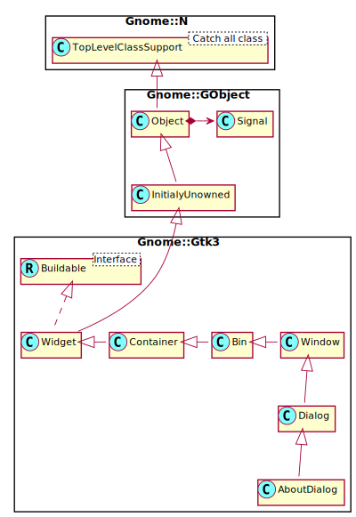

Gnome::Gtk3::AboutDialog
========================

Display information about an application

Description
===========

The **Gnome::Gtk3::AboutDialog** offers a simple way to display information about a program like its logo, name, copyright, website and license. It is also possible to give credits to the authors, documenters, translators and artists who have worked on the program. An about dialog is typically opened when the user selects the `About` option from the `Help` menu. All parts of the dialog are optional.

About dialogs often contain links and email addresses. **Gnome::Gtk3::AboutDialog** displays these as clickable links. By default, it calls gtk_show_uri() when a user clicks one. The behavior can be overridden with the `activate-link` signal.

To specify a person with an email address, use a string like "Edgar Allan Poe <edgar@poe.com>". To specify a website with a title, use a string like "GTK+ team http://www.gtk.org".

To make constructing a **Gnome::Gtk3::AboutDialog** as convenient as possible, you can use the function `gtk_show_about_dialog()` which constructs and shows a dialog and keeps it around so that it can be shown again.

Note that GTK+ sets a default title of `_("About %s")` on the dialog window (where \%s is replaced by the name of the application, but in order to ensure proper translation of the title, applications should set the title property explicitly when constructing a **Gnome::Gtk3::AboutDialog**.

It is also possible to show a **Gnome::Gtk3::AboutDialog** like any other **Gnome::Gtk3::Dialog**, e.g. `using gtk_dialog_run()`. In this case, you might need to know that the “Close” button returns the `GTK_RESPONSE_CANCEL` response id.

Synopsis
========

Declaration
-----------

    unit class Gnome::Gtk3::AboutDialog;
    also is Gnome::Gtk3::Dialog;

Uml Diagram
-----------

Inheriting this class
---------------------

Inheriting is done in a special way in that it needs a call from new() to get the native object created by the class you are inheriting from.

    use Gnome::Gtk3::AboutDialog;

    unit class MyGuiClass;
    also is Gnome::Gtk3::AboutDialog;

    submethod new ( |c ) {
      # let the Gnome::Gtk3::AboutDialog class process the options
      self.bless( :GtkAboutDialog, |c);
    }

    submethod BUILD ( ... ) {
      ...
    }

Example
=======

    my Gnome::Gtk3::AboutDialog $about .= new;

    $about.set-program-name('My-First-GTK-Program');

    # Show the dialog.The status can be tested for which button was pressed
    my Int $return-status = $about.gtk-dialog-run;

    # When dialog buttons are pressed control returns here.
    # Hide the dialog again.
    $about.gtk-widget-hide;

Types
=====

enum GtkLicense
---------------

The type of license for an application. This enumeration can be expanded at later date.

  * GTK_LICENSE_UNKNOWN: No license specified

  * GTK_LICENSE_CUSTOM: A license text is going to be specified by the developer

  * GTK_LICENSE_GPL_2_0: The GNU General Public License, version 2.0 or later

  * GTK_LICENSE_GPL_3_0: The GNU General Public License, version 3.0 or later

  * GTK_LICENSE_LGPL_2_1: The GNU Lesser General Public License, version 2.1 or later

  * GTK_LICENSE_LGPL_3_0: The GNU Lesser General Public License, version 3.0 or later

  * GTK_LICENSE_BSD: The BSD standard license

  * GTK_LICENSE_MIT_X11: The MIT/X11 standard license

  * GTK_LICENSE_ARTISTIC: The Artistic License, version 2.0

  * GTK_LICENSE_GPL_2_0_ONLY: The GNU General Public License, version 2.0 only. Since 3.12.

  * GTK_LICENSE_GPL_3_0_ONLY: The GNU General Public License, version 3.0 only. Since 3.12.

  * GTK_LICENSE_LGPL_2_1_ONLY: The GNU Lesser General Public License, version 2.1 only. Since 3.12.

  * GTK_LICENSE_LGPL_3_0_ONLY: The GNU Lesser General Public License, version 3.0 only. Since 3.12.

  * GTK_LICENSE_AGPL_3_0: The GNU Affero General Public License, version 3.0 or later. Since: 3.22.

  * GTK_LICENSE_AGPL_3_0_ONLY: The GNU Affero General Public License, version 3.0 only. Since: 3.22.27.

Methods
=======

new
---

### default, no options

Creates a new **Gnome::Gtk3::AboutDialog**.

    multi method new ( )

### :native-object

Create an object using a native object from elsewhere. See also **Gnome::N::TopLevelSupportClass**.

    multi method new ( N-GObject :$native-object! )

### :build-id

Create an object using a native object from a builder. See also **Gnome::GObject::Object**.

    multi method new ( Str :$build-id! )

add-credit-section
------------------

Creates a new section in the Credits page.

    method add-credit-section (
      Str $section_name, *@people
    )

  * $section_name; The name of the section

  * @people; A list of people who belong to that section

get-artists
-----------

Returns the string which are displayed in the artists tab of the secondary credits dialog.

Returns: A string array containing the artists.

    method get-artists ( --> Array )

get-authors
-----------

Returns the string which are displayed in the authors tab of the secondary credits dialog.

Returns: An array containing the authors.

    method get-authors ( --> Array )

get-comments
------------

Returns the comments string. The string is owned by the about dialog and must not be modified.

    method get-comments ( --> Str )

get-copyright
-------------

Returns the copyright string.

Returns: The copyright string. The string is owned by the about dialog and must not be modified.

    method get-copyright ( --> Str )

get-documenters
---------------

Returns the string which are displayed in the documenters tab of the secondary credits dialog.

Returns: An array containing the documenters

    method get-documenters ( --> Array )

get-license
-----------

Returns the license information.The string is owned by the about dialog and must not be modified.

    method get-license ( --> Str )

get-license-type
----------------

Retrieves the license set using `set_license_type()`. Returns a *GtkLicense* value.

    method get-license-type ( --> GtkLicense  )

get-logo
--------

Returns the pixbuf displayed as logo in the about dialog.

Returns: the pixbuf displayed as logo. The pixbuf is owned by the about dialog. If you want to keep a reference to it, you have to call `g_object_ref()` on it.

    method get-logo ( --> N-GObject  )

get-logo-icon-name
------------------

Returns the icon name displayed as logo in the about dialog.

Returns: the icon name displayed as logo.

    method get-logo-icon-name ( --> Str )

get-program-name
----------------

Returns the program name displayed in the about dialog.

Returns: The program name. The string is owned by the about dialog and must not be modified.

    method get-program-name ( --> Str )

get-translator-credits
----------------------

Returns the translator credits string which is displayed in the translators tab of the secondary credits dialog. The string is owned by the about dialog and must not be modified.

    method get-translator-credits ( --> Str  )

get-version
-----------

Returns the version string.

Returns: The version string. The string is owned by the about dialog and must not be modified.

    method get-version ( --> Str  )

get-website
-----------

Returns the website URL. The string is owned by the about dialog and must not be modified.

    method get-website ( --> Str  )

get-website-label
-----------------

Returns the label used for the website link. The string is owned by the about dialog and must not be modified.

    method get-website-label ( --> Str )

get-wrap-license
----------------

Returns `True` if the license text in this about dialog is automatically wrapped.

    method get-wrap-license ( --> Bool )

set-artists
-----------

Sets the strings which are displayed in the artists tab of the secondary credits dialog.

    method set-artists ( *@artists )

  * @artists; A list of string arguments

set-authors
-----------

Sets the strings which are displayed in the authors tab of the secondary credits dialog.

    method set-authors ( *@authors )

  * @authors; a list of string arguments

### Example

    my Gnome::Gtk3::AboutDialog $a .= new;
    $a.set-authors( 'mt++', 'pietje puk');

set-comments
------------

Sets the comments string to display in the about dialog. This should be a short string of one or two lines.

    method set-comments ( Str $comments )

  * $comments; a comments string

set-copyright
-------------

Sets the copyright string to display in the about dialog. This should be a short string of one or two lines.

    method set-copyright ( Str $copyright )

  * $copyright; the copyright string

set-documenters
---------------

Sets the strings which are displayed in the documenters tab of the secondary credits dialog.

    method set-documenters ( *@documenters )

  * @documenters; an list of string arguments

set-license
-----------

Sets the license information to be displayed in the secondary license dialog. If *license* is `Any`, the license button is hidden.

    method set-license ( Str $license )

  * $license; the license information or `Any`

set-license-type
----------------

Sets the license of the application showing the this about dialog dialog from a list of known licenses. This function overrides the license set using `set-license()`.

    method set-license-type ( GtkLicense $license_type )

  * $license_type; the type of license

set-logo
--------

Sets the pixbuf to be displayed as logo in the about dialog. If it is undefined, the default window icon set with `gtk_window_set_default_icon()` will be used.

    method set-logo ( Gnome::Gdk3::Pixbuf $logo )

  * $logo; a *Gnome::Gdk3::Pixbuf* object

set-logo-icon-name
------------------

Sets the pixbuf to be displayed as logo in the about dialog. If it is undefined, the default window icon set with `g=tk_window_set_default_icon()` will be used.

    method set-logo-icon-name ( Str $icon_name )

  * $icon_name; an icon name, or undefined

set-program-name
----------------

Sets the name to display in the about dialog. If this is not set, it defaults to `g_get_application_name()`.

    method set-program-name ( Str $name )

  * $name; the program name

set-translator-credits
----------------------

Sets the translator credits string which is displayed in the translators tab of the secondary credits dialog.

The intended use for this string is to display the translator of the language which is currently used in the user interface. Using `gettext()`, a simple way to achieve that is to mark the string for translation:

    $about-dialog.set-translator-credits("translator-credits");

It is a good idea to use the customary msgid “translator-credits” for this purpose, since translators will already know the purpose of that msgid, and since *Gnome::Gtk3::AboutDialog* will detect if “translator-credits” is untranslated and hide the tab.

    method set-translator-credits ( Str $translator_credits )

  * $translator_credits; the translator credits

set-version
-----------

Sets the version string to display in the about dialog.

    method set-version ( Str $version )

  * $version; the version string

set-website
-----------

Sets the URL to use for the website link.

    method set-website ( Str $website )

  * $website; a URL string starting with "http://"

set-website-label
-----------------

Sets the label to be used for the website link.

    method set-website-label ( Str $website_label )

  * $website_label; the label used for the website link

set-wrap-license
----------------

Sets whether the license text in this about dialog is automatically wrapped.

    method set-wrap-license ( Bool $wrap_license )

  * $wrap_license; whether to wrap the license

Signals
=======

activate-link
-------------

The signal which gets emitted to activate a URI. Applications may connect to it to override the default behaviour, which is to call `gtk_show_uri()`.

Returns: `1` if the link has been activated.

    method handler (
      Str $uri,
      Gnome::Gtk3::AboutDialog :_widget($dialog),
      Int $_handler-id,
      N-GObject :$_native-object,
      *%user-options
      --> gboolean #`{ use Gnome::N::GlibToRakuTypes }
    );

  * $uri; the URI that is activated.

  * $dialog; The instance which registered the signal

  * $_handler-id; The handler id which is returned from the registration

  * $_native-object; The native object provided by the caller wrapped in the Raku object.

  * %user-options; A list of named arguments provided at the `register-signal()` method

Properties
==========

artists
-------

The people who contributed artwork to the program, as a `undefined`-terminated array of strings. Each string may contain email addresses and URLs, which will be displayed as links, see the introduction for more details.

The **Gnome::GObject::Value** type of property *artists* is `G_TYPE_BOXED`.

authors
-------

The authors of the program, as a `undefined`-terminated array of strings. Each string may contain email addresses and URLs, which will be displayed as links, see the introduction for more details.

The **Gnome::GObject::Value** type of property *authors* is `G_TYPE_BOXED`.

comments
--------

Comments about the program. This string is displayed in a label in the main dialog, thus it should be a short explanation of the main purpose of the program, not a detailed list of features.

The **Gnome::GObject::Value** type of property *comments* is `G_TYPE_STRING`.

copyright
---------

Copyright information for the program.

The **Gnome::GObject::Value** type of property *copyright* is `G_TYPE_STRING`.

documenters
-----------

The people documenting the program, as a `undefined`-terminated array of strings. Each string may contain email addresses and URLs, which will be displayed as links, see the introduction for more details.

The **Gnome::GObject::Value** type of property *documenters* is `G_TYPE_BOXED`.

license
-------

The license of the program. This string is displayed in a text view in a secondary dialog, therefore it is fine to use a long multi-paragraph text.

Note that the text is only wrapped in the text view if the "wrap-license" property is set to `True`; otherwise the text itself must contain the intended linebreaks.

When setting this property to a non-`undefined` value, the *license-type* property is set to `GTK_LICENSE_CUSTOM` as a side effect.

The **Gnome::GObject::Value** type of property *license* is `G_TYPE_STRING`.

license-type
------------

The license of the program, as a value of the `GtkLicense` enumeration.

The **Gnome::Gtk3::AboutDialog** will automatically fill out a standard disclaimer and link the user to the appropriate online resource for the license text.

If `GTK_LICENSE_UNKNOWN` is used, the link used will be the same specified in the *website* property.

If `GTK_LICENSE_CUSTOM` is used, the current contents of the *license* property are used.

For any other **Gnome::Gtk3::License** value, the contents of the *license* property are also set by this property as a side effect.

Widget type: GTK_TYPE_LICENSE

The **Gnome::GObject::Value** type of property *license-type* is `G_TYPE_ENUM`.

logo
----

A logo for the about box. If it is `undefined`, the default window icon set with `gtk_window_set_default_icon()` will be used.

Widget type: GDK_TYPE_PIXBUF

The **Gnome::GObject::Value** type of property *logo* is `G_TYPE_OBJECT`.

logo-icon-name
--------------

A named icon to use as the logo for the about box. This property overrides the *logo* property.

The **Gnome::GObject::Value** type of property *logo-icon-name* is `G_TYPE_STRING`.

program-name
------------

The name of the program. If this is not set, it defaults to `g_get_application_name()`.

The **Gnome::GObject::Value** type of property *program-name* is `G_TYPE_STRING`.

translator-credits
------------------

Credits to the translators. This string should be marked as translatable. The string may contain email addresses and URLs, which will be displayed as links, see the introduction for more details.

The **Gnome::GObject::Value** type of property *translator-credits* is `G_TYPE_STRING`.

version
-------

The version of the program.

The **Gnome::GObject::Value** type of property *version* is `G_TYPE_STRING`.

website
-------

The URL for the link to the website of the program. This should be a string starting with "http://.

The **Gnome::GObject::Value** type of property *website* is `G_TYPE_STRING`.

website-label
-------------

The label for the link to the website of the program.

The **Gnome::GObject::Value** type of property *website-label* is `G_TYPE_STRING`.

wrap-license
------------

Whether to wrap the text in the license dialog.

The **Gnome::GObject::Value** type of property *wrap-license* is `G_TYPE_BOOLEAN`.

