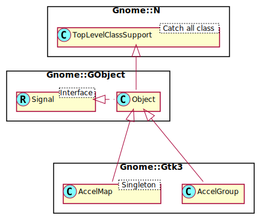

Gnome::Gtk3::AccelGroup
=======================

Groups of global keyboard accelerators for an entire **Gnome::Gtk3::Window**.

Description
===========

A **Gnome::Gtk3::AccelGroup** represents a group of keyboard accelerators, typically attached to a toplevel **Gnome::Gtk3::Window** (with `Gnome::Gtk3::Window.add-accel-group()`). Usually you won’t need to create a **Gnome::Gtk3::AccelGroup** directly; instead you might whish to use **Gnome::Gtk3::Builder** together with **Gnome::Gio::Action** and modules using the **Gnome::Gtk3::Actionable** role.

Note that “accelerators” are different from “mnemonics”. Accelerators are shortcuts for activating a menu item; they appear alongside the menu item they’re a shortcut for. For example “Ctrl+Q” might appear alongside the “Quit” menu item. Mnemonics are shortcuts for GUI elements such as text entries or buttons; they appear as underlined characters. See `Gnome::Gtk3::Label.new(:mnemonic)`. Menu items can have both accelerators and mnemonics, of course.

See Also
--------

`Gnome::Gtk3::Window.add-accel-group()`, `Gnome::Gtk3::AccelMap.change-entry()`,

Synopsis
========

Declaration
-----------

    unit class Gnome::Gtk3::AccelGroup;
    also is Gnome::GObject::Object;

Uml Diagram
-----------

Types
=====

enum GtkAccelFlags
------------------

Accelerator flags used with `connect()`.

  * GTK-ACCEL-VISIBLE: Accelerator is visible

  * GTK-ACCEL-LOCKED: Accelerator not removable

  * GTK-ACCEL-MASK: Mask

class N-GtkAccelKey
-------------------

  * UInt $.accel-key: The accelerator keyval

  * UInt $.accel-mods:The accelerator modifiers mask from GdkModifierType to be found in **Gnome::Gdk3::Types**.

  * UInt $.accel-flags: The accelerator flags

Methods
=======

new
---

### default, no options

Create a new AccelGroup object.

    multi method new ( )

### :native-object

Create an AccelGroup object using a native object from elsewhere. See also **Gnome::N::TopLevelClassSupport**.

    multi method new ( N-GObject :$native-object! )

### :build-id

Create a AccelGroup object using a native object returned from a builder. See also **Gnome::GObject::Object**.

    multi method new ( Str :$build-id! )

activate
--------

Finds the first accelerator in the *accel-group* that matches *$accel-key* and *$accel-mods*, and activates it.

Returns: `True` if an accelerator was activated and handled this keypress.

Note: It seems that it always returns False altough the callback is called and finishes without errors.

    method activate (
      UInt $accel-quark, N-GObject() $acceleratable,
      UInt $accel-key, UInt $accel-mods
      --> Bool
    )

  * $accel-quark; the quark for the accelerator name

  * $acceleratable; the **Gnome::Gtk3::Object**, usually a **Gnome::Gtk3::Window**, on which to activate the accelerator

  * $accel-key; accelerator keyval from a key event

  * $accel-mods; keyboard state mask from a key event. A mask from GdkModifierType to be found in **Gnome::Gdk3::Types**.

The `$accel-quark` can be retrieved as follows where the key sequence of the accelerator is `<ctrl>A `.

    my Gnome::Glib::Quark $quark .= new;
    my Str $accel-name = $ag.accelerator-name( GDK_KEY_A, GDK_CONTROL_MASK);
    my UInt $accel-quark = $quark.from-string($accel-name);

connect
-------

Installs an accelerator in this group. When *accel-group* is being activated in response to a call to `groups-activate()`, the *closure* will be invoked if the *accel-key* and *accel-mods* from `groups-activate()` match those of this connection.

The signature used for the *closure* is that of **Gnome::Gtk3::AccelGroupActivate**.

Note that, due to implementation details, a single closure can only be connected to one accelerator group.

    method connect (
      UInt $accel-key, UInt $accel-mods,
      UInt $accel_flags, N-GObject() $closure
    )

  * $accel-key; key value of the accelerator

  * $accel-mods; modifier combination of the accelerator. A mask from GdkModifierType to be found in **Gnome::Gdk3::Types**.

  * $accel_flags; a flag mask to configure this accelerator. A mask from bits of GtkAccelFlags

  * $closure; closure to be executed upon accelerator activation

connect-by-path
---------------

Installs an accelerator in this group, using an accelerator path to look up the appropriate key and modifiers (see `Gnome::Gtk3::AccelMap.add-entry()`).

When the *accel-group* is being activated in response to a call to `groups-activate()`, *closure* will be invoked if the *$accel-key* and *$accel-mods* from `groups-activate()` match the key and modifiers for the path.

The signature used for the *closure* is that of **Gnome::Gtk3::AccelGroupActivate**.

Note that *accel-path* string will be stored in a **Gnome::Gtk3::Quark**. Therefore, if you pass a static string, you can save some memory by interning it first with `g-intern-static-string()`.

    method connect-by-path ( Str $accel_path, N-GObject() $closure )

  * $accel_path; path used for determining key and modifiers

  * $closure; closure to be executed upon accelerator activation

disconnect
----------

Removes an accelerator previously installed through `connect()`.

Returns: `True` if the closure was found and got disconnected

    method disconnect ( N-GObject() $closure --> Bool )

  * $closure; the closure to remove from this accelerator group, or `undefined` to remove all closures

disconnect-key
--------------

Removes an accelerator previously installed through `connect()`.

Returns: `True` if there was an accelerator which could be removed, `False` otherwise.

    method disconnect-key ( UInt $accel-key, UInt $accel-mods --> Bool )

  * $accel-key; key value of the accelerator

  * $accel-mods; modifier combination of the accelerator. A mask from GdkModifierType to be found in **Gnome::Gdk3::Types**.

from-accel-closure
------------------

Finds the **Gnome::Gtk3::AccelGroup** to which *closure* is connected; see `connect()`.

Returns: the **Gnome::Gtk3::AccelGroup** to which *closure* is connected, or `undefined`

    method from-accel-closure ( N-GObject() $closure --> N-GObject )

  * $closure; a **Gnome::Gtk3::Closure**

get-is-locked
-------------

Locks are added and removed using `lock()` and `unlock()`.

Returns: `True` if there are 1 or more locks on the *accel-group*, `False` otherwise.

    method get-is-locked ( --> Bool )

get-modifier-mask
-----------------

Gets a mask with bits from enum GdkModifierType found in **Gnome::Gdk3::Types** representing the mask for this *accel-group*. For example, modifiers like **GDK-CONTROL-MASK**, **GDK-SHIFT-MASK**, etc.

Returns: the modifier mask for this accel group.

    method get-modifier-mask ( --> UInt )

groups-activate
---------------

Finds the first accelerator in any **Gnome::Gtk3::AccelGroup** attached to *$object* that matches *$accel-key* and *$accel-mods*, and activates that accelerator.

Returns: `True` if an accelerator was activated and handled this keypress

    method groups-activate (
      N-GObject() $object, UInt $accel-key, UInt $accel-mods
      --> Bool
    )

  * $object; the widget, usually a **Gnome::Gtk3::Window**, on which to activate the accelerator.

  * $accel-key; accelerator keyval from a key event.

  * $accel-mods; keyboard state mask from a key event. A mask from GdkModifierType to be found in **Gnome::Gdk3::Types**.

accelerator-get-default-mod-mask
--------------------------------

Gets the modifier mask.

The modifier mask determines which modifiers are considered significant for keyboard accelerators. See `gtk-accelerator-set-default-mod-mask()`.

Returns: the default accelerator modifier mask. A mask of GdkModifierType to be found in **Gnome::Gdk3::Types**.

    method accelerator-get-default-mod-mask ( --> UInt )

accelerator-get-label
---------------------

Converts an accelerator keyval and modifier mask into a string which can be used to represent the accelerator to the user.

Returns: a newly-allocated string representing the accelerator.

    method accelerator-get-label (
      UInt $accelerator-key, UInt $accelerator-mods --> Str
    )

  * $accelerator-key; accelerator keyval

  * $accelerator-mods; accelerator modifier mask from GdkModifierType to be found in **Gnome::Gdk3::Types**.

accelerator-name
----------------

Converts an accelerator keyval and modifier mask into a string parseable by `gtk-accelerator-parse()`. For example, if you pass in **Gnome::Gtk3::DK-KEY-q** and **Gnome::Gtk3::DK-CONTROL-MASK**, this function returns “<Control>q”.

If you need to display accelerators in the user interface, see `gtk-accelerator-get-label()`.

Returns: a newly-allocated accelerator name

    method accelerator-name (
      UInt $accelerator-key, UInt $accelerator-mods --> Str
    )

  * $accelerator-key; accelerator keyval

  * $accelerator-mods; accelerator modifier mask from GdkModifierType to be found in **Gnome::Gdk3::Types**.

accelerator-parse
-----------------

Parses a string representing an accelerator. The format looks like “<Control>a” or “<Shift><Alt>F1” or “<Release>z” (the last one is for key release).

The parser is fairly liberal and allows lower or upper case, and also abbreviations such as “<Ctl>” and “<Ctrl>”. Key names are parsed using `gdk-keyval-from-name()`. For character keys the name is not the symbol, but the lowercase name, e.g. one would use “<Ctrl>minus” instead of “<Ctrl>-”.

If the parse fails, *accelerator-key* and *accelerator-mods* will be set to 0 (zero).

    method accelerator-parse ( Str $accelerator --> List )

  * $accelerator; string representing an accelerator

The returned List contains;

  * $accelerator-key; the accelerator keyval, or `undefined`

  * $accelerator-mods; the accelerator modifier mask from GdkModifierType to be found in **Gnome::Gdk3::Types**. `undefined`

Note that many letters are translated to lowercase. So, for example, the string '<Ctrl>A' will not produce `GDK_KEY_A` but `GDK_KEY_a` for the returned `$accelerator-key`. The resulting behaviour however, will be the same.

accelerator-set-default-mod-mask
--------------------------------

Sets the modifiers that will be considered significant for keyboard accelerators. The default mod mask depends on the GDK backend in use, but will typically include **Gnome::Gtk3::DK-CONTROL-MASK** | **Gnome::Gtk3::DK-SHIFT-MASK** | **Gnome::Gtk3::DK-MOD1-MASK** | **Gnome::Gtk3::DK-SUPER-MASK** | **Gnome::Gtk3::DK-HYPER-MASK** | **Gnome::Gtk3::DK-META-MASK**. In other words, Control, Shift, Alt, Super, Hyper and Meta. Other modifiers will by default be ignored by **Gnome::Gtk3::AccelGroup**.

You must include at least the three modifiers Control, Shift and Alt in any value you pass to this function.

The default mod mask should be changed on application startup, before using any accelerator groups.

    method accelerator-set-default-mod-mask ( UInt $default_mod_mask )

  * $default_mod_mask; accelerator modifier mask from GdkModifierType to be found in **Gnome::Gdk3::Types**.

lock
----

Locks the given accelerator group.

Locking an acelerator group prevents the accelerators contained within it to be changed during runtime. Refer to `Gnome::Gtk3::Map.change-entry()` about runtime accelerator changes.

If called more than once, *accel-group* remains locked until `unlock()` has been called an equivalent number of times.

    method lock ( )

unlock
------

Undoes the last call to `lock()` on this *accel-group*.

    method unlock ( )

Signals
=======

There are two ways to connect to a signal. The first option you have is to use `register-signal()` from **Gnome::GObject::Object**. The second option is to use `connect-object()` directly from **Gnome::GObject::Signal**.

First method
------------

The positional arguments of the signal handler are all obligatory as well as their types. The named attributes `:$widget` and user data are optional.

    # handler method
    method mouse-event ( GdkEvent $event, :$widget ) { ... }

    # connect a signal on window object
    my Gnome::Gtk3::Window $w .= new( ... );
    $w.register-signal( self, 'mouse-event', 'button-press-event');

Second method
-------------

    my Gnome::Gtk3::Window $w .= new( ... );
    my Callable $handler = sub (
      N-GObject $native, GdkEvent $event, OpaquePointer $data
    ) {
      ...
    }

    $w.connect-object( 'button-press-event', $handler);

Also here, the types of positional arguments in the signal handler are important. This is because both methods `register-signal()` and `connect-object()` are using the signatures of the handler routines to setup the native call interface.

Supported signals
-----------------

### accel-activate

The accel-activate signal is an implementation detail of **Gnome::Gtk3::AccelGroup** and not meant to be used by applications.

Returns: `True` if the accelerator was activated

    method handler (
      N-GObject $acceleratable,
      UInt $keyval,
      UInt $modifier,
      Int :$_handle_id,
      Gnome::Gtk3::AccelGroup :_widget($accel_group),
      *%user-options
      --> Int
    );

  * $accel_group; the **Gnome::Gtk3::AccelGroup** which received the signal

  * $acceleratable; the object on which the accelerator was activated

  * $keyval; the accelerator keyval

  * $modifier; the modifier combination of the accelerator, a mask of GdkModifierType bits.

  * $_handle_id; the registered event handler id

### accel-changed

The accel-changed signal is emitted when an entry is added to or removed from the accel group.

Widgets like **Gnome::Gtk3::AccelLabel** which display an associated accelerator should connect to this signal, and rebuild their visual representation if the *accel-closure* is theirs.

    method handler (
       $keyval,
      GdkModifierType #`{ from Gnome::Gdk3::Window } $modifier,
      Unknown type G_TYPE_CLOSURE $accel_closure,
      Int :$_handle_id,
      Gnome::GObject::Object :_widget($accel_group),
      *%user-options
      --> Int
    );

  * $accel_group; the **Gnome::Gtk3::AccelGroup** which received the signal

  * $keyval; the accelerator keyval

  * $modifier; the modifier combination of the accelerator

  * $accel_closure; the **Gnome::Gtk3::Closure** of the accelerator

  * $_handle_id; the registered event handler id

