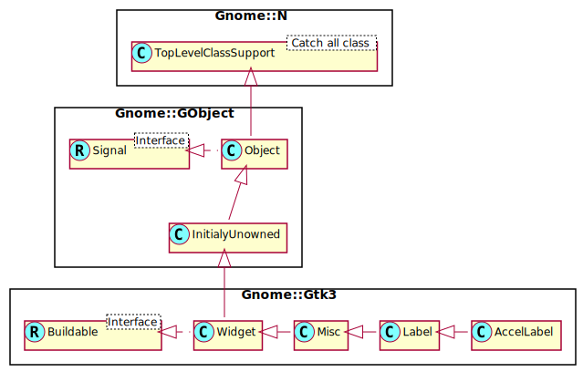

Gnome::Gtk3::AccelLabel
=======================

A label which displays an accelerator key on the right of the text

Description
===========

The **Gnome::Gtk3::AccelLabel** widget is a subclass of **Gnome::Gtk3::Label** that also displays an accelerator key on the right of the label text, e.g. “Ctrl+S”. It is commonly used in menus to show the keyboard short-cuts for commands.

The accelerator key to display is typically not set explicitly (although it can be, with `set-accel()`). Instead, the **Gnome::Gtk3::AccelLabel** displays the accelerators which have been added to a particular widget. This widget is set by calling `set-accel-widget()`.

For example, a **Gnome::Gtk3::MenuItem** widget may have an accelerator added to emit the “activate” signal when the “Ctrl+S” key combination is pressed. A **Gnome::Gtk3::AccelLabel** is created and added to the **Gnome::Gtk3::MenuItem**, and `set-accel-widget()` is called with the **Gnome::Gtk3::MenuItem** as the second argument. The **Gnome::Gtk3::AccelLabel** will now display “Ctrl+S” after its label.

Note that creating a **Gnome::Gtk3::MenuItem** with `Gnome::Gtk3::MenuItem.new(:$label)` (or one of the similar functions for **Gnome::Gtk3::CheckMenuItem** and **Gnome::Gtk3::RadioMenuItem**) automatically adds a **Gnome::Gtk3::AccelLabel** to the **Gnome::Gtk3::MenuItem** and calls `set-accel-widget()` to set it up for you.

A **Gnome::Gtk3::AccelLabel** will only display accelerators which have `GTK-ACCEL-VISIBLE` set (see `GtkAccelFlags` from **Gnome::Gtk3::AccelGroup**). A **Gnome::Gtk3::AccelLabel** can display multiple accelerators and even signal names, though it is almost always used to display just one accelerator key.

Css Nodes
---------

Like **Gnome::Gtk3::Label**, **Gnome::Gtk3::AccelLabel** has a main CSS node with the name label. It adds a subnode with name accelerator.

    label
    ╰── accelerator

See Also
--------

**Gnome::Gtk3::AccelGroup**

Synopsis
========

Declaration
-----------

    unit class Gnome::Gtk3::AccelLabel;
    also is Gnome::Gtk3::Label;

Uml Diagram
-----------

Inheriting this class
---------------------

Inheriting is done in a special way in that it needs a call from new() to get the native object created by the class you are inheriting from.

    use Gnome::Gtk3::AccelLabel;

    unit class MyGuiClass;
    also is Gnome::Gtk3::AccelLabel;

    submethod new ( |c ) {
      # let the Gnome::Gtk3::AccelLabel class process the options
      self.bless( :GtkAccelLabel, |c);
    }

    submethod BUILD ( ... ) {
      ...
    }

Methods
=======

new
---

### :text

Create a new AccelLabel object with the label from `$text`.

    multi method new ( :$text! )

### :native-object

Create a AccelLabel object using a native object from elsewhere. See also **Gnome::N::TopLevelClassSupport**.

    multi method new ( N-GObject :$native-object! )

### :build-id

Create a AccelLabel object using a native object returned from a builder. See also **Gnome::GObject::Object**.

    multi method new ( Str :$build-id! )

get-accel
---------

Gets the keyval and modifier mask set with `set-accel()`.

    method get-accel ( List )

The returned Lis contains

  * UInt $accelerator-key; the keyval

  * UInt $accelerator-mods; the modifier mask, a mask with GdkModifierType bits.

get-accel-widget
----------------

Fetches the widget monitored by this accelerator label, or `undefined`. See `set-accel-widget()`.

    method get-accel-widget ( --> N-GObject )
    method get-accel-widget-rk ( --> Gnome::Gtk3::Widget )

get-accel-width
---------------

Returns the width needed to display the accelerator key(s). This is used by menus to align all of the **Gnome::Gtk3::MenuItem** widgets, and shouldn't be needed by applications.

Returns: the width needed to display the accelerator key(s).

    method get-accel-width ( --> UInt )

set-accel
---------

Manually sets a keyval and modifier mask as the accelerator rendered by *accel-label*.

If a keyval and modifier are explicitly set then these values are used regardless of any associated accel closure or widget.

Providing an *$accelerator-key* of 0 removes the manual setting.

    method set-accel ( UInt $accelerator-key, UInt $accelerator-mods )

  * UInt $accelerator-key; a keyval, or 0

  * UInt $accelerator-mods; the modifier mask for the accel, a mask with bits from GdkModifierType.

set-accel-closure
-----------------

Sets the closure to be monitored by this accelerator label. The closure must be connected to an accelerator group; see `Gnome::Gtk3::AccelGroup.connect()`. Passing `undefined` for *$accel-closure* will dissociate the *accel-label* from its current closure, if any.

    method set-accel-closure ( N-GClosure $accel_closure )

  * N-GClosure $accel_closure; the closure to monitor for accelerator changes, or `undefined`

set-accel-widget
----------------

Sets the widget to be monitored by this accelerator label. Passing `undefined` for *accel-widget* will dissociate *accel-label* from its current widget, if any.

    method set-accel-widget ( N-GObject $accel_widget )

  * N-GObject $accel_widget; the widget to be monitored, or `undefined`

Properties
==========

An example of using a string type property of a **Gnome::Gtk3::Label** object. This is just showing how to set/read a property, not that it is the best way to do it. This is because a) The class initialization often provides some options to set some of the properties and b) the classes provide many methods to modify just those properties. In the case below one can use **new(:label('my text label'))** or **.set-text('my text label')**.

    my Gnome::Gtk3::Label $label .= new;
    my Gnome::GObject::Value $gv .= new(:init(G_TYPE_STRING));
    $label.get-property( 'label', $gv);
    $gv.set-string('my text label');

Supported properties
--------------------

### Accelerator Closure: accel-closure

The **Gnome::GObject::Value** type of property *accel-closure* is `G_TYPE_BOXED`.

### Accelerator Widget: accel-widget

The widget to be monitored for accelerator changes Widget type: GTK-TYPE-WIDGET

The **Gnome::GObject::Value** type of property *accel-widget* is `G_TYPE_OBJECT`.

